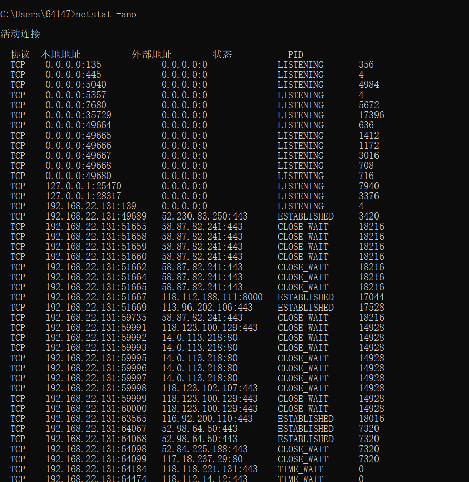
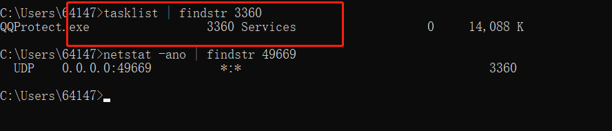

### window进程查询
在日常工作中，经常会碰到启动某个应用时，提示xxx端口已经并占用，导致当前应用无法正常启动。 如何找到占用特定端口的应用并将其释放呢？

1. 查找当前系统的端口使用情况 `netstat -ano`

2. 显示太多的话还可以查看某一个具体的端口 `netstat -ano | findstr xxx` 换位你要查询的端口号，就可以查看是那个程序在占用端口，也可以查看末尾的 PID  值。在 任务管理器 =》 详细信息中 查看对应的程序，以及停止程序

3. 上面只是查询了端口对应的程序 PID 信息，执行 `tasklist | findstr PID` 可以查询是那个执行程序

4. 这样可以到任务管理器中停止程序或者使用命令停止程序 `taskkill /f /t /im "name"` 后面 name 根据上面查询出来的程序来消除，下面例子是删除 世界之窗浏览器的测试

5. 然后就可以启动自己的程序了。

## URL发展历史
#### HTTP/0.9
- 只有一个命令GET
- 响应类型: 仅 超文本
- 没有header等描述数据的信息
- 服务器发送完毕，就关闭TCP连接
####  HTTP/1.0
- 增加了很多命令（post HESD ）
- 增加status code 和 header
- 多字符集支持、多部分发送、权限、缓存等
- 响应：不再只限于超文本 (Content-Type 头部提供了传输 HTML 之外文件的能力 — 如脚本、样式或媒体文件)
####  HTTP/1.1
- 持久连接。TCP三次握手会在任何连接被建立之前发生一次。最终，当发送了所有数据之后，服务器发送一个消息，表示不会再有更多数据向客户端发送了；则客户端才会关闭连接（断开 TCP）
- 支持的方法: GET , HEAD , POST , PUT ,DELETE , TRACE , OPTIONS
- 进行了重大的性能优化和特性增强，分块传输、压缩/解压、内容缓存磋商、虚拟主机（有单个IP地址的主机具有多个域名）、更快的响应，以及通过增加缓存节省了更多的带宽
#### HTTP2
- 所有数据以二进制传输。HTTP1.x是基于文本的，无法保证健壮性，HTTP2.0绝对使用新的二进制格式，方便且健壮
- 同一个连接里面发送多个请求不再需要按照顺序来
- 头信息压缩以及推送等提高效率的功能
