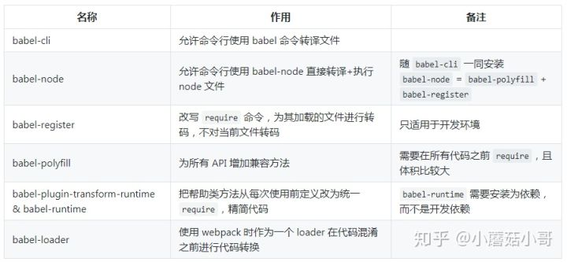

# babel常用插件
babel7的使用方式和之前的有一些不一样，一般的使用都需要添加`@babel/core
@babel/cli   @babel-loader`


### `@babel/cli`
cli就是工具，安装了该插件就能在命令行中使用babel来编译文件

### `@babel/node`
`babel-node` 是 `@babel/cli` 的一部分，不需要特别安装，可以直接执行一个使用ES6编写的js文件
> 可以说 @babel/node = @babel/polyfill + @babel/register

### `@babel/register`
`@babel/register` 模块改写 require 命令，为它加上一个钩子。此后，每当使用 require 加载 .js、.jsx、.es 和 .es6 后缀名的文件，就会先用 babel 进行转码。

使用时，必须首先加载 `require('babel-register')`。

需要注意的是，`@babel/register` 只会对 require 命令加载的文件转码，而 不会对当前文件转码。由于它是实时转码，所以 只适合在开发环境使用。

## `@babel/polyfill`
babel 默认只转换 js 语法，而不转换新的 API，比如 `Iterator、Generator、Set、Maps、Proxy、Reflect、Symbol、Promise` 等全局对象，以及一些定义在全局对象上的方法(比如 Object.assign)都不会转码。

举例来说，es2015 在 Array 对象上新增了 Array.from 方法。babel 就不会转码这个方法。如果想让这个方法运行，必须使用 `@babel/polyfill`。(内部集成了 core-js 和 regenerator)

**所有代码运行之前增加 `require('babel-polyfill')`。或者更常规的操作是在 webpack.config.js 中将 babel-polyfill 作为第一个 entry**

`@babel/polyfill`的缺点
1. 使用会导致打出来的包特别的大，因为是一个整体，将我们需要的不需要的全部添加了
2. `@babel/polyfill` 会污染全局变量，给很多类的原型添加了方法，如果我们开发的是一个类库供其他人使用，则会发生未可知的错误

*因为上面的第二个缺点，我们一般开发中更加倾向于使用 `@babel/plugin-transform-runtime`  但是如果代码中包含了高版本的jS方法，还是要使用`@babel/polyfill`*


## babel-runtime 和 `@babel/plugin-transform-runtime` (重点)
我们时常在项目中看到 .babelrc 中使用`@babel/plugin-transform-runtime`，而 package.json 中的 dependencies (注意不是 devDependencies) 又包含了 `babel-runtime`，那这两个是不是成套使用的呢？他们又起什么作用呢？

先说 `@babel/plugin-transform-runtime`。

babel 会转换 js 语法，之前已经提过了。以 `async/await` 举例，如果不使用这个 plugin (即默认情况)，转换后的代码大概是：
```js
// babel 添加一个方法，把 async 转化为 generator
function _asyncToGenerator(fn) { return function () {....}} // 很长很长一段

// 具体使用处
var _ref = _asyncToGenerator(function* (arg1, arg2) {
  yield (0, something)(arg1, arg2);
});
```

不用过于纠结具体的语法，只需看到，这个 _asyncToGenerator 在当前文件被定义，然后被使用了，以替换源代码的 await。但每个被转化的文件都会插入一段 _asyncToGenerator 这就导致重复和浪费了。使用了 `@babel/plugin-transform-runtime` 了之后，转化后的代码会变成
```js
// 从直接定义改为引用，这样就不会重复定义了。
var _asyncToGenerator2 = require('babel-runtime/helpers/asyncToGenerator');
var _asyncToGenerator3 = _interopRequireDefault(_asyncToGenerator2);

// 具体使用处是一样的
var _ref = _asyncToGenerator3(function* (arg1, arg2) {
  yield (0, something)(arg1, arg2);
});

```

从定义方法改成引用，那重复定义就变成了重复引用，就不存在代码重复的问题了。

但在这里，我们也发现 `babel-runtime` 出场了，它就是这些方法的集合处，也因此，在使用 `@babel/plugin-transform-runtime` 的时候必须把 `babel-runtime` 当做依赖。

再说 babel-runtime，它内部集成了

**core-js:** 转换一些内置类 (Promise, Symbols等等) 和静态方法 (Array.from 等)。绝大部分转换是这里做的。自动引入。
**regenerator:** 作为 core-js 的拾遗补漏，主要是 generator/yield 和 async/await 两组的支持。当代码中有使用 generators/async 时自动引入。
helpers, 如上面的 asyncToGenerator 就是其中之一，其他还有如 jsx, classCallCheck 等等，可以查看 babel-helpers。在代码中有内置的 helpers 使用时(如上面的第一段代码)移除定义，并插入引用(于是就变成了第二段代码)。

### babel-loader
一些大型的项目都会有构建工具 (如 webpack 或 rollup) 来进行代码构建和压缩 (uglify)。理论上来说，我们也可以对压缩后的代码进行 babel 处理，但那会非常慢。因此如果在 uglify 之前就加入 babel 处理，

所以就有了 babel 插入到构建工具内部这样的需求。以webpack 为例，webpack 有 loader 的概念，因此就出现了 `babel-loader`。

和 `@babel/cli` 一样，`babel-loader` 也会读取 .babelrc 或者 package.json 中的 babel 段作为自己的配置，之后的内核处理也是相同。唯一比 `@babel/cli` 复杂的是，它需要和 webpack 交互，因此需要在 webpack 这边进行配置。比较常见的如下：
```js
module: {
  rules: [
    {
      test: /\.js$/,
      exclude: /(node_modules|bower_components)/,
      loader: 'babel-loader'
    }
  ]
}
// 也可以在配置的时候传递参数 options 但是一般将配置放到单独的配置文件更好
```

