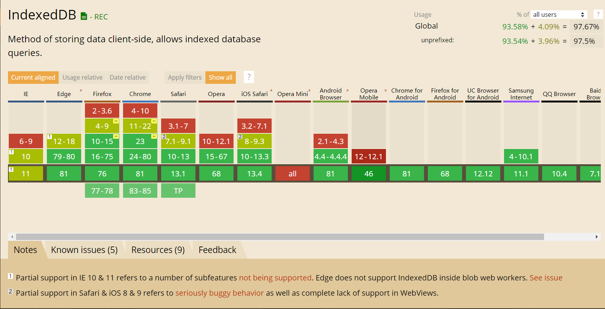

# 浏览器存储方案

### indexedDB的使用

随着前端的不断发展，`web storage` 也有发展，社区就出现了浏览器数据库的概念，而 `Web SQL Database`  和 `indexedDB（索引数据库）`就是相应的实现，`Web SQL Database`基本上已经被放弃了，目前主流的浏览器都实现了  `indexedDB（索引数据库）`

IndexedDB 是一种使用浏览器存储大量数据的方式，它创造的数据可以被查询，并且可以离线使用，对于那些需要大量数据或者是离线使用的程序是非常有效的解决方法。indexedDB 就是基于事务操作的 `key-value` 形数据库 ，它的API大多是异步的

