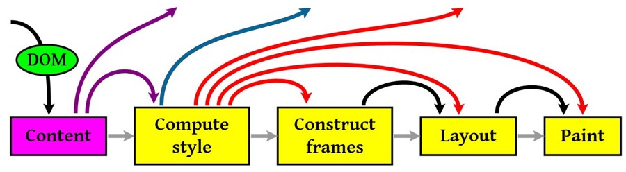

## 浏览器加载页面
要了解页面的优化加载，就需要知道页面的从服务器获取资源到展示的具体流程。

1. load 事件
> window.onload 事件应该仅用于检测一个完全加载的页面，当一个资源及其依赖的资源全部加载完成时，触发load事件

2. DOMContentLoaded
> document.addEventListener("DOMContentLoaded",function(){});

    > 当初始的 HTML 文档被完全加载和解析完成之后，DOMContentLoaded 事件被触发，而无需等待样式表、图像和子框架的完成加载。DOMContentLoaded 事件必须等待其所属script之前的样式表加载解析完成才会触发。

浏览器会对资源进行分析，首先开启下载线程，对所有资源进行优先级排序下载(一般浏览器对同域名下的下载线程限定在6个，超过就只能等待下载，所以一般将资源分布在不同的域名下)，同时，主线程会对文档进行解析
- 遇到 script 标签，首先阻塞后续内容的解析，同时检查该script是否已经下载下来，已经下载，便执行代码
- 遇到 link 标签时，不会阻塞后续内容的解析(即是DOM渲染)，检查link标签是否已经下载，已经下载便构建cssdom
- 遇到DOM标签，执行DOM构建，将该DOM元素添加到文档树中

**在body中第一个script资源下载完成之前，浏览器会进行首次渲染，将该script标签前面的DOM 树和CSSDOM合并为一个render树，渲染到页面中，这是页面从白屏到首次渲染的时间节点，比较关键**


### HTML文档的加载和页面的首次渲染
当我们输入一个页面地址时，发生了 那些事情，忽略DNS，缓存等内容

1. 浏览器下载该地址对应的HTML页面
2. 浏览器解析HTML页面中DOM结构
3. 开启下载线程(http1.1中是每一个资源的下载都要开启一个http请求，对应一个tcp/ip链接)文档中的所有资源按优先排序下载
4. 主线程继续解析文档，到达 head节点，head里的外部资源一般是外链样式表和JS文件
    - 发现外链css或者Js，如果是外链JS，则停止解析后续内容，等待资源下载，下载完成后立即执行，如果是外链css，继续解析后续内容
5. 解析到body，body中内容很多，分开讨论
    - **有DOM元素，外链js：当解析到外链Js的时候，查看是否下载到本地，未下载则js之前的DOM被渲染到页面上，js会阻塞后续DOM构建，等待js下载并执行再解析后续的DOM元素；**
    - 有dom，外链css： 外连css不会影响后续的DOM解析，但是会影响渲染，即是外链css加载完之前，页面还是白屏；
    - 有 DOM 元素，外链js，外链css: 外链js和外连css的顺序会影响页面渲染，这点尤为重要，在body中js之前的css未加载完成之前，页面是不会被渲染的，js之前的外链css加载完成之后，JS之前的DOM树和css树合并为render树渲染到页面上
6. 文档解析完毕，页面重新渲染，当页面引用的所有JS同步代码执行完毕，触发 DOMContentLoaded 事件
7. HTML 文档中的图片资源，js代码中有异步加载的css,js,图片资源都加载完毕之后触发 load 事件。


### 浏览器解析页面的全部流程
浏览器内核拿到内容之后，渲染步骤可以分为以下几步

1. 解析HTML，构建 DOM树
2. 解析css，构建CSS规则树
3. 合并DOM树和css规则树，生成 render树
4. 布局render树（layout / reflow），负责各元素尺寸，位置信息
5. 绘制render树（paint），绘制页面像素信息
6. 浏览器将各层的信息发送给GPU，GPU将各层合成，显示在页面上


#### html解析构成DOM树
```html
<html>
  <head>
    <meta name="viewport" content="width=device-width,initial-scale=1">
    <link href="style.css" rel="stylesheet">
    <title>Critical Path</title>
  </head>
  <body>
    <p>Hello <span>web performance</span> students!</p>
    <div></div>
  </body>
</html>
```


#### css规则生成类似的
```shell
body { font-size: 16px }
p { font-weight: bold }
span { color: red }
p span { display: none }
img { float: right }
```


#### 构建渲染树
将DOM树和CSSDOM构建成渲染树，这时有一些不可见DOM不会被插入渲染树中，如head这种不可见的，以及`display: none;`等


#### 渲染，有了render树，接下来就开始渲染

1. 计算css样式
2. 构建渲染树
3. 布局，主要定位坐标和大小，是否换行，各种position, overflow, z-index等
4. 绘制，将图像绘制出来

图中的线与箭头表示js动态修改了DOM和css，导致了重新布局(Layout) 或渲染(Repaint)


#### 回流(Layout)和重绘(Repain)
- layout 一般意味着元素的内容，结构，尺寸和位置发生了变化，需要重新计算样式和渲染树
- repaint 意味着元素发生的改变只影响了元素的一些外观(背景，边框颜色，文字颜色)，此时只需要应用新样式绘制就好

**回流的成本开销要高于重绘，而且一个节点的回流往往会导致子节点以及同级节点的回流， 回流一定伴随着重绘，重绘却可以单独出现，尽量避免回流**


#### 引起回流方式
```shell
1. 页面渲染初始化
2. DOM结构改变，比如删除了某个节点
3. render树改变，比如减少了padding值
4. 窗口 resize
5. 最复杂的一种： 获取某些属性，会引发回流
很多浏览器会做优化处理，很多操作队列然后一起处理，但是当你需要获取某些属性的时候，浏览器就会先回流然后返回值
offset(top/left/width/height)
scroll(top/left/width/height)
client(top/left/width/height)
width, height
调用 getComputedStyle() / currentStyle

页面书写的时候最好将复杂的元素决定定位脱离文档流，使其不会产生回流
```


#### 简单层和符合层
上面只是简单的说明了绘制，但是绘制是一个很复杂的过程，现在结合复合层和简单层来介绍一下

- 可以认为默认只有一个复合图层，所有的DOM节点都在这个复合图层下
- 如果开启了硬件加速功能，可以将某个节点变成复合图层
- 复合图层之间的绘制互不干扰，由GPU直接控制
- 简单图层中，就算是absolute布局，变化时不影响整体的回流，但是由于在同一个图层中，仍然会影响绘制的，因此做动画时性能任然很低，而复合层是独立的所以一般做动画都推荐使用硬件加速，过多的 GPU 加速会引起页面卡顿甚至闪退。


#### css的可视化格式模型
css的可视化格式模式规定了浏览器在页面中如何处理文档树
```shell
包含块
控制框
BFC  / IFC
定位体系
浮动
...
```

FC 即上下文，它定义框内部的元素渲染规则，比较抽象，不同类型的框参与不同的 FC 类型，**块级框对应BFC，行内框对应IFC**

BFC 的几个特点

1. 内部box在垂直方向，一个接一个的放置
2. box的垂直方向由margin决定，属于同一个BFC的两个box间的margin会重叠
3. BFC区域不会与float box重叠（可用于排版)
4. BFC就是页面上的一个隔离的独立容器，容器里面的子元素不会影响到外面的元素。反之也如此
5. 计算BFC的高度时，浮动元素也参与计算（不会浮动坍塌）

BFC 的触发方式

1. 根元素
2. float属性不为none
3. position为absolute或fixed
4. display为inline-block, flex, inline-flex，table，table-cell，table-caption
5. overflow不为visible（大网站常用的方式）

IFC 行内框产生的格式上下文，IFC 规则，主要是行内块的对齐的标准
```shell
在行内格式化上下文中
框一个接一个地水平排列，起点是包含块的顶部。
水平方向上的 margin，border 和 padding 在框之间得到保留
框在垂直方向上可以以不同的方式对齐：它们的顶部或底部对齐，或根据其中文字的基线对齐
```

1. 行内元素总是会应用IFC渲染规则
2. 行内元素会应用IFC规则渲染，譬如text-align可以用来居中等
3. 块框内部，对于文本这类的匿名元素，会产生匿名行框包围，而行框内部就应用IFC渲染规则
4. 行内框内部，对于那些行内元素，一样应用IFC渲染规则
5. 另外，inline-block，会在元素外层产生IFC（所以这个元素是可以通过text-align水平居中的），当然，它内部则按照BFC规则渲染

