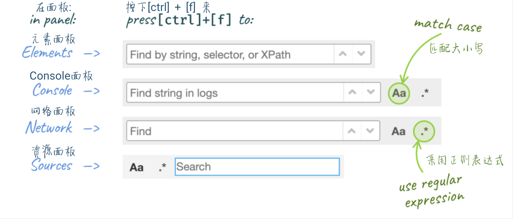
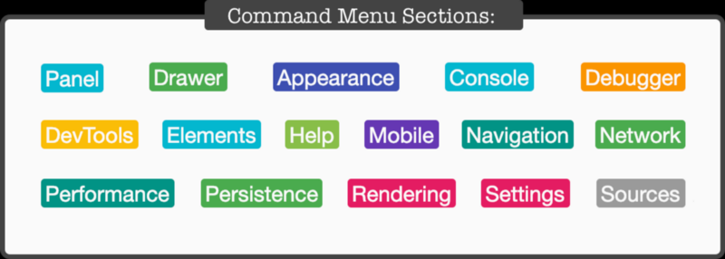
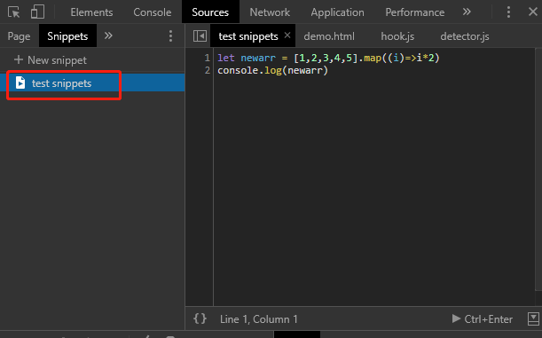
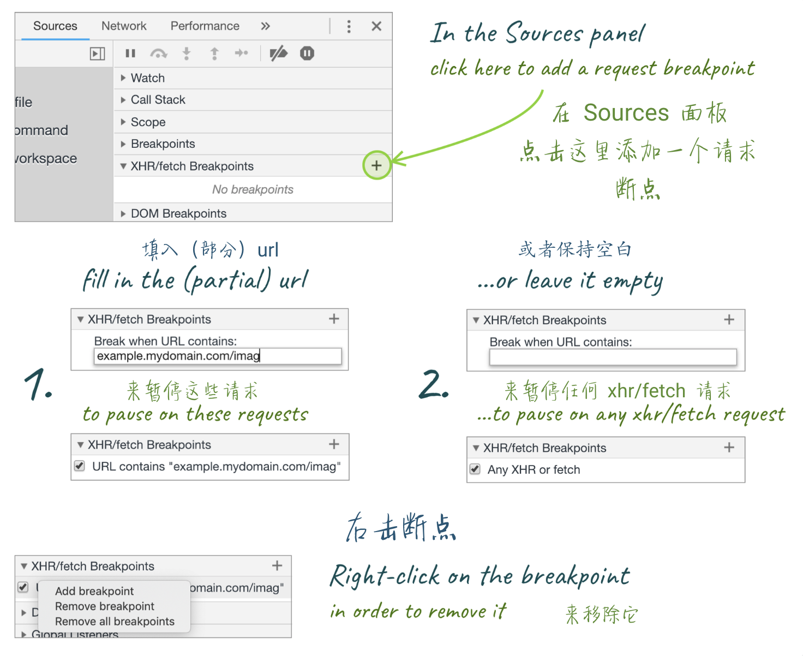

# chrome 调试技巧

> 本笔记来自掘金小册，汲取了其中常用的记录一下

1. copy()   方法是一个全局方法，可以在 `console` 里面复制你想查看的内容，  `copy($_)    copy($0)`

2. 在 Elements 面板中， `$0` 是对我们当前选中的HTML节点的引用，可以直接在控制台打印选择的HTML节点， `$1 $2 $3 $4` 表示之前选中的HTML节点(最多4次)

3. 在`console`面板中 `$` 就是`document.querySelector` 的别名，`$$` 就是 `document.QuerySelectorAll` 的别名，而且返回的就是一个数组，不是 `node list`

4. `$_` 我们在开发中常常打印变量的值，使用 `$_` 表示对上次执行的引用

5. **console 默认就被 async 包裹的，可以直接使用 await 方法** Promise 等

   ```js
   response = await fetch('http://jsonplaceholder.typicode.com/todos/1'); 
   response.json();
   
   await navigator.storage.estimate(); // storage 系统的 占用数 和 空闲数
   ```

6. **Coditional breakpoints 条件断点**，在添加条件断点的时候，可以使用任何这段代码能获取到的当前作用域的值，当我们循环的时候就可以判断条件进入断点

   1. 右击行号，选择 `Add conditional breakpoint ...` 添加条件断点
   2. 右击一个已经设置了断点的，选择 `Edit breakpoint`  编辑断点
   3. 输入一个表达式，只有结果值为 true的时候才会进入断点

7. 因为可以设置条件断点，就可以在在sources 里面直接右键添加 `Add conditional breakpoint ...` 就不用再代码中写 `console.log()`

8. store as global (存储为一个全局变量)， 当我们在js代码中打印的时候，不能复制，可以在打印的内容前面的三角形 右键，变为一个全局变量，再使用 copy 方法

9. 保存堆栈信息( Stack trace) ， 在出现错误时，可以在错误的打印处，右键 `save as`  将错误的堆栈信息保存下来(适用于团队合作)

10. 直接复制HTML节点，选中一个HTML节点，然后右键 copy 就可以复制HTML节点，或者直接 `Ctrl + c`

11. 切换 devTools ，我们可以使用快捷键  `Ctrl + shift + D` 来快速切换控制台的位置

    > 通常是从 开始的位置 到 右边位置， 但是如果一开始就是 右边的位置 那么会切换到 左边的位置）

12. 我们可以使用快捷键快速切换控制台展示的面板， `ctrl + 1`  可以快速切换到 Elements 面板， 使用  `Ctrl + [  /  Ctrl + ]` 可以快速左右切换面板

    > 上面的的快捷键默认是禁用的，需要 devTools >> settings >> Preferences >> *Appearance*  打开这个选项

13. devTools 的前4个面板都可以通过 `Ctrl + F` 来搜索内容, 在 sources 中可以通过 `Ctrl + P` 来搜索具体的某个文件

    

14. 我们可以直接看到的 devTools 只是很小的一部分功能，我们可以使用 command 菜单来使用更多功能

    - 在Chrome 的控制台 `Ctrl + shift + P` 调出命令行
    - 使用 `DevTools` 的 `dropdown` 下拉选项 `run command`

    

12. 快速切换面板的布局， 一般的面板都是左右布局的，有时不利于我们阅读，我们可以在command命令行中输入  `layout` 命令来改变布局为上下布局等(好像只对 Elements 面板有效 ？ )

13. 切换主图，我们可以在 command 命令行 运行 `theme` 的选项来实现控制台的暗色效果

17. 如果要给`console`打印的内容前面添加时间戳，可以在 command 命令里面 输入 `>timestamps`

18. 运行代码块，当我们需要在页面中运行一段代码块的时候，可以将代码块存储在页面中，Snippets 就是将JS代码放到`devTools`中， 在`sources`面板中，选中 Snippets 然后 `add new snippets`， 右键运行就可以执行该段代码， 还可以在 command 命令行中使用 `!name` 的方式来快速执行代码片段(snippets应该是强存储于浏览器上，且跨域名全局可用) 

    

19. 在上下文中，我们可以使用 `monitorEvents` 来监听函数执行时传递的参数
    1. 我们在HTML中选择节点 在 console 面板 $0 查看选中的节点
    2. 在 console 面板执行  monitorEvents($0, ‘click’); 
    3. 点击对应的DOM节点，然后控制台就会输出，节点绑定的函数执行时传入的全部参数

20.  `console.assert(temp, errormsg);`  如果temp为false时，会输出后面的错误信息，减少 if 操作

21. console 打印多个变量的容易混淆变量表示的意义

    ```js
    console.log(temp1, temp2, temp3);
    console.log({temp1, temp2, temp3}); // 这样打印出来就是一个对象的形式
    ```

22. `console.table();` 打印对象时，会展示一个表格的形式，方便查看，还可以传入第二个参数只展示某一个项内容

23. `console.dir();`  打印DOM节点，所关联到的真实的JS对象，包括属性等

24. 回调中直接使用 `console.log`  在循环的时候，我们可能需要判断有些参数有无，可以在回调中使用console的方式，或者直接使用 consolelog 方法作为回调

    ```js
    let { location } = window;
    Object.keys(location).map(item=> console.log(item));
    Object.keys(location).map(console.log); 
    // 下面的方法或得到的参数会比上面那种多，
    ```

25. 在 console 面板中 点击那个眼睛，可以添加实时的JS表达式，它会不断更新，表达式的结果将永远存在

26. 在 network 中如果要重复一个XHR 请求的时候，可以右键 `Replay XHR ` 来重发请求

27. 在某一特定时刻，想要对已经发起的`ajax`请求进行捕获，可以使用 `XHR/fetch breakpoint` 

    > 只能在source 面板中设置

    

28. 通过 `h` 来隐藏HTML节点，我们开发中想要临时隐藏一个DOM节点，可以使用 `h`,但是它占据的宽高不会消失，和删除节点的区别

29. 我们在 Elements 展开DOM节点的时候，可以右键 `expand recursively` 一次展开全部的子DOM

30. DOM断点，我们可以在DOM中添加断点，监听节点或子节点被添加，移除事件,当JS执行操作时就可以打印节点的信息

    1. 点击 `...` 或者元素右键 break on
    2. 选择 `subtree modifications` :监听任何它内部的节点被 `移除` 或者 `添加`的事件
    3. 选择 `attribute modifications` :监听任何当前选中的节点被 `添加`，`移除` 或者 `被修改值`的事件
    4. 选择 `node removal` :监听被选中的元素被 `移除` 的事件


## Drawer

devTools 中只是罗列了常用的展示为tab页，其实还有很多隐藏在  `Drawer`中， 在任一的面板使用 `[ESC]` 可以展示 `Drawer`,  也可以使用 command 命令中 `toggle drawer` 来展示

- `Animations`
- `Changes`
- `Console`
- `Coverage`
- `Network conditions`
- `Performance monitor`
- `Quick source`
- `Remote devices`
- `Rendering`
- `Request blocking`
- `Search`
- `Sensors`
- `What’s new`

1. 控制传感器 Sensors ：面板可以让你模拟特定的的位置，支持从预定义的位置中选择，或则手动添加经纬度，添加的值将被 `navigator.geolocation.watchPosition` 报告

2. Sensors  还可以模拟手机在3D空间中的位置，测试APP的加速计

3. `Network conditions`： 面板可以模拟特定的网络行为，主要用来测试页面资源的大小和离线功能，还能模拟特定的用户代理(例如 IE8，9等)

4. `quick source` 可以查看资源，让我们显示Elements的同时查看JS代码，设置断点等

5. **检测代码 coverage**:  可以使用 `coverage`面板来检测页面冗余代码的摘要细节信息，使用该工具可以跟踪当前JS和CSS代码中**那些行正在被执行，并显示未使用字节的百分比**

6. changes : 面板 可以查看你在DevTools中修改的样式内容，我们有时会忘记修改了那些内容，此时可以修改完成之后，使用 `command` 命令 `show change` 掉出 `drawer` 中的 changes面板，会将修改的内容全部罗列出来，展示方式和Git类似，方便我们查看修改的全部内容

   > DOM 节点的内联样式好像不能显示出来