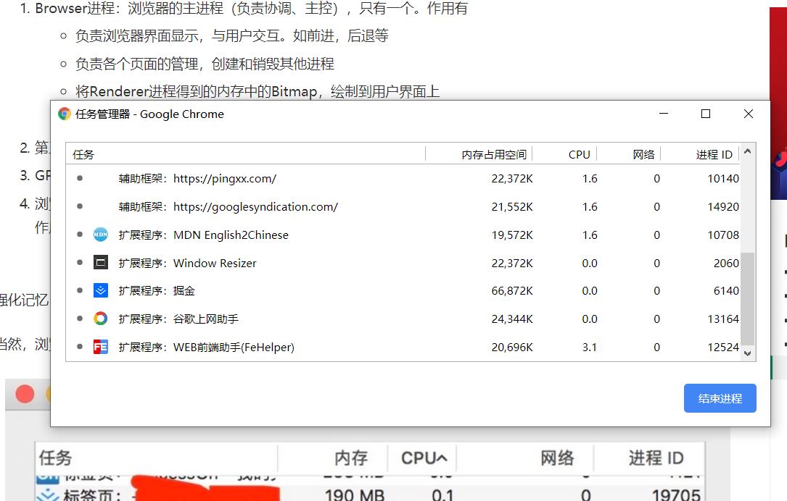

## 浏览器多线程和js单线程
在window的任务管理器可以看到很多后台进程，每个进程都占用CPU和内存，**进程是 CPU 资源分配的最小单位(是能拥有资源和独立运行的最小单位)**
**进程是CPU调度的最小单位(线程是简历在进程的基础上的一次程序运行单位，一个进程中可以有多个线程)**

### 浏览器是多进程的
- 浏览器是多进程的
- 浏览器之所有能运行，是因为系统给它的进程分配了资源
- 每打开一个Tab页面就相当于创建了独立的浏览器进程

可以测试每打开一个新的页面浏览器都会增加一个进程
> 有些浏览器有优化机制，打开新的空白的Tab页面都算是一个进程，所以没打开一个Tab页面就新开一个进程不是绝对的

### 浏览器包含了那些进程
浏览器是多进程的，我们了解一下它包含了那些进程
1. Browser进程，浏览器的主进程(负责协调，主控)，只有一个，
    - 负责浏览器界面显示，与用户交互，前进后退等
    - 负责各个页面的管理，创建和销毁其他进程
    - 将 Renderer 进程得到的内存中的Bitmap,绘制到用户界面上
    - 网络资源的管理，下载
2. 第三方插件进程： 每种类型的插件对应一个进程，仅当使用时才创建，上图中底部的几个进程类型
3. GPU 进程： 最多一个，用于3D绘制
4. 浏览器渲染进程(浏览器内核)(Renderer进程，内部是多线程的),默认每个Tab页面一个进程，互不影响，主要是页面渲染，脚本执行，事件处理等

> 浏览器中打开一个网页相当于新建了一个进程（进程内有自己的多线程）

### 浏览器多进程的特性
1. 避免单个page crash影响整个浏览器
2. 避免第三方插件影响整个浏览器
3. 多进程充分利用多核优势
4. 方便使用沙盒模型隔离插件进程，提高稳定性
5. 缺点是内存等资源消耗更大，利用空间换时间

### 渲染进程
页面的渲染，js的执行，事件的循环，都在这个进程中执行的，**浏览器的渲染进程是多线程的**，下面罗列一下它包含的常用线程
1. GUI 渲染线程： 负责渲染浏览器界面，HTML解析和css解析，构建DOM树渲染，页面重绘或者回流会在该进程执行，**注意GUI渲染进程和js引擎进程是互斥的**当js引擎被执行的时候，该进程被挂起，GUI更新会被保存在一个队列中，等JS引擎执行完毕立即执行
2. JS引擎线程： 常称JS内核，负责处理JS脚本程序，解析和运行，JS引擎一直等待着任务队列中任务的到来，然后加以处理，一个Tab页面中，无论任何时候都只有一个JS线程在运行JS代码。**注意JS线程和GUI渲染线程是互斥的，只会有一个处于运行中**
3. 事件触发线程
    - 归属于浏览器而不是JS引擎，用于控制事件循环(JS引擎自己都忙不过来，就需要浏览另开线程协助)
    - 当JS引擎执行定时器（或者是ajax，鼠标点击等）会将对应任务添加到事件线程中
    - 当对应的事件符合触发条件被触发(延时器时间到了，ajax成功)，该线程会把事件添加到事件处理队列的尾部，等待JS引擎处理
    - 由于JS是单线程关系，所有的待处理事件都需要排队等待JS引擎处理
4. 定时触发器线程
    - setInterval与setTimeout所在线程
    - 浏览器定时器不是由JavaScript引擎计时的(本身是单线程，如果处于阻塞状态会影响准确)，因此单独开一个线程来计时并触发
5. 异步http请求线程： 在XMLHttpRequest在连接后是通过浏览器新开一个线程请求，将检测到状态变更时，如果设置有回调函数，异步线程就产生状态变更事件，将这个回调再放入事件队列中

### Browser进程(控制进程)和浏览器内核(Renderer进程)的通信过程
如果打开任务管理器，然后打开一个浏览器就可以看到： **任务管理器中出现了2个进程，一个是主控进程，一个是开tab页的渲染进程**

一个简化的流程：
1. Browser进程收到用户请求，首先需要获取内容(比如网络现在资源)，随后将该任务通过RendererHost接口传递给Render进程
2. Render进程的Renderer接口收到消息，简单解释后交给渲染进程，开始渲染页面
3. Browser进程接收到结果并将结果绘制出来

### 浏览器内核中线程之间的关系

1. GUI渲染线程和JS引擎线程互斥
2. JS阻塞页面加载

### WebWorker  和 ShardWorker

如果一个JS引擎是单线程的，如果JS执行过长时间，就会阻塞页面渲染，所以HTML5中支持了 Web Worker

>Web Worker为Web内容在后台线程中运行脚本提供了一种简单的方法。线程可以执行任务而不干扰用户界面
>
>一个worker是使用一个构造函数创建的一个对象(e.g. Worker()) 运行一个命名的JavaScript文件 
>
>这个文件包含将在工作线程中运行的代码; workers 运行在另一个全局上下文中,不同于当前的window
>
>因此，使用 window快捷方式获取当前全局的范围 (而不是self) 在一个 Worker 内将返回错误

- 创建worker时，js引擎向浏览器申请开一个子进程(子进程是浏览器开的，完全受主线程控制，不能操作DOM)
- js引擎线程与worker线程间通过特定的方式通信，
- 如有耗时的计算，可以单独开一个worker线程，这样不管线程如果计算，都不会影响js线程，只需将结果传递给主线程即可，**但是JS引擎是单线程的本质没有改变**

1. WebWorker 只属于某个页面，不会和其他页面的render进程(浏览器内核进程)共享，每一个tab页面需要单独创建一个WebWorker来计算JS程序
2. ShardWorker是浏览器所有页面共享的，不能采用和worker同意的方式实现，因为不属于某一个render进程，所以是浏览器为shardworker单独创建一个进程来运行JS计算，在浏览器中只能存在一个ShardWorker进程

### [浏览器的渲染过程](./bworwseradd.md)

### [js执行进程和执行过程](../javasript/eventloop.md)
