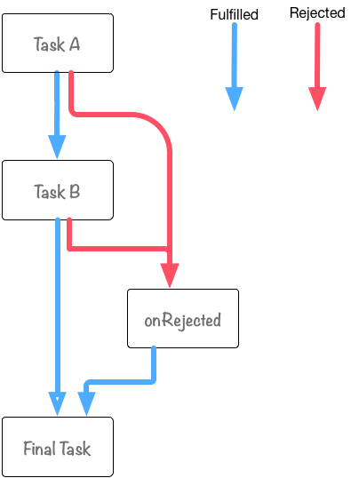

## Promise对象
Promise 是异步编程的一种解决方案，比传统的解决方案——回调函数和事件——更合理和更强大。ES6 将其写进了语言标准，统一了用法，原生提供了Promise对象。Promise是把类似的异步处理对象和处理规则进行规范化， 并按照采用统一的接口来编写。

Promise 就是一个容器，其中保存了某个未来才会结束的事件（通常是一个异步操作）的结果，Promise类似于 XMLHttpRequest，从构造函数 Promise 来创建一个新建新promise对象作为接口。可以使用 new Promise（）的构造函数实例化。

**Promise 与回调函数方式相比有哪些不同：**
1.  在使用Promise 进行一步处理的时候，我们必须按照接口规定的方法编写处理代码。
> 除了Promise对象规定的 then / catch 等方法外其他方法都不可使用，而不会像回调函数那样可以自由的定义回调函数，必须严格遵守固定，统一的编程方式来编写
2. 因为Promise 的统一接口的做法，就可以形成基于接口的各种各样的异步处理模式
3. Promise 可以将复杂的异步处理轻松的进行模式化
```javascript
var promise = new Promise(function(resolve, reject){
	// 其中 resolve / reject 是浏览器内置的，不需要自己设置函数
}); 
promise.then(onFulfilled, onRejected);
// 成功和失败都可以调用,且只会调用一次 下面的方式是同样的效果
promise.then(function(val){}).catch(function(err){})   // 推荐使用
```
像 Promise 这样的全局对象，还有拥有一些静态方法， `Promise.all()`   `promise.resolve` 主要是对 Promise 对象的一些赋值方法。


#### 实际中的使用
一般我们都是使用 `new Promise()` 来创建 Promise 对象，但是可以使用简易方法：`Promise.resolve` 和 `Promise.reject` 两个方法，在进行promise对象的初始化或者编写测试代码的时候都非常方便
```javascript
Promise.resolve(42) // 可以认为是一种语法糖的形式  等同于下面的形式
new Promise(function(resolve){
	resolve(42)
})
```

#### Promise 只能进行异步操作
在上面的方法中，`promise.resolve(42)` promise 对象立刻进入了resolve状态，这个时候`promise.then`注册回调函数的时候，也必然是异步的，这是promise设计上的规定

不止是 promise ，其他函数也会存在这个问题由于 JS 是从上向下执行的，代码出现的位置不同，当前环境的状态不同就会导致可能会产生不同的效果
```javascript
function onReady(fn) {
    var readyState = document.readyState;
    if (readyState === 'interactive' || readyState === 'complete') {
        fn();
    } else {
        window.addEventListener('DOMContentLoaded', fn);
    }
}
onReady(function () {
    console.log('DOM fully loaded and parsed');
});
console.log('==Starting==');
```
上面代码就是在js文件的不同文字，打印的都不同，为了解决这一个问题，我们选择统一使用异步的方式
> 在开发中不要对异步回调函数进行同步调用
	>  - 绝对不能对异步回调函数（即使在数据已经就绪) 进行同步调用
	>  - 如果对异步回调进行同步调用的话，处理顺序可能会与预期不符，产生意料之外的后果
	>  - 对异步回调函数进行同步调用，还可能会导致栈溢出或异常处理错乱等
	>  - 如果想在将来某个时刻调用异步回调函数的话，可以使用 setTimeout 方式

#### Promise 链式操作
在 promise 中可以将任意个 then 连接起来操作，注意其中一个抛出异常就会进入catch 函数，后面的then 就不会执行，链式操作中要传递参数的话需要在函数中 return。 **每一个then 不止是注册了一个回调函数，还会将回调函数的值进行变换，创建并返回一个新的 promise 对象**
```javascript
Promise.resolve()
.then(function teskA(){})
.then(function teskB(){})
.catch(function error(){})
.then(function final(){})
```

`Promise.then().catch()` 像是针对最初的 promise 对象进行了一连串的方法调用，然而实际上不管是 then 还是 catch 方法调用，都返回了一个新的 promise 对象

####  Promise.all
Promise.all 接受一个数组为参数，当数组的所有promise状态都确定的时候才执行 .then方法，**每个promise的结果（resolve或reject时传递的参数值），和传递给 Promise.all 的promise数组的顺序是一致的，then方法中的参数也是数组**
**Promise.all 中的 promise 并不是串行的，是同时执行的**

####  Promise.race
Promise.race 只要有一个promise对象进入 FulFilled 或者 Rejected 状态的话，就会继续进行后面的处理。then方法中的参数就是最先完成的promise的结果，但是并不会取消后续的promise的执行。

### 错误处理
.catch 可以理解为 promise.then(undefined, onRejected)  这是两种不同的处理错误的写法
```javascript
function throwErr(value){ throw new Error(value ) };
function badMain(onRejected){
	return Promise.resolve(42).then(throwErr, onRejected)
};
funtion goodMain(onRejected){
	return Promise.resolve(42).then(throwErr).catch(onRejected)
};
badMain(()=>{console.log('aaaa')});
goodMain(()=>{console.log('bbbb')});
// 上述的代码运行结果是会输出 'bbbb'
```
上面的代码看似只是不同的写法，但是其中还是有差距的
- 在 badMain 函数中虽然指定了错误处理函数，但是 onRejected 函数只能捕获之前 promise 抛出的错误，不能捕获第一个参数抛出的错误，第一个参数产生的错误只能由后续的 onRejected 函数捕获
- 使用promise.then(onFulfilled, onRejected) 的话，在 onFulfilled 中发生异常的话，在 onRejected 中是捕获不到这个异常的。
- goodMain 的代码则遵循了 throwError→onRejected 的调用流程。 这时候 throwError 中出现异常的话，在会被方法链中的下一个方法，即 .catch 所捕获
- 需要着重理解  then /  catch 方法都会返回一个新的 Promise 对象，每次调用方法处理的都不是同一个 promise 对象

#### 注意使用 reject 而不是直接在代码中 throw 错误

### Deferred 和 Promise 的关系
- Deferred和Promise不同，它没有共通的规范，每个Library都是根据自己的喜好来实现的
- Deferred 拥有 Promise
- Deferred 具备对 Promise 的状态进行操作的得特权方法
- Deferred 是可以基于 Promise 对象来构建的

```javascript
function Deferred(){
	this.promise = new Promise(function(resolve, reject){
		this._resolve = resolve;
		this._reject = reject;
	}.bind(this))
}
Deferred.prototype.resolve = function(value){
	this._resolve.call(this.promise, value)
}
Deferred.prototype.reject = function(reason){
	this._reject.call(this.promise, reason)
}
```
上面的代码实现了 Deferred ，在使用promise的地方都可以使用  