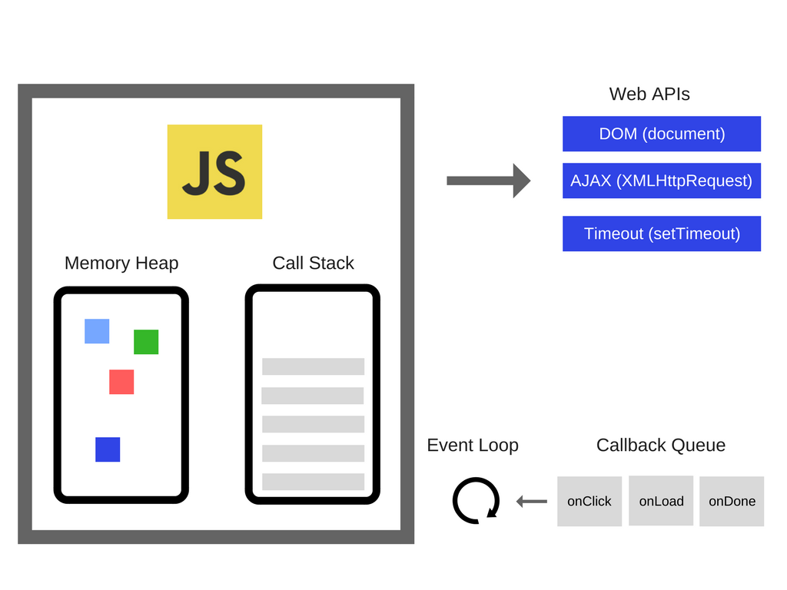
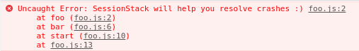

## JS 如何工作: 引擎，运行时，调用堆栈的概述

#### JS引擎
JavaScript引擎是执行JavaScript代码的程序或者说是解释器，JavaScript引擎能够被实现成标准解析器或者能够将JavaScript以某种方式编译为字节码的即时编译器。

- V8： 有Google开发，使用了C++ 编写的开源引擎
- Rhino： 有Mozilla 基金会管理，完全使用java开发的开源引擎
- JAVScriptCore： 有苹果公司为Safari浏览器开发
- chakra(JScript9): IE引擎
- chakra(JavaScript)： 微软edge引擎

JavaScript引擎说起来最流行的就是谷歌的V8引擎了，V8引擎不仅使用在谷歌浏览器中，还是用在Node中，。V8 最初被设计出来是为了提高浏览器内部 JavaScript 的执行性能。为了获取更快的速度，V8 将 JavaScript 代码编译成了更加高效的机器码，而不是使用解释器。

V8引擎在内部也使用了多个线程来处理js代码

- 主线程完成获取代码，然后编译执行任务
- 还有一个单独的线程用于编译，以便主线程可以继续执行，而前者可以优化代码
- 一个`Profiler`(分析器)线程，它会告诉运行时在那些方法上我们花了很多时间，以便优化他们
- 还有一些线程处理垃圾回收扫描


#### 运行时
有些浏览器的API经常被用到（eg: setTimeout）,但是这些API却不是浏览器提供的，



所以说我们还有很多引擎之外的 API，我们把这些称为浏览器提供的 Web API，比如说 DOM、AJAX、setTimeout等等。


#### 调用栈

JavaScript是单线程语言，只能有一个调用栈，调用栈里面是我们函数的执行记录，这样发生错误时能清除的知道异常的堆栈追踪。

```js
function foo() {
  throw new Error('SessionStack will help you resolve crashes :)');
}
function bar() {
  foo();
}
function start() {
  bar();
}
start();
// 下图就可以清除的看到异常时，堆栈的列表
```



