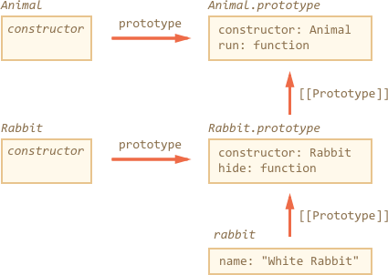
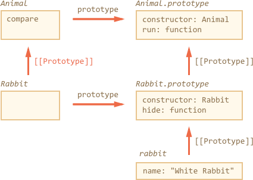
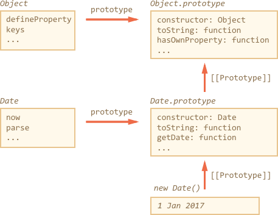

## class 实现继承的方式
在ES6中使用class实现继承，子类必须在 **constructor方法**中调用**super方法**，这是因为子类没有自己的this对象，而是继承父类的this对象，然后对其进行扩展。如果不调用super方法，子类就得不到this对象。必须在使用 this 之前调用super

### super 作为关键字的作用
- super当作函数使用时，代表父类的构造函数。作为函数，super 只能用在子类的构造函数中，用在其他地方就会报错

```js
class A {
  constructor(){
    console.log(new.taget.name)
        this.x = 1;
  }
  print(){
    console.log(this.x)
  }
}
class B extends A{
    constructor(){
        super();
        // A.prototype.constructor.call(this)  当作函数使用的时候等同于下面这句话，主要是其中的 this 指针的问题
        this.x = 2;
    }
    m(){
        super.print()
    }
}

let b = new B();
b.m()   // 2      虽然调用的是 A.prototype.print()   但是绑定了B对象的this 所以输出2 
```

- super 作为对象，在普通方法中，指向父类的原型对象，在静态方法中，指向父类（只能访问父类的静态方法）

```js
class Parent{
  static method(msg){
      console.log('static',msg);   
  }
  method(msg){
    console.log('instance',msg)
  }
}
class Child extends Parent{
    static method(msg){
        super.method(msg)   静态方法中 super 指向父类，方法内部的this指向当前的子类
    }
    method(msg){
        super.method(msg)   普通方法中，super指向父类的原型对象，方法内部的this指向子类实例
    }
}
Child.method(1);  // static 1

var child = new Child()
child.method(2);   // instance  2
```

- **ES6 规定，通过super 调用父类的方法时，super 会绑定子类的 this**

### class继承的实现原理是基于原型继承
```js
class Amianl {}

class Rabbit extends Amianl{}
```
**extends 关键字实际上是在 `Rabbit.prototype` 添加 `[[Prototype]]` 引用到 `Animal.prototype`**, 所以 rabbit 可以访问自己的方法和 Animal 的方法


> extends后面可以跟 返回类的表达式

1. 如果在子类中定义了和父类重名的函数，会先调用自己的方法，我们一般是想扩展父类的方法，所以可以使用class提供的 super 关键字
  - 使用 `super.method()` 调用父方法（需要注意其中涉及到的this指针）
  - 使用 `super()` 调用父构造函数(仅在 constructor 函数中)

```js
class Rabbi extends Animal{
  stop(){
    super.stop(); // 调用父类的 stop 函数
  },
  show(){
    // 箭头函数无 super ，它会从外部函数中获取super
    setTimeout(()=>{super.stop()},1000)  // 正确执行
    setTimeout( function(){ super.stop() }, 1000)  // 会报错 
  }
}
```

2. 如果一个类扩展了另一个类，并且没有 constructor，会自动加载
```js
class Rabbit extends Animal{
    cosntructor(...args){
        super(..args)
    }
}
```

### super 实现原理与 `[[HomeObject]]`
当我们调用 `super.method()`是如何检索 method 的呢，也许可以从 this的 `[[Prototype]]` 中获得方法，`this.__proto__.method` 但是这样是行不通的，下面通过一个普通对象来解释
```js
let animal ={
  name: 'Animal',
  eat(){
    console.log(`${this.name} eats`)
  }
}
let rabbit ={
  __proto__: 'animal',
  name: 'rabbit',
  eat(){
    this.__proto__.eat.call(this) // 改变上下文执行环境  *
  }
}
rabbit.eat()   // rabbit eats
```
上面的代码可以看出当前对象的上下文就是当前对象，目前看是对的，但是如果再继承一个对象，就会出错
```js
// 接上面代码块
let longear={
  __proto__: 'rabbit',
  name: 'longear',
  eat(){
    this.__proto__.eat.call(this) // 注意 this 指针绑定 **
  }
}

longear.eat();   // 报错  Maximum call stack size exceeded 
// 有一种解决办法就是将 eat 中的this 变为当前对象变量名，但是不能用 this 来解决
```
上面报错就是 this 指针的问题，在 *. ** 这两行中 this 指向的都是 longEar 这个对象 ，所有方法的 this 都是指向当前对象，而不是原型或者其他东西， 所以上面 *. ** 两行的 this.__proto__ 都执行了 rabbit ，然后会无线循环调用下去

### `[[HomeObject]]`
JS提供了一种特殊的内部属性`[[ HomeObject ]]`，当函数被指定为类或者对象方法时，其 `[[ HomeObject ]]` 数据为该对象，就是将对象名保存在内部的一个属性中，且不能变化，这种也是安全的，因为 `[[ HomeObject ]]` 仅用于在 super 中获取下一层，
```js
let animal = {
  name: 'Animal',
  eat() {    // [[HomeObject]]  == animal
     console.log(`${this.name} eats`
  }
}
let rabbit = {
  __proto__: animal,
  name: 'Rabbit',
  eat() {    // [[ HomeObject ]] == rabbit
    super.eat()
  }
}
let longEar = {
  __proto__: rabbit,
  name: 'LongEar',
  eat (){   // [[HomeObject]] == longEar
    super.eat()
  }
}

longEar.eat() 
```
上面的每个方法都会在内部 `[[HomeObject]]` 属性中记住它的对象且不变的，然后`super`会使用 `[[HomeObject]]` 来解析原型，就比上面的 this 准确，相对于 `ObjectName.__proto__` 的方式
> 只用有方法语法`method(){}` 的时候会设置 `[[HomeObject]]`  非方法语法`method:function(){}` 这种方式不会设置 `[[HomeObject]]`

### class 定义的静态方法不会被实例继承，但是可以被子类继承
```js
class Animal {
    static run(){}
}
class Rabbit extends Animal {}    // 可以调用 run 方法

let rabbit  = new Animal()   // 不能调用 run 方法
```
原理： extends 同样给 Rabbit 提供了应用到 Animal 的 `[[prototype]]`(对比最上面的图)



```js
class Animal { }
class Rabbit extends Animal {}

Rabbit.__proto__ === Animal    // true
Animal.__proto__  === Function.prototype    //true
Rabbit.prototype.__proto__  === Animal.prototype   // true
```

### 所有类型都是对象，内置对象没有静态`[[prototype]]`引用
例如Object 有自带的 Object.keys, Object.defineProperty 方法，但是 Array, Date 不会继承.




### 原生对象的扩展
Array, Map 等内置对象也是可以扩展的
```js
class PowerArray extends Array{
    isEmpty(){    // 默认的会调用 constructor 方法 和 super（）
        return this.length === 0;
    }
}
let arr = new PowerArray(1,2,3,4,5,6,10,40)
arr.isEmpty()    // false

let filterArr = arr.filter(item => item >= 10)
fiterArr;   [10,40]
fiterArr.isEmpty()   //false

arr.constructor === PowerArray   // true
filterArr.constructor === PowerArray   // true
```
filter map 等内置方法，返回新的继承类型的对象，他们依靠 constructor 属性来做到这一点的，所以当返回新的 fiteArr 数组时，就像 new PowerArray 一样，所以可以调用原型的方法


### class 多继承的方式
如果在开发中，我们一个类需要继承其他不同的类，并且相同的方法都是需要执行的
```js
class BaseModal {
  close (){
    console.log(`this is Basemodal close`)
  }
}
let DragModal = (superClass) => class extends superClass{
  hasLayer = true;
  drag(){
    console.log(`this is dragmodal drag fn`)
  }
}
let ScaleModal = (superClass) => class extends superClass{
  scale(){
    console.log(`this is scalemodal fn`)
  }
  close(){
    console.log(`this is scalemodal close fn`);
    if(super.close){
      super.close();
    }
  }
}
@DragModal
@ScaleModal
class ChildModal extends Basemodal{
  close(){
    console.log(`this is chidlren modal close`)
    if(super.close){
      super.close();
    }
  }
}
let  c = new ChildModal();
```

1. 使用高阶函数的形式，让一个类同时继承了多个类
2. `ScaleModal` 是一个在 ChildModal 和 BaseModal 之间插入一个混入类，继承了 BaseModal 所有方法，接着子类再去继承这个混入类，达到混入方法的目的，也可以实现同时继承多个类的形式
3. 装饰器的执行是先从外到内进入，然后由内向外执行