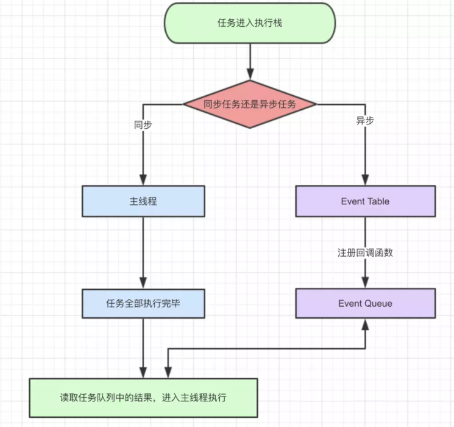
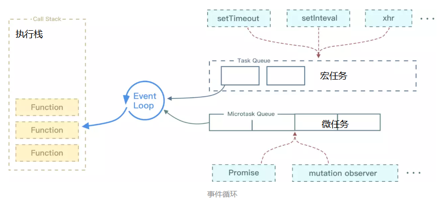
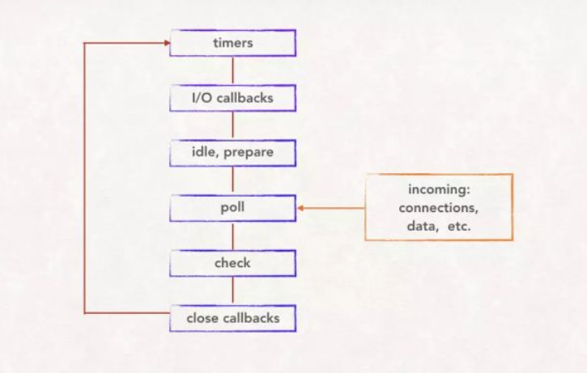
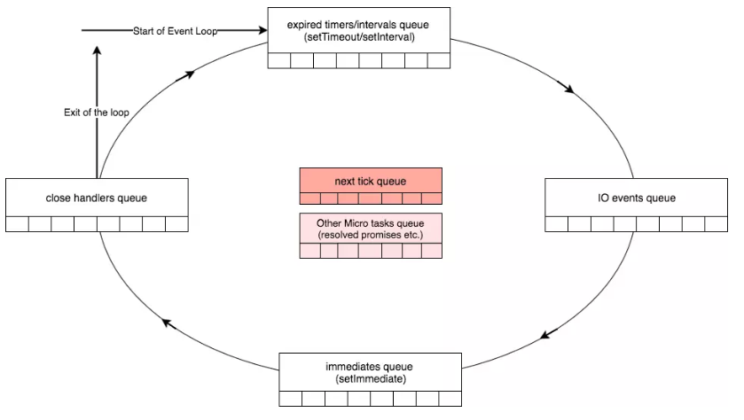

## js事件循环(Event Loop)
js是一门单线程语言，虽然在HTML5中提出了 Web-Worker，但是单线程的本质还是没改变，如果前一个任务执行时间过长后面的任务一直得不到执行，就会引起阻塞。所以将任务分为了 **同步任务和异步任务**， 打开一个网页的时候，网页的渲染就是一大堆同步任务，页面骨架的渲染和页面元素的渲染等，加载图片和音频等就是异步任务



1. 同步任务和异步任务进入不同的执行线程，同步函数在主线程上执行，形成一个执行栈，异步的进入 Event Table并注册函数。
2. 事件触发线程管理着一个任务队列，当指定的事件需要执行时(例如延时器等待了指定的时间)，Event Table会将函数移入 Event Queue中
3. 主线程的任务执行完毕，就会去Event Queue中取出对应的函数，进入主线程执行，上述过程会不短的重复，就是常说的事件循环。

> 上图中Event Queue 包括 macro task queue 和 micro task queue，



不同类型的任务会进入对应的Event Queue，按任务源可以分为**微任务(microtask)和宏任务(macrotask)**，在 ES6 规范中，microtask 称为 jobs，macrotask 称为 task，**要注意宏任务每次只执行队列中的一个而微任务会把队列执行完**

1. 先执行第一个宏任务 script 标签，每次宏任务只会拉出一个Task执行
2. 宏任务执行完毕再执行微任务，microtask会依次执行直至清空队列
3. 微任务执行完毕之后，如有必要会渲染页面
4. 然后开始下一轮的Event Loop，执行宏任务，再执行微任务

> js引擎存在 monitoring process 进程，会持续不断的检查主线程执行栈是否为空，一旦为空，就会去Event Queue那里检查是否有等待被调用的函数。

**微任务包括 process.nextTick ，promise ，MutationObserver**

**宏任务包括 script ， setTimeout ，setInterval ，setImmediate(node环境下) ，I/O ，UI交互事件**

> 今日头条的一道面试题，测试执行顺序...有一个问题就是下面的代码在js文件执行和用webpack启动项目打印出来的结果不一致 ？？？

```js
console.log('script start')

async function async1() {
  await async2()
  console.log('async1 end')
}
async function async2() {
  console.log('async2 end')
}
async1()

setTimeout(function() {
  console.log('setTimeout')
}, 0)

new Promise(resolve => {
  console.log('Promise')
  resolve()
})
  .then(function() {
    console.log('promise1')
  })
  .then(function() {
    console.log('promise2')
  })

console.log('script end')

/*
script start
async2 end
Promise
script end
promise1
promise2
async1 end
setTimeout
*/
```
首先先来解释下上述代码的 async 和 await 的执行顺序。当我们调用 async1 函数时，会马上输出 async2 end，并且函数返回一个 Promise，接下来在遇到 await的时候会就让出线程开始执行 async1 外的代码，所以我们完全可以把 await 看成是让出线程的标志。

然后当同步代码全部执行完毕以后，就会去执行所有的异步代码，那么又会回到 await 的位置执行返回的 Promise 的 resolve 函数，这又会把 resolve 丢到微任务队列中，接下来去执行 then 中的回调，当两个 then 中的回调全部执行完毕以后，又会回到 await 的位置处理返回值，这时候你可以看成是 Promise.resolve(返回值).then()，然后 await 后的代码全部被包裹进了 then 的回调中，所以 console.log('async1 end') 会优先执行于 setTimeout。

### 单独说一下定时器
**JS事件循环的核心是： JS引擎线程和事件触发线程**， 但是其中还隐藏了一些其他的细节，如调用setTimeout后，是如何等待特定时间后才添加到事件队列中的。

这不是使用的JS引擎，而是由定时器线程控制(因为JS引擎线程自己在执行代码)，因为JS线程是单线程的，如果处于阻塞线程状态就会影响后续计时的准确，所有需要单独开一个线程来计时

> 注意使用setInterval方法的时候要注意累计效应(JS运行时间较长，空闲的时候一次性执行多次setInterval事件)
> 在iOS的webview或者Safari浏览中，页面滚动的时候是不执行JS的，浏览器最小化显示的时候也是不执行JS的，需要注意


### Node中的Event Loop
事件循环是 Node.js 处理非阻塞 I/O 操作的机制——尽管 JavaScript 是单线程处理的——当有可能的时候，它们会把操作转移到系统内核中去。[node官网介绍](https://nodejs.org/zh-cn/docs/guides/event-loop-timers-and-nexttick/)

> node中Event Loop的执行顺序的简略图

- timers: 执行被setTimeout() 和 setInterval()注册的回调函数.
- I/O callbacks: 执行除了 close事件的回调、 被 timers和setImmediate()注册的回调.
- idle, prepare: node内部执行
- poll: 轮询获取新的 I/O 事件; node有可能会在这个地方阻塞.
- check: 在这里调用setImmediate() 注册的回调.
- close: 执行close事件的回调


> node 中 Event Loop 实现

1. Node的Event Loop分阶段，阶段有先后，依次是
    - expired timers and intervals，即到期的setTimeout/setInterval
    - I/O events，包含文件，网络等等
    - immediates，通过setImmediate注册的函数
    - close handlers，close事件的回调，比如TCP连接断开
2. 同步任务及每个阶段之后都会清空microtask队列
    - 优先清空next tick queue，即通过process.nextTick注册的函数
    - 再清空other queue，常见的如Promise
3. 而和规范的区别，在于node会清空当前所处阶段的队列，即执行所有task

---
```js
//  用一个复杂点的代码来测试一下
console.log('1');

setTimeout(function() {   // setTimeout1
  console.log('2');
  process.nextTick(function() {
    console.log('3');
  })
  new Promise(function(resolve) {
    console.log('4');
    resolve();
  }).then(function() {
    console.log('5')
  })
})
process.nextTick(function() {
  console.log('6');
})
new Promise(function(resolve) {
  console.log('7');
  resolve();
}).then(function() {
  console.log('8')
})

setTimeout(function() {  // setTimeout2
  console.log('9');
  process.nextTick(function() {
    console.log('10');
  })
  new Promise(function(resolve) {
    console.log('11');
    resolve();
  }).then(function() {
    console.log('12')
  })
})
```
上述代码总共执行了三次事件循环
1. 第一次宏任务为script标签，微任务为 process.nextTick 和promise.then()
2. 第二次宏任务为 setTimeout1， 微任务为延时器里面的代码
3. 第三次宏任务为 setTimeout2， 微任务为延时器里面的代码

> 完整结果  1，7，6，8，2，4，3，5，9，11，10，12; node环境中可能会不一致 1，7，6，8，2，4，9，11，3，10，5，12；

在node中的执行顺序（两个setTimeout延时相同，被合并入了同一个expired timers queue，而一起执行了）
1. 第一次宏任务为script标签，微任务微任务为 process.nextTick 和promise.then()
2. 第二次宏任务为 2个setTimeout，微任务为其中的代码
3. **process.nextTick注册的函数优先级高于Promise**


----
参考文档:

- [Event Loop的规范和实现](https://juejin.im/post/5a6155126fb9a01cb64edb45)