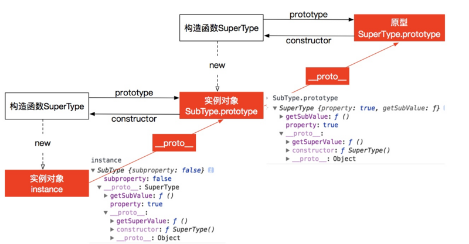
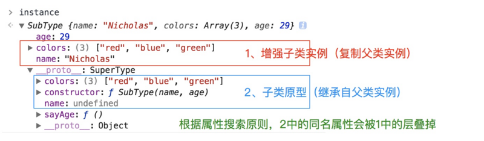
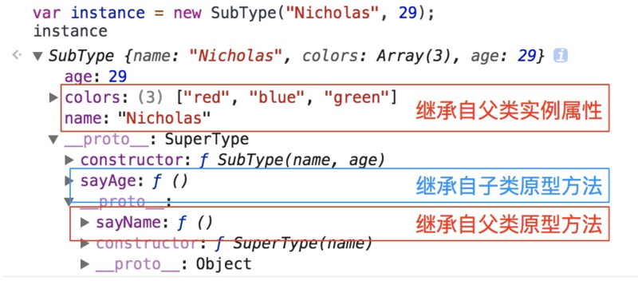

### javascript 常用的八种继承，多继承
1. **原型链继承**
构造函数，原型和实例之间的关系：每个构造函数都有一个原型对象，原型对象都包含了一个指向构造函数的指针，而实例都包含一个原型对象的指针，继承的本质就是复制，重写原型对象，代之以一个新类型的实例
```javascript
function Super(){}
Super.prototype.name = function(){}

function Children(){}
Chilren.prototype = new Super();
Chilren.prototype.constructor = Children;
// 这样有一个问题，写法只能是上面这种，不能使用 xxx.prototype = {} 的形式
```

> 缺点： 多个实例对引用类型的操作会被篡改，因为复杂数据类型都是指向同一个地址，这是原型链通有的缺点，下面涉及到原型链继承都有的缺点

2. **借用构造函数继承**
使用父类的构造函数雷增强子类实例，等同于复制父类的实例给子类（不使用原型）
```javascript
function SuperType(){ this.color = ['res', 'green']};

function SubType(){ 
	Super.call(this) 
};
```
> 上面这种方式就不会产生第一种方式的引用类型的问题
> 缺点：
> - 只能继承父类的实例属性和方法，不能继承原型属性/方法
> - 无法实现复用，每个子类都有父类实例函数的副本，影响性能
	
3. **组合继承**
组合上述两种方式就是组合继承，用原型链实现对原型属性和方法的继承，借用构造函数技术实现实例属性的继承
```javascript
function SuperType(name, color){
  this.name = name
  this.color = ['res', 'green']
};
SuperType.prototype.sayName = function(){}

function SubType(name,age){
	// 继承属性
	SuperType.call(this,name)
	this.age = 25
}
// 继承方法 构建原型
SubType.prototype = new SuperType();
SubType.prototype.constructor = SubType; 
SubType.prototype.fnname= function(){}; 
```
**注意下面这种写法是有问题的**
```javascript
function SuperType(params) {
  // **其中会打印2次** 
  // 第一次就执行到 SubType.prototype = new SuperType(); 这里时，
  // 但是这个时候 params 是为空的，给 sex  
  console.log(params) //{name: "wujun", sex: "man"}  
  this.color = ['res', 'green']
  this.sex = params.sex
};
SuperType.prototype.sayName = function() {}

function SubType(...params) {
  console.log(111, params)  // 打印的是数组的形式
  // 继承属性
  SuperType.call(this, ...params)
  this.age = 26
}
// 继承方法 构建原型
SubType.prototype = new SuperType();
SubType.prototype.constructor = SubType;
const temp = {
  name: 'wujun',
  sex: 'man'
}
var instance1 = new SubType("Nicholas", 29);
```

> 缺点：
> 第一次调用 SuperType() :   给 SubType.prototype 写入两个属性 name, color
> 第二次调用 SuperType() ： 给 instance1 写入两个属性 name, color
> 实例对象 instance1 上的两个属性就屏蔽了其原型对象 SubType.prototype的两个同名属性，所以组合模式的缺点就在使用子类创建实例对象时，其原型中会存在两份相同的属性/方法

4. **原型式继承**
利用一个空对象作为中介，将某个对象直接赋值给空对象构造函数的原型
```javascript
function object(obj){
  function F(){}
  F.prototype = obj;
  return new F();
}
```
- ES 5 中提供了原生的 Object.create() 方法替代上面的方法
> 缺点：
> 原型链继承多个实例的引用类型属性指向相同，存在篡改的可能，和 第一点一样
> 无法传递参数

5. **寄生式继承**
核心：在原型式继承的基础上，新增对象，返回构造函数
```javascript
function createAnother(params){
  var clone = object(params) // 通过调用 object() 函数创建一个新对象
  clone.sayHi = function(){  // 以某种方式增强对象
	console.log('hi')
  }
  return clone;   // 返回这个对象
}
```
函数的主要作用是为构造函数新增属性和方法，以增强函数
```javascript
var person = {
  name: 'wujun',
  friends: ['liyuan', 'tome']
}
var anotherPerson = createAnother(person)
anotherPerson.sayHi();   // hi
```
> 缺点：
> 原型链继承多个实例的引用类型属性指向相同，存在篡改可能，和第一种一样
> 无法传递参数

6. **寄生组合式继承 -- 目前最成熟的方法，现在普遍库实现方式**
结合借用构造函数传递参数和寄生式模式实现继承
```javascript
function inheritPrototype(subType, superType){
  // 创建对象，创建父类原型的一个副本
  var prototype = Object.create(superType.prototype);
  // 增强对象，弥补因重写原型而失去的默认的 constructor
  prototype.constructor = subType;
  // 指定对象，将新创建的对象赋值给子类的原型
  subType.prototype = prototype;
}
// 父类初始化实例属性和原型属性
function SuperType(name){
  this.name = name;
  this.colors = ["red", "blue", "green"];
}
SuperType.prototype.sayname = function(){}
// 借用构造函数传递增强子类实例属性（支持传参和避免篡改）
function SubType(name, age){
  SuperType.call(this, name)
  this.age = age;
}

// 将父类原型指向子类
inheritPrototype(SubType, SuperType);

// 新增子类原型属性
SubType.prototype.sayAge = function(){}

let instance1 = new SubType('wujun', 26);
let instance2 = new SubType('liyuan', 24);
```

> 这个例子的高效率体现在它只调用了一次 SuperType 构造函数，并且因此避免了在 SubType.prototype 上创建不必要的，多余的属性，于此同时，原型链还能保持不变，所以还能够正常使用 instanceof 和 isPrototypeOf() 

7. **混入方式继承多个对象**
用一个子对象可以继承多个父类的原型，实现子类的组合
```javascript
function MyClass(){
  SuperClass.call(this);
  OtherSuperClass.call(this);
}
// 继承一个类
MyClass.prototype = Object.create(SuperClass.prototype)
// 混合其他
Object.assign(MyClass.prototype, OtherSuperClass.prototype)
// 重新指定 constructor
MyClass.prototype.constructor = MyClass

MyClass.prototyep.myMethod = function(){ // do something }
```
> Object.assign 会把 OtherSuperClass 原型上的函数拷贝到 MyClass 原型上，使 MyClass 的原型实例都可用 OtherSuperClass 的方法

8.   **ES6 类继承 extends**
extends 关键字主要用于类声明或者类表达式中，以创建一个类，该类是另一个类的子类，其中 constructor 表示构造函数，一个类只能有一个构造函数，有多个会报错 - SyntaxError ,如果没有显示指定构造方法，则会添加默认的 constructor 方法。使用 super() 可以继承父类的全部方法
```javascript
class SuperType{
  constructor(height, width){
    this.height = height;
    this.width = width;
  }
  get area(){
    return this.calcArea()
  }
  calcArea(){
	 return this.height * this.width
  }
}
const temp = new SuperType(10, 20)
-------------------------------------------------------
*********  继承  *******
class SubType extends SuperType{
  constructor(length){
    super(length, length)
    this.name = 'wujun'
  }
  get area(){
	return this.height * this.width
  }
}
```
extends 继承的核心代码如下，其实现和上述的寄生组合式继承方式一样
```javascript
function _inherits(subType, superType){
  subType.prototype = Object.create(superType && superType.prototype,{
    constructor: {
      value: subType,
      enumerable: false,
      writable: true,
      configurable: true
    }
  })

  if(superType){
    Object.setPrototypeOf
    ? Object.setPrototypeOf(subType, superType)
    : subType.__proto__ = superType;
  }
}
```

**总结一些要点**

1. 函数声明和类声明的区别： 函数声明会提升，类声明不会，首先需要声明类，然后访问他，否则会报错 ReferenceError
2. ES5 和ES6 继承的区别
	- es5的继承本质上是先创建子类的实例对象，然后将父类的方法添加到this上（parent.call(this)）
	- ES6 的继承有所不同，实质上是先创建父类的实例对象this，然后再用子类的构造函数修改this，因为子类没有自己的this对象，所以必须先调用父类的 super() 方法，继承父类的 this 对象，否则新建实例会报错