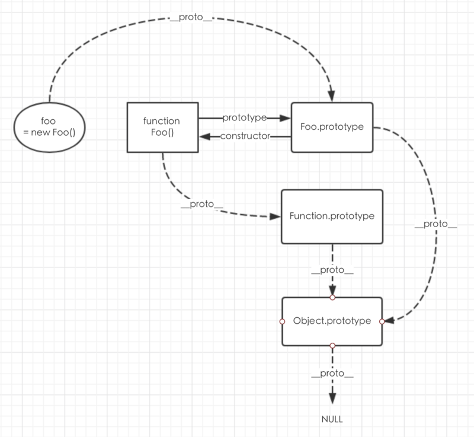

## proto和prototype的区别和联系
```js
function Foo(firstName, lastName){
    this.firstName = firstName;
    this.lastName = lastName; 
}
Foo.prototype.logName = function(){
    Foo.combineName();   // 理解这里为什么出错，用this就是可以的
    console.log(this.fullName);
}
Foo.prototype.combineName = function(){
    this.fullName = `${this.firstName} ${this.lastName}`
}

var foo = new Foo('Sanfeng', 'Zhang');
foo.logName(); // Uncaught TypeError: Foo.combineName is not a function
```

### prototype 
`prototype` 是一个拥有 [[Construct]] 内部方法的对象才有的属性，ES6 中的类，对象的方法等，但是箭头函数就没有 `[[Construct]]` 因此没有 `prototype` 这个属性

当创建函数时，JS会为这个函数自动添加 `prototype` 属性，指向的是 `Functionname.prototype` 我们可以设置原型对象添加属性或者方法

### __proto__
每个对象都有 `__proto__` 属性，这个属性用来标识自己所继承的原型。

**JS中任意对象都有一个内助属性 `[[Prototype]]` 大多数浏览都是用  `__proto__` 来访问，并不是标准用法**


### 原型链
**JS 可以通过`prototype`和`__proto__`在两个对象之间创建一个关联，使得一个对象就可以通过委托访问另一个对象的属性和方法，这样的一个关联就是原型链的原理**

JS函数内部有2个不同的方法： `[[Call]]` `[[Construct]]`

1. 如果不通过关键字调用函数，就执行 `[[Call]]` 函数，直接返回执行代码中的函数体
2. 通过new关键字调用，则访问`[[Construct]]`函数，它负责创建一个实例对象，把实例对象的 `__proto__` 属性指向构造函数的 `prototype`来实现继承构造函数`prototype`的所有属性和方法，将 this 绑定到实例上，然后在执行函数体


上图的构造函数的代码表示
```js
foo.__proto__ == Foo.prototype;
foo.__proto__.__proto__ == Foo.prototype.__proto__ == Object.prototype;
foo.__proto__.__proto__.__proto__ == Foo.prototype.__proto__.__proto__ == Object.prototype.__proto__ == null;
// 所有原型链最终的结果都是 null
```