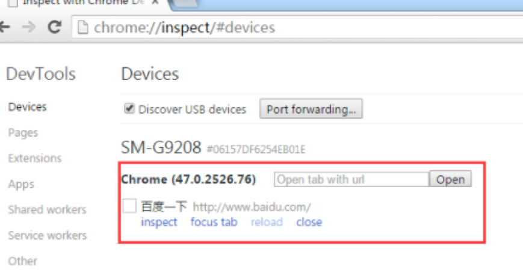
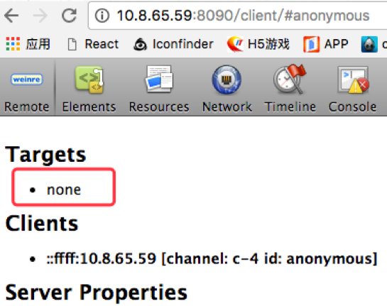
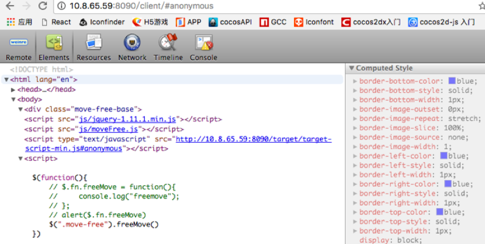
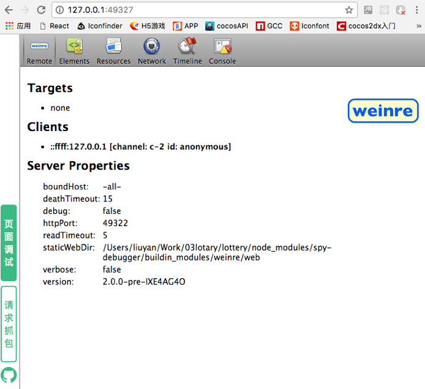
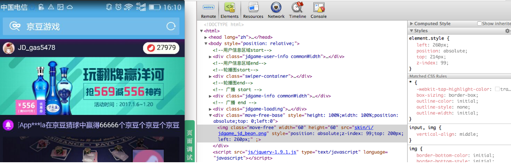

## 手机调试功能

本文主要介绍了3中移动端测试的方式，可以按照自己需求选择

1. chrome 真机调试
2. weinre 调试
3. spy-debugger 调试

第一种 Chrome 真机调试，有一个很大的局限性就是，只能调试手机端的Chrome浏览器，对于QQ 和 UC浏览器不适用，在测试兼容性问题时，帮助不大，主要是简单快捷

第二种 weinre 调试方式，安装和使用不复杂，适用于全平台的调试，任何手机的任何浏览器皆可以调试，只是需要手机和电脑在同一个网段下

第三种 `spy-debugger` 安装稍微复杂一点， `spy-debugger` 集成了weinre，不过增加了抓包工具，方便调试


#### Chrome真机调试

手机端下载Chrome浏览器，用USB连接到电脑，打开手机的USB调试模式

然后在PC端打开 Chrome浏览器，在地址栏输入 `chrome://inspect`  勾选 `discovery usb device` 然后在手机端浏览网页就可以看到如下页面，点击 inspect 进行调试




#### wenire真机调试

Weinre是一款基于 web inspector的远程调试工具，借助网络，可以在在PC上直接调试运行在移动设备上的远程页面

> 本地服务器: 可以使用http-server、tomcat等,也可以使用编译器集成的服务

全局安装： `npm install -g weinre`

启动  `weinre --httpPort 8090 --bounHost -all-`

```she
weinew启动参数说明:
httpPort: 设置Wninre使用的端口号，默认是8080
boundHost: [hostname | Ip | -all-]: 默认是 ‘localhost’.
debug [true | false] : 这个选项与–verbose类似， 会输出更多的信息。默认为false。
readTimeout [seconds] : Server发送信息到Target/Client的超时时间， 默认为5s。
deathTimeout [seconds] : 默认为3倍的readTimeout，页面超过时间没响应就断开连接
```

启动了weinre之后，我们在浏览器中输入localhost:8090.显示如下界面，表示已经启动成功。


点击debug client user interface，进入调试页面。



当前的targets 中内容为空，现在我们需要另外一点操作，在我们要调试的页面中，增加一个脚本

```js
<script src="http://localhost:8090/target/target-script-min.js#anonymous"></script>
// 需要将 localhost 换成本机的IP地址
```

然后，我们在本地启动一个服务器，可以是`http-server`,启动之后，我们在手机端访问要调试的网页。然后就会发现targets下面增加了记录。这时，我们就可以点击Elements进行调试。



修改样式时，会在手机端即时生效，并且也可以查看控制台信息，唯一一点就是，不能进行断点调试。

**最后，在调试结束之后，别忘记删除嵌入的script。**

除了这种方法之后，还介绍了在手机端保存一段Js代码，在需要调试某个页面时，点击执行JS,但是现在浏览器为了安全起见，已经不再支持此方法。默认的方法是搜索，而非执行，所以不可取。


#### spy-debugger 真机调试

用这个方法，我们不再需要自己增加和删除脚本。`Spy-debugger`内部集成了`weinre`，通过代理的方式拦截所有html自动注入`weinre`所需的js代码。简化了`weinre`需要给每个调试的页面添加js代码。spy-debugger原理是拦截所有html页面请求注入`weinre`所需要的js代码。让页面调试更加方便。

特性

- 页面调试 + 抓包
- 支持HTTPS
- spy-debugger 内部集成了 weinre node-mitmproxy、AnyProxy
- 自动忽略原生APP发起的HTTP请求，只拦截 webview 发起的HTTP请求，对使用了SSL pinning技术的原生App不造成任何影响
- 可以配合其他代理工具一起使用（默认使用AnyProxy）

安装与使用

1. 全局安装  `npm install -g spy-debugger`
2. 启动 spy-debugger   可以指定端口   [-p 8888]
3. 设置手机代理，代理的地址为PC的IP地址，代理端口为 ` spy-debugger  ` 默认端口 9888
   1. Android设置步骤:设置 - WLAN - 长按选中网络 - 修改网络 - 高级 - 代理设置 - 手动
   2. iOS设置代理步骤：设置 - 无线局域网 - 选中网络 - HTTP代理手动
4. 手机安装证书(node-mitmproxy CA根证书)
   1. 第一步生成: `spy-debugger initCA`   生成CA 根证书，(根证书生成在 `/Users/XXX/node-mitmproxy/ 目录下(Mac)`)
   2. 安装证书： 把 `node-mitmproxy` 文件夹下的 `node-mitmproxy.ca.crt ` 传到手机上安装
   3. spy-debugger 启动界面，同样，在手机端刷新页面之后，taigets中会有记录



以我曾经做的京东游戏的页面展示一下效果，当我们在手机上选中一个元素时，可以在电脑上看到相应的信息，这样我们就可以看出有可能是什么样式不兼容导致了UI的异常了，同样，还可以在控制台中看到JS的log信息，对于移动端调试来说非常有帮助。



##### 总结

1. chrome  inspect 应用场景有限
2. weinre安装简单，使用过程中需要增加和删除script，如果调试页面很多的情况下，不适用
3. spy-debugger安装略复杂，但是使用过程非常愉快。