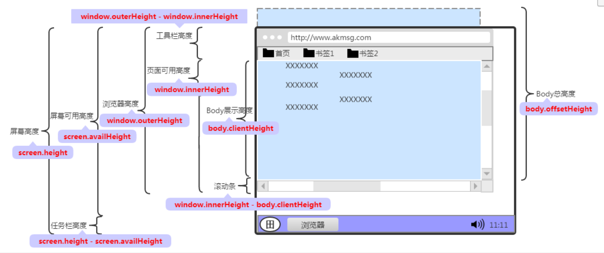

## mobile适配
之前的几年中可以使用 Flexible 来实现H5页面的布局，通过Hack手段来根据设备的dpr值相应改变<meta>标签中viewport的值，但是现在我们可以放下 Flexible，使用新的适配方案了。

在移动布局，需要面对两个最为重要的问题
1. 各终端下的适配问题
2. Retina 屏的细节处理
不同的终端，我们面对的屏幕分辨率，DPR，1px, 2x图等一系列问题，现在我们可以通过使用css原生技术来处理

### 适配终端
以前的Flexible方案是通过JS来模拟 VW 的特性，现在这个属性已经被大多数浏览器支持，可以直接使用了。 VW 是基于 Viewport 视窗的长度单位，这里的视窗指的就是浏览器可视化区域，window.innerWidth / window.innerHeight 的大小


在css3中和viewport 相关的单位有四个 Vw, Vh, Vmin, Vmax
- Vw: 是viewport width 的简写，1vw 等于视窗宽度的1%
- Vh: 是viewport height 的简写，1vw 等于视窗宽度的1%
- vmin: vmin的值是当前 vw和vh中较小的值
- vmax: vmin的值是当前 vw和vh中较大的值


所以现在的开发可以直接使用 vw来作为单位，目前我们的设计稿是使用的750px宽度的，`100vw = 750px; 1vw=7.5px`,我们在开发中不想自己计算值的话可以直接使用[postcss-px-to-viewport](https://github.com/evrone/postcss-px-to-viewport),这样我们就可以直接写设计稿上的像素，会自动转换，一般的配置如下(根目录下的post.config.js文件)，如果像素不是750而是1125的直接改变配置就可以了。
```shell
require('postcss-px-to-viewport')({
    viewportWidth: 750,
    viewportHeight: 1334,
    unitPrecision: 5,
    viewportUnit: 'vw',
    selectorBlackList: [],
    minPixelValue: 1,
    mediaQuery: false
}),
...   其他的postcss插件
```

上面解决了转换的计算，我们一般页面上那些地方使用vw来适配页面，
1. 容器适配，可以使用vw
2. 文本的适配，可以使用vw
3. 大于1px的边框，圆角，阴影都可以使用vw
4. 内距和外距都可以使用vw


### viewport 的不足之处
1. 比如当容器使用vw单位，margin采用px单位时，很容易造成整体宽度超过100vw，从而影响布局效果。(对于类似这样的现象，我们可以采用相关的技术进行规避。比如将margin换成padding，并且配合box-sizing。只不过这不是最佳方案，随着将来浏览器或者应用自身的Webview对calc()函数的支持之后，碰到vw和px混合使用的时候，可以结合calc()函数一起使用，这样就可以完美的解决。)
2. 另外一点，px转换成vw单位，多少还会存在一定的像素差，毕竟很多时候无法完全整除。


### [解决1px方案](./mobile1px.md)


### 总结一下
1. 使用vw来实现页面的适配，并且通过PostCSS的插件`postcss-px-to-viewport`把px转换成vw。这样的好处是，我们在撸码的时候，不需要进行任何的计算，你只需要根据设计图写px单位
2. 为了更好的实现长宽比，特别是针对于img、vedio和iframe元素，通过PostCSS插件`postcss-aspect-ratio-mini`来实现，在实际使用中，只需要把对应的宽和高写进去即可
3. 为了解决1px的问题，使用PostCSS插件`postcss-write-svg`,自动生成border-image或者background-image的图片


### 降级处理
vw方案并不是所有的机型都支持了，如果业务需求，我们可以进行降级处理
1. CSS Ployfill: 通过响应的Polyfill做处理，目前针对vw单位主要有[vminpoly](https://github.com/saabi/vminpoly)、[Viewport Units Buggyfill](https://github.com/rodneyrehm/viewport-units-buggyfill)、[vunits.js]和[Modernizr]。个人推荐采用Viewport Units Buggyfill
