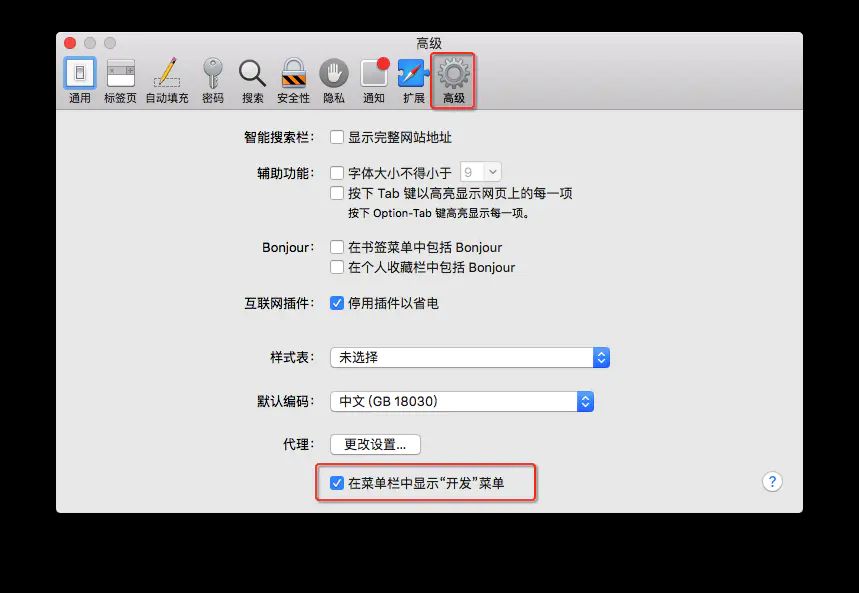
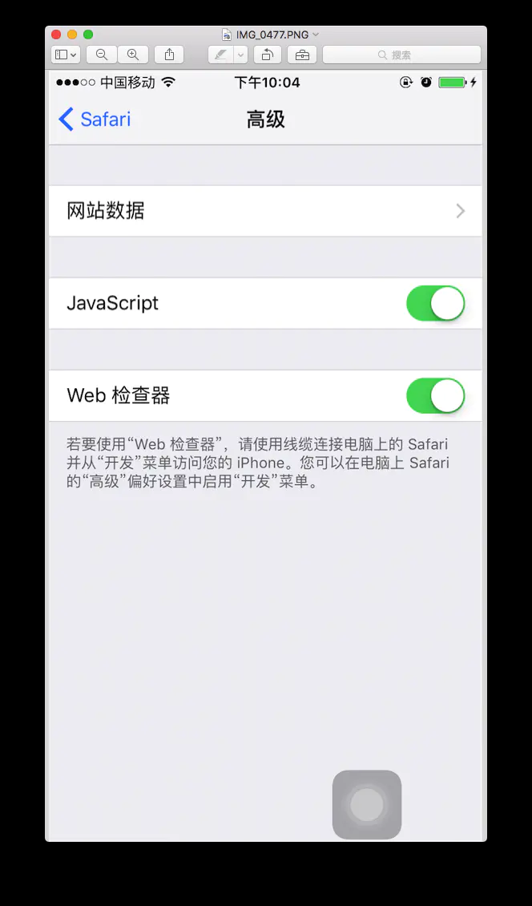
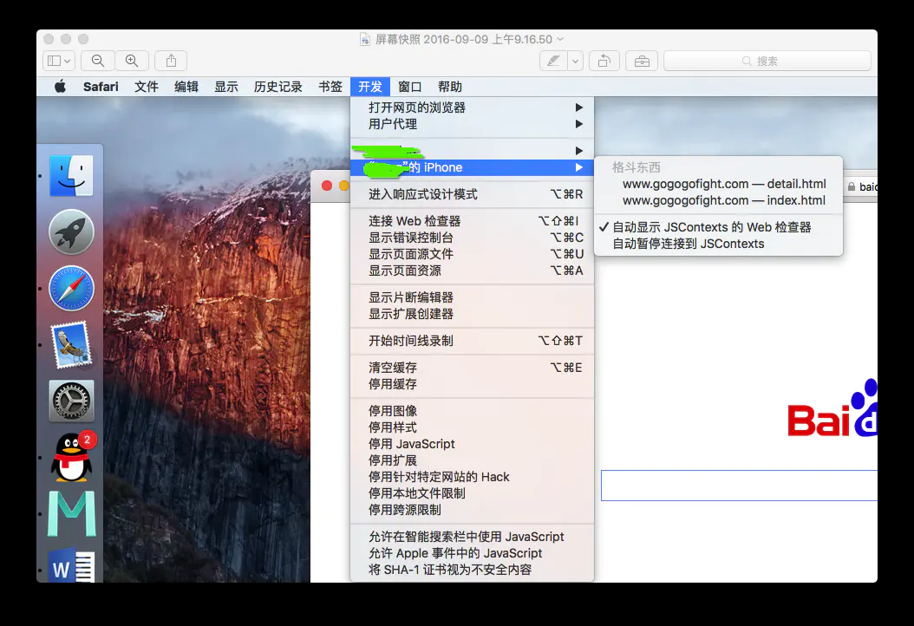
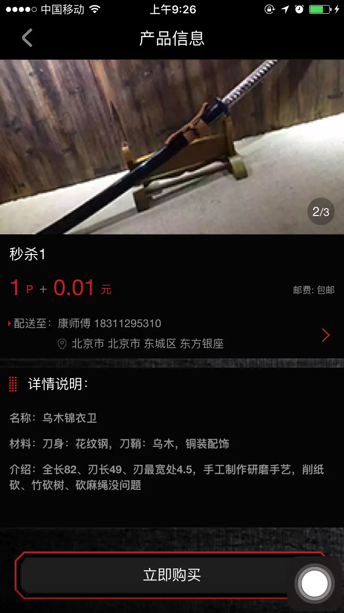
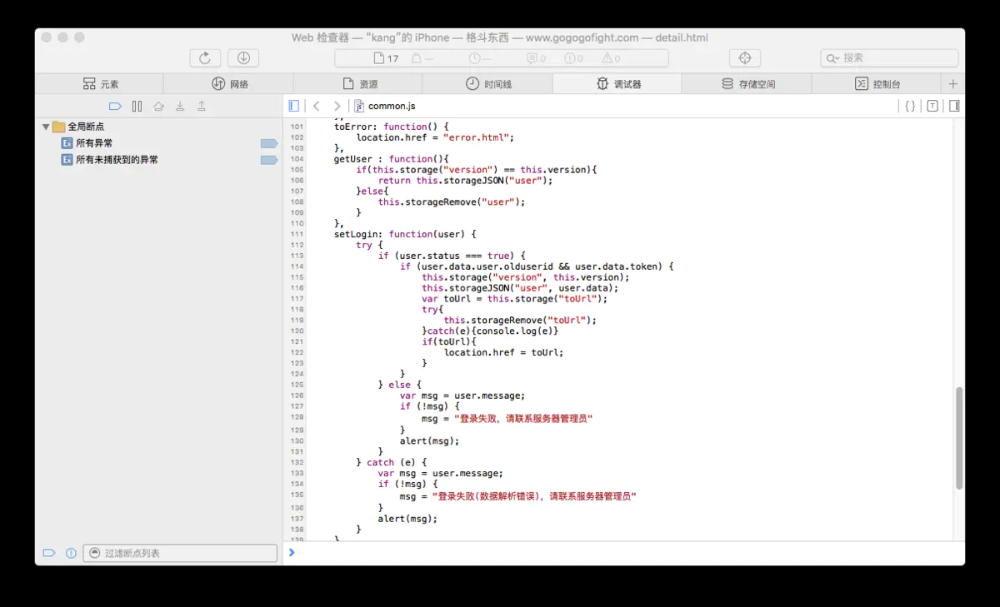

## safari调试APP页面

当下移动端开发过程中大量使用前段H5、js等等技术，而这些web页面的调试在Xcode控制台中不太明了，经常我们移动app运行了方法，但是不能显示响应的效果，这时候或许就是已经报错了，但是我们在Xcode控制台是看不到这些错误。这时候我们就可以用功能强大的Safari浏览器来开启开发模式连接iPhone来调试app脸面的web页面了。

### Safari设置

打开Safari偏好设置，选中 ‘高级菜单’ ，在页面最下方 ‘在菜单中显示开发菜单’ ,  在复选框内打钩，这样设置完毕就能在Safari菜单中看到开发菜单了

### iPhone设置

打开iPhone手机设置APP 选择Safari，找到高级选项，在JavaScript开关web检查器开关，将两个开关都打开

### 调试

准备工作完成，将iPhone连接到Mac，打开Safari浏览器，运行手机APP里面的web页面，在开发菜单中选择连接的手机，找到调试的页面，就能在Safari里面调试了

如果手机打开的页面

就可以在Safari浏览器查看接口返回数据

### Safari控制台

在Safari中鼠标右键，就可以检查元素，接口返回数据等