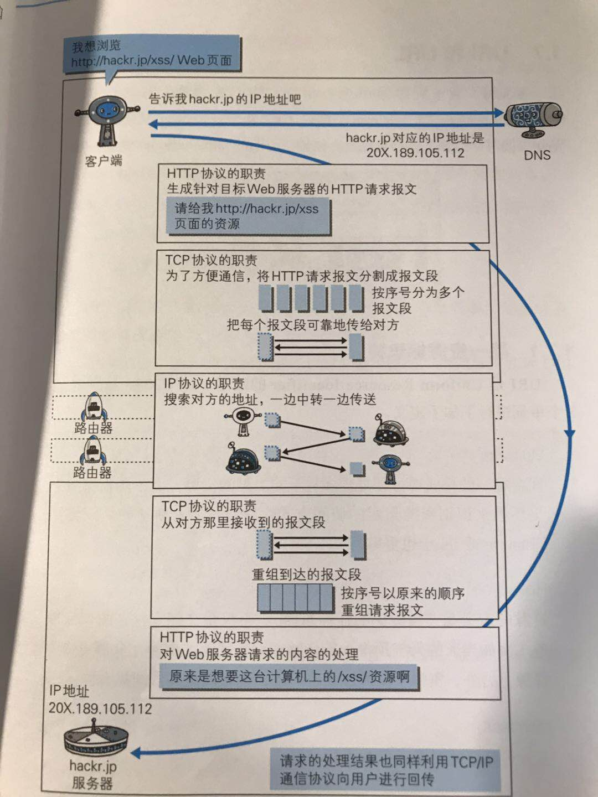
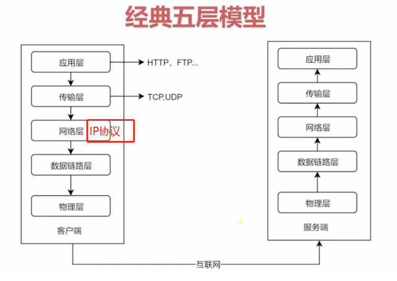

## 协议族
关于网络协议的相关笔记

我们使用的网络(包括互联网)是在TCP/IP协议族的基础上运作的，HTTP协议只是其中的一个子集，TCP/IP 是一个协议族，并不是单指这两个协议，我们常用的协议有：TCP、 DNS、 IP、 PPPoE、 FTP、 UDP....

TCP/IP 协议族中很重要的一点就是分层，TCP/IP 协议族按照层次分别是：应用层 、 传输层 、 网络层 、 数据链路层

