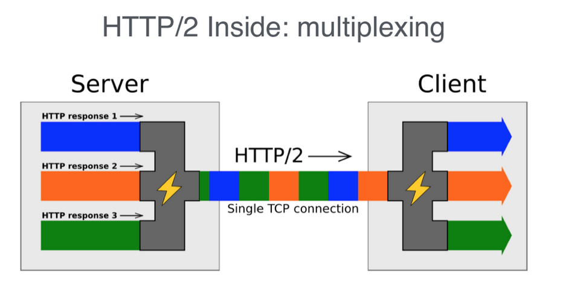
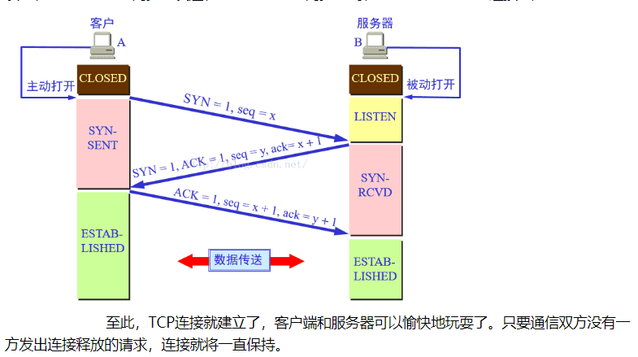
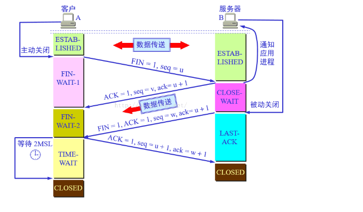

# http/http2/https
HTTP 协议是互联网的基础协议，HTTP 是基于 TCP/IP 协议的应用层协议。它不涉及数据包（packet）传输，主要规定了客户端和服务器之间的通信格式，默认使用80端口。HTTPS 默认使用443端口

我们目前主要是使用的http1.1协议，可以参考[阮一峰的HTTP协议入门](http://www.ruanyifeng.com/blog/2016/08/http.html)

### http/1.0的缺点
1. 线程阻塞，在同一时间内，同一域名的请求有一定数量的限制（浏览一般限定在6个），超过数量的请求会被阻塞，(这样服务器的最大连接数如果为300的话，就最多只能50个人同时访问)
2. 浏览器与服务的连接很短暂，浏览器的每次请求都需要和服务建立TCP连接(3次握手)，服务器完成请求就关闭连接，

### http1.1 和 http1.0的区别
1. 新增的 PUT / PATCH / HEAD / OPTIONS / DELETE 等方法
2. 请求头新增了Host字段： 用来指定服务器的域名，该字段可以将请求发往同一台服务器上的不同网站
3. 持久连接： HTTP1.1 中默认使用长连接，可以被多个请求复用，不需要声明`Connection: keep-live` 当连接一段时间未使用，则自动关闭
4. 管道机制： HTTP1.1 中引入了管道机制，在同一个TCP请求中，客户端可以**同时发送**多个请求，不过服务器还是按照顺序，先响应A请求，完成在响应B请求，之前的机制是先发送A请求，等响应了在发送B请求，前面的可能会造成阻塞（队头阻塞）
5. 响应头新增了Content-Length字段，同一个TCP连接可以传送多个响应，就需要该字段来申明本次响应的数据长度来区分数据包属于那一个请求,使用的前提条件是，服务器知道响应数据的长度。
6. 支持分块传输编码:对于一些很耗时的动态操作来说，服务器需要等待所有操作完成才能发送数据，效率不高，更好的办法是产生一块数据就发送一块数据，采用**流模式**来替代**缓存模式**，`Transfer-Encoding: chunked` 表示响应由数量未定的数据块组成，每个非空的数据块之前，会有一个16进制的数值，表示这个块的长度。最后是一个大小为0的块，就表示本次回应的数据发送完了
7. 缓存处理：在HTTP1.0中主要使用header里的If-Modified-Since,Expires来做为缓存判断的标准，HTTP1.1则引入了更多的缓存控制策略例如Entity tag，If-Unmodified-Since, If-Match, If-None-Match等更多可供选择的缓存头来控制缓存策略
8. 宽带优化及网络连接的使用： HTTP1.0中请求服务器都是将整个对象返回，并不支持断点传输，HTTP1.1在请求头中引入了 range 头域，可以请求资源的某个部分，即返回206(Partial Content)
9. 错误通知：HTTP1.1新增了24个错误编码，409(Conflict):表示请求的资源与资源的当前状态发生冲突;410(Gone):服务器上的某个资源被永久性删除

### HTTP/2 和 HTTP/1.1的区别
1. 二进制协议： 在HTTP1.1的头部信息是文本格式，文本的表现形式有多样性，HTTP/2的头信息和数据都变为二进制，统称为**帧**：头信息帧和数据帧
2. 头信息压缩： HTTP是无状态协议，每次请求都需要携带头信息，请求的很多字段都是重复的，浪费带宽，HTTP/2引入了头信息压缩机制，一方面是采用 gizp 或者 compress 压缩；另一方面试客户端和服务器同时维护了一张头信息表，所有字段都存入其中，生成对应的索引号，以后发生的时候就只发送索引号
3. 服务端推送（server push），HTTP2.0也具有server push功能。目前，有大多数网站已经启用HTTP2.0，利用chrome控制台可以查看是否启用
4. **多路复用**，在一个连接里，客户端可以同时发送多个请求，服务器可以同时发送多个响应，而且不用按照顺序一一对应，这样就避免了“队头阻塞”。举例来说，在一个TCP连接里面，服务器同时收到了A请求和B请求，于是先回应A请求，结果发现处理过程非常耗时，于是就发送A请求已经处理好的部分， 接着回应B请求，完成后，再发送A请求剩下的部分。

5. 数据流： HTTP/2将每个请求响应的所有数据包成为一个数据流，每个流都有一个独一无二的编号，数据包发出的时候都必须标记数据流ID，用来区分是那个数据流（客户端发出的数据流，ID一律为奇数，服务器发出的，ID为偶数） 数据发送过程中，客户端和服务器都可以发送信号（RST_STREAM帧），取消这个数据流。1.1版取消数据流的唯一方法，就是关闭TCP连接。这就是说，HTTP/2 可以取消某一次请求，同时保证TCP连接还打开着，可以被其他请求使用。客户端还可以指定数据流的优先级。优先级越高，服务器就会越早回应。

### HTTPS 协议
最初，HTTPS是与SSL一起使用的；在SSL逐渐演变到TLS时，最新的HTTPS也由在2000年五月公布的RFC 2818正式确定下来。HTTPS并非是应用层的新协议，只是HTTP通信接口部分用SSL 和TLS 协议替代而已，通常，HTTP直接和TCP通讯，当使用SSL时，则变为了先和SSL通信，SSL再和TCP通信，HTTPS就是身披SSL协议外壳的HTTP。

HTTP + 加密 + 认证 +  完整性保护 = HTTPS；解决了明文问题，通信方的认证问题，验证通信报文完整性问题

HTTP和HTTPS对比
1. HTTP协议运行在TCP之上，所有传输的内容都是明文的，HTTPS运行在SSL/TLS之上，SSL/TLS运行在TCP之上，所有传输过程中的数据都是加密的
2. HTTPS协议需要到CA申明证书
3. HTTP默认使用80端口号，HTTPS默认使用443端口
4. HTTPS用户访问速度较慢，需要[SSL握手](http://www.ruanyifeng.com/blog/2014/02/ssl_tls.html)，HTTPS 对速度会有一定程度的降低，而且服务器资源压力较大（要进行大量的密钥算法计算，消耗CPU，内存），因此使用HTTPS需要做好足够的优化，
5. HTTPS可以有效的防止运营商劫持，解决了防劫持的一个大问题.

### TCP连接和断开（三次握手 、 四次挥手）
1. 客户端的应用程序主动打开，并向服务器发送请求报文
2. 服务器应用进程被打开，如同意连接，则发送确认报文
3. 客户端收到确认报文之后，通知上层应用进程连接已建立，并向服务器发送确认报文，服务器接收到确认报文后，也通知上层应用进程连接已建立

数据传输完毕之后
1. 数据传输完毕之后，客户端应用进程发出连接释放报文段，并停止发送数据，其首部 `FIN=1,seq=u`
2. 服务器端收到连接释放报文段，发出确认报文，其首部`ack=u+1, seq=v`,此时本次连接进入半关闭状态，客户端不再向服务器发送数据，而服务器仍会继续发送
3. 若服务器已经没有要向客户端发送的数据，其应用进程就会通知服务器释放TCP连接，这个阶段服务器所发出的最后一个报文的首部为`FIN=1, ACK=1, seq=w, ack=u+1`
4. 客户端收到连接释放的报文段之后，必须发出确认`ACK=1,seq=u+1,ack=w+1`,再经过 2MLS(最长报文段寿命)后，本次TCP连接才真的关闭了

