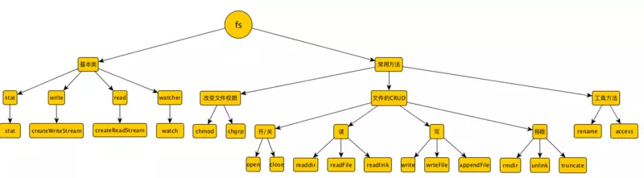

## Buffer/Stream/fs
在后端，在node中，Buffer和Stream处处体现。Buffer是缓冲区的意思，Stream是流的意思。在计算机中，缓冲区是存储中间变量，方便CPU读取数据的一块存储区域；流是类比水流形容数据的流动。Buffer和Stream一般都是字节级操作。

### 二进制缓冲区Buffer
在前端，我们只需做字符串级别的操作，很少接触字节、进制等底层操作，一方面这足以满足日常需求，另一方面Javascript这种应用层语言并不是干这个的；然而在后端，处理文件、网络协议、图片、视频等时是非常常见的，尤其像文件、网络流等操作处理的都是二进制数据。为了让javascript能够处理二进制数据，node封装了一个Buffer类，主要用于操作字节，处理二进制数据。

```js
// 创建一个长度为 10、且用 30 填充的 Buffer。
const buf1 = Buffer.alloc(10, 30)
console.log(buf1)// <Buffer 1e 1e 1e 1e 1e 1e 1e 1e 1e 1e>
// 字符串转Buffer
const buf2 = Buffer.from('javascript')
console.log(buf2)// <Buffer 6a 61 76 61 73 63 72 69 70 74>
// 字符串转 bufferd
console.log(buf2.toString())// javascript
console.log(buf2.toString('hex')) //6a617661736372697074
```

1. Buffer 类似于一个整数数组，可以取下标，有length属性，有剪切复制操作等，很多API也类似数组
2. Buffer的大小在被创建时确定，且无法调整
3. Buffer处理的是字节，两位十六进制，因此在整数范围就是0～255。
4. Buffer可以与string互相转化，还可以设置字符集编码。Buffer用来处理文件I／O、网络I/O传输的二进制数据，string用来呈现。在处理文件I／O、网络I/O传输的二进制数据时，应该尽量以Buffer形式直接传输，速度会得到很好的提升，但操作字符串比操作Buffer还是快很多的

### Buffer内存分配与性能优化
Buffer是一个典型的javascript与C++结合的模块，与性能有关的用C++来实现，javascript 负责衔接和提供接口。Buffer所占的内存不是V8分配的，是独立于V8堆内存之外的内存，通过C++层面实现内存申请、javascript 分配内存。值得一提的是，每当我们使用Buffer.alloc(size)请求一个Buffer内存时，Buffer会以8KB为界限来判断分配的是大对象还是小对象，小对象存入剩余内存池，不够再申请一个8KB的内存池；大对象直接采用C++层面申请的内存。因此，对于一个大尺寸对象，申请一个大内存比申请众多小内存池快很多。

### 流 Stream
**在文件I/O、网络I／O中数据的传输都可以称之为流，流是能统一描述所有常见输入输出类型的模型，是顺序读写字节序列的抽象表示。** 流是有方向的。A端输入数据到B端，对B就是输入流，得到的对象就是**可读流；**对A就是输出端、得到的对象是**可写流**。**有的流即可以读又可以写，如TCP连接，Socket连接等，称为读写流(Duplex)。**还有一种在读写过程中可以修改和变换数据的读写流称为Transform流.

在node中，这些流中的数据就是Buffer对象，可读、可写流会将数据存储到内部的缓存中，等待被消费；Duplex 和 Transform 则是都维护了两个相互独立的缓存用于读和写。在维持了合理高效的数据流的同时，也使得对于读和写可以独立进行而互不影响。

在node中，这四种流都是EventEmitter的实例，它们都有close、error事件，可读流具有监听数据到来的data事件等，可写流则具有监听数据已传给低层系统的finish事件等，Duplex 和 Transform 都同时实现了 Readable 和 Writable 的事件和接口

- 可写流： HTTP requests, on the client、HTTP responses, on the server、fs write streams、zlib streams、crypto streams、TCP sockets、child process stdin、process.stdout, process.stderr
- 可读流：HTTP responses, on the client、HTTP requests, on the server、fs read streams、zlib streams、crypto streams、TCP sockets、child process stdout and stderr、process.stdin
- 可读可写流：TCP sockets、zlib streams、crypto streams
- 变换流：zlib streams、crypto streams
```js
var rs = fs.createReadStream(src);
var ws = fs.createWriteStream(dst);

rs.on('data', function (chunk) {
    if (ws.write(chunk) === false) {
        rs.pause();
    }
});

rs.on('end', function () {
    ws.end();
});

ws.on('drain', function () {
    rs.resume();
});
```
> 值得一提的是writable的drain事件，这个事件表示缓存的数据被排空了。为什么有这个事件呢？起因是调用可写流的write和可读流的read都会有一个缓存区用来缓存写／读的数据，缓存区是有大小的，一旦写的内容超过这个大小，write方法就会返回false，表示写入停止，这时如果继续read完缓存区数据，缓存区被排空，就会触发drain事件，可以这样来防止缓存区爆仓

### 管道的概念
提到流就不得不提到管道的概念，这个概念也非常形象：水流从一端到另一端流动需要管道作为通道或媒介。流也是这样，数据在端之间的传送也需要管道，**只有可读流才具有pipe能力，可写流作为目的地。**
```js
// 将 readable 中的所有数据通过管道传递给名为 file.txt 的文件
const readable = getReadableStreamSomehow();
const writable = getWritableStreamSomehow('file.txt');
// readable 中的所有数据都传给了 'file.txt'
readable.pipe(writable);

// 对流进行链式地管道操作
const r = fs.createReadStream('file.txt');
const z = zlib.createGzip();
const w = fs.createWriteStream('file.txt.gz');
r.pipe(z).pipe(w);
```

pipe不仅可以作为通道，还能很好的控制管道里的流，控制读和写的平衡，不让任一方过度操作。另外，pipe可以监听可读流的data、end事件，这样就可以构建快速的响应：即可解决爆仓问题
```js
// 一个文件下载的例子，使用回调函数的话需要等到服务器读取完文件才能向浏览器发送数据
var http = require('http') ;
var fs = require('fs') ;
var server = http.createServer(function (req, res) {
    fs.readFile(__dirname + '/data.txt', function (err, data) {
        res.end(data);
    }) ;
}) ;
server.listen(8888) ;

// 而采用流的方式，只要建立连接，就会接受到数据，不用等到服务器缓存完data.txt
var http = require('http') 
var fs = require('fs') 
var server = http.createServer(function (req, res) {
    var stream = fs.createReadStream(__dirname + '/data.txt') 
    stream.pipe(res) 
}) 
server.listen(8888)
```


### fs文件模块
s文件模块是高阶模块，继承了EventEmitter、stream、path等底层模块，提供了对文件的操作，包括文件的读取、写入、更名、删除、遍历目录、链接POSIX文件系统等操作。与node设计思想和其他模块不同的是，fs模块中的所有操作都提供了异步和同步两个版本。fs模块主要由下面几部分组成:

1. 对底层POSIX文件系统的封装,对应于操作系统的原生文件操作
2. 继承Stream的文件流 fs.createReadStream和fs.createWriteStream
3. 同步文件操作方法，如fs.readFileSync、fs.writeFileSync
4. 异步文件操作方法， fs.readFile和fs.writeFile



```js
const fs = require('fs'); // 引入fs模块
/* 读文件 */

// 使用流
const read = fs.createReadStream('sam.js',{encoding:'utf8'});
read.on('data',(str)=>{
    console.log(str);
})
// 使用readFile
fs.readFile('test.txt', {}, function(err, data) {
    if (err) {
        throw err;
    }
    console.log(data);
});
// open + read
fs.open('test.txt','r',(err, fd) => {
    fs.fstat(fd,(err,stat)=>{
        var len = stat.size;  //检测文件长度
        var buf = new Buffer(len);
        fs.read(fd,buf,0,len,0,(err,bw,buf)=>{
            console.log(buf.toString('utf8'));
            fs.close(fd);
        })
    });
});

/* 写文件与读取文件API形式类似 */
```
读写文件都有三种方式，他们的区别
1. createReadStream/createWriteStream创建一个将文件内容读取为流数据的ReadStream对象，这个方法主要目的就是把数据读入到流中，得到是可读流，方便以流进行操作
2. readFile/writeFile：Node.js会将文件内容视为一个整体，为其分配缓存区并且一次性将文件内容读/写取到缓存区中，在这个期间，Node.js将不能执行任何其他处理，所以当读写大文件的时候，有可能造成缓存区“爆仓”
3. read/write 读/写文件内容是不断地将文件中的一小块内容读/写入缓存区，最后从该缓存区中读取文件内容

> 同步API也是如此。其中最常用的是readFile，读取大文件则采取用，read则提供更为细节、底层的操作，而且read要配合open。

#### 监听文件
```js
const FSWatcher = fs.watch('eda.txt', (eventType, filename) => {
    console.log(`${eventType}`)
})
FSWatcher.on('change', (eventType, filename) => {
    console.log(`${filename}`)
})
// watch和返回的FSWatcher实例的回调函数都绑定在了 change 事件上

fs.watchFile('message.text', (curr, prev) => {
  console.log(`the current mtime is: ${curr.mtime}`);
  console.log(`the previous mtime was: ${prev.mtime}`);
})
```
监听文件的两种方式
- watch 调用的是底层的API来监视文件，很快，可靠性比较高
- watchFile 是通过不断的轮询 fs.Stat（文件统计数据）来获取文件的变化，较慢，可靠性较低，回调函数的参数是 `fs.Stat` 实例

> 尽可能多的使用watch，watchFile 用于需要得到文件更多信息的场景。

#### 创建压缩文件
```js
const fs = require('fs');
const path = require('path')
const zlib = require('zlib')

fs.createReadStream('./mock/test01.html')
  .pipe(zlib.createGzip())
  .pipe(fs.createWriteStream('test01.html.gz'))
```