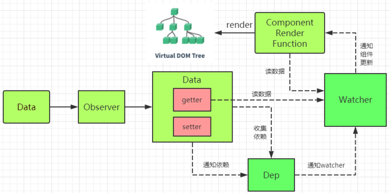

# vue框架
当实例化一个Vue构造函数，会执行Vue 的init方法，在init方法中主要执行三部分内容，一是初始化环境变量，二是处理vue组件数据，三是解析挂载组件，这三个部分构成了Vue的整个执行过程

在初始化的时候，vue将遍历此对象所有属性采用数据劫持结合发布-订阅模式，并通过 `Object.defineProperty` 做数据劫持把所有的属性变为 `getter/setter`，在数据变动时发布消息给订阅者，触发响应的监听回调，属于上述的第二个部分。在生命周期init 和 created 之间执行，`options.data  $options.props  $options.computed  $options.methods  $options.events  $options.watch` 对方法的处理



Object.defineProperty 只能劫持对象的属性， vue2.x 需要对每个对象的每个属性进行遍历，是通过递归 + 遍历data对象来实现数据监控的，如果属性也是对象，就需要深度遍历

Object.defineProperty 在数组的状态下，将数组下标为属性的方式监听的话，性能开销会比较大，所以vue2.x没有实现对数组的动态监听

vue3.x采用了 Proxy 来劫持整个对象，并返回一个新对象，Proxy不仅可以代理对象，也可以代理数组，还可以代理动态增加的属性

```js
// 最简单核心的代码  
function defineReactive(obj, key){
  let val = obj[key]
  Object.defineProperty(obj,key,{
    get(){  return val; },
    set(newValue){ val = newValue;}
  })
}
// 完整代码还需要考虑 对象的属性描述符是否可编辑， array的length 属性就不可编辑 
// 本来是否设置了 getter setter方法
// 属性的值也是对象，需要递归属性值，爆栈的处理
```


**指令的缩写只在其有参数的时候使用**

每个组件实例（就是组件）都有对应的 watcher 对象，会在渲染的过程中把属性记录为依赖，当依赖的setter调用时，就通知`watcher`重新计算，从而使它关联的组件更新，而不是像 `React` 那样更新该组件及其所有子组件

父组件给子组件传参 prop 的时候，如果是非prop特性的值(即在子组件没有申明对应的接受变量) ，则该类的属性会被写到子组件的根元素上面。

因为vue在实例初始化的时候对属性执行了`getter / settter` ，属性必须在data对象上面才能变为属性依赖，在JS中不能将新添加的属性变为响应式的（`Object.observe` 被废弃了）。 
**vue不允许动态添加根级响应式属性，必须在初始化的时候确定好**


异步更新队列： 在vue中更新DOM并不是同步立马更新的，而是vue开启一个队列，缓冲在同一事件循环中发生的所有数据变化（如果同一个watcher被多次触发，只会推入队列一次），然后在一个事件的 'tick' 中，一次性全部执行更新，在内部使用的是 `Promise.then`,如果想立马使用更新后的数据，就需要触发 `vm.$nextTick()`

```javascript
methods: {
	updata: function(){
		this.message = 'new message'
		this.$nextTick(function(){
		// 现在数据已经更新了 可以使用
		})
	}
}
// 返回的是Promise对象，还可以使用
methods: {
  updata: async function(){
    this.message = 'new message'
    await this.$nextTick();
    // 数据已经更新
  }
}
```

vue 是单向数据流，双向绑定只是一种语法糖，那vue是如何做双向绑定的 ？
`Object.defineProperty` 只是用来做响应式更新的，和双向绑定没有关系，下面是双向绑定的实现原理

```javascript
// 语法糖的形式  可以同时响应多个数据 .sync
<PersonalInfo
	v-model="phoneInfo"
	:zip-code.sync="zipCode"
/>
// 编译之后的实现原理
<PersonalInfo
	:phone-info="phoneInfo"
	@change="val=>(phoneInfo=val)"
	:zip-code="zipCode"
	@update:zipCode="val=>(zipCode=val)"
/>
```


指令： 指令带有前缀 `v-` 他们提供vue的特殊特性 `v-model v-bind v-if v-for v-on`等，每一个都有特殊的功能，指令特性预期是单个JS表达式，指令的职责是表达式的值改变时，将其产生的连带影响，响应式的作用域DOM。指令后面能够接受一个参数,表示的是将该参数与指令表达式的值实现绑定，参数可以使用`[]`的形式来实现JS表达式求值

修饰符： 修饰符是指出指令应该特殊绑定的方式。`.prevent`

计算属性：我们可以在vue实例的 `computed` 中声明计算属性（函数的形式），当作组件的数据一样使用，当计算属性依赖的属性发生改变时，计算属性也会发生更新，默认只有getter，但是需要的话可以设置setter ，设值函数

方法： 可以使用方法来实现计算属性的效果，但是需要理解他们两者的区别和使用场景

1. 计算属性会基于它的响应式依赖进行缓存，依赖不变，则计算属性不会重新计算
2. 方法是每次重新渲染的时候都会重新执行
3. 一般两种实现是一致的，但是有性能开销比较大的时候最好使用计算属性缓存

侦听属性（watch）： 一般我们使用计算属性更好，但是如果要访问异步API或者监听router的话，使用侦听属性就会更好

JSX语法：vue可以不用模版直接写 render 渲染函数，使用JSX语法

文本： 数据绑定使用最常见的 `{{}}` 的形式文件插值， `v-one` 是只能插值一次的指令，其中HTML的文本内容是个特殊的，需要使用 `v-html`指令， 在`{{}}`语法中可以使用JS的代码运算，也会被解析

双大括号 `{{}}` 不能作用在HTML特性上，遇到特性的只能使用各种指令，指令使用 `v-bind:id="XXXX"` 其中的 XXXX 会被当作变量来解析，如果是只想在HTML上设置固定的特性，则不适用指令，直接写属性即可，其中指令的变量中还可以使用JS的运算（每个绑定只能是单个表达式）

事件也好，插槽也好都是可以通过属性的方式去解决的

vue中的插槽有三种：单个插槽、具名插槽、作用域插槽，


### vue 注册组件的方式

1. 全局注册的方式 全局注册的组件可以用在其被注册之后的任何 (通过 `new Vue`) 新创建的 Vue 根实例，也包括其组件树中的所有子组件的模板中。

   ```js
   // 定义名为 todo-item 的新组件 这样全局注册的每个组件名字不能重复
   Vue.component('todo-item', {
     template: '<li>这是个待办项</li>'
   })
   ```

2. 组件的测试方式


自定义组件的循环`v-for`  在组件中使用`v-for`的时候，数据不会被自动传递到组件里，因为组件有自己独立的作用域，为了把数据传递到组件里，我们使用`props`

```js
<my-component
	v-for="(item, index) in items"
	v-bind:item="item"
	v-bind:index="index"
	v-bind:key = "item.id"
/><my-component>
```

计算属性中依赖的数据必须是响应式数据才能生效


vue组件中使用第三方的插件的时候，需要在组件销毁的时候销毁第三方插件的实例，可以在 `beforeDestroy` 声明周期中，还可以使用 **程序化的侦听器** 的方式来销毁插件实例

```js
mounted: function () {
  var picker = new Pikaday({
    field: this.$refs.input,
    format: 'YYYY-MM-DD'
  })

  this.$once('hook:beforeDestroy', function () {
    picker.destroy()
  })
}
```

在写法种，key可以增加我们比较虚拟DOM的性能，更加优化，最好不要使用`index`作为key的值，


### prop传值为对象的时候
我们有时需要修改传入的prop的值，有两种方式
1. 在data中申请变量，将prop设置为其初始值，在`template`中显示该变量
2. 设置一个计算属性的值，将props的值在其中返回

> 第一种方式的时候，如果在父组件修改了prop的中，在子组件组价的值是不会变化的，使用计算属性的方式的话，子组件的值也会随着父组件的改变而改变

**但是对象和数组的形式例外，即使将prop赋值给data中的变量，然后修改data中的变量，父组件的值也会受到改变，且控制台不会报错，需要注意**

Q: 如果我想让子组件继承prop的值，然后我修改的时候不影响父组件的值，但是父组件的值改变的时候子组件的值也会变化
A: 在组件的data中初始化变量`temp:{...Object}`，修改的时候只修改 `temp` ,再用`watch`监听Object的值，如果改变了再赋值给 temp.


Q: 一个父组件中，引入子组件，传递prop，然后子组件中的方法会执行，父组件中prop改变的时候，子组件生命周期函数不会执行了，methods中的方法会执行吗？
A: 生命周期函数在第一的时候执行，数据改变的时候不会再执行，`ta-model`弹出框的时候 就不能再改变的时候执行方法，需要写在`updated`中


### vue 组件化编程
组件化编程的核心思想应该是关注点分离、单一职责原则和开闭原则。而不是粘贴复制

- 关注点分离：vue本身就很好运用了关注点分离，比如将template、script和style三者分开。在组件化编程还是得运用一下这个思想的。组件的各部分要根据其关注点合理地将其分开，这个分开不一定是分开为两个组件，当业务量比较大的时候，这两者会是组件群，在组件群里面再分离，最小的单元应该会是组件。运用关注点分离之后你会发现原来复杂的问题问题一下子变得简单了，更重要的是维护者可以很容易地接手项目。
- 单一职责原则：很多同学写组件恨不得在一个组件就写完所有东西，生怕多一个组件。单一职责告诉你一个组件，一个函数应该只做一件事。比较官方的说法是一个组件只有一个理由去改动它。独立为一个组件有两种情况：
    1. 一种是这个组件是通用组件，我将通用组件又分为基础组件和通用业务组件，基础组件正是像elementUI和iView提供的这些组件，这些组件不能跟接口和vuex耦合，无论在哪个项目都可以使用；业务通用组件则是通用的业务块，这个组件可以跟接口和vuex耦合，但是它在整个项目中又是通用的。比如有一个输入搜索公司成员的组件，那我将这一块连同接口完整的封装起来并且提供对外接口v-model和一些参数。通用业务组件对整个项目的效率提高有很大帮助。
    2. 另外一种则是纯粹的业务组件，这个业务组件是不可通用的。那为什么要将其独立呢？是为了可维护性和可扩展性，我们将其独立为一个组件之后，业务的关注点也得到了分离。这一种组件独立的要求是其业务高度内聚，只有在业务高度内聚的情况下我们才能很好地把它抽离出来。高度内聚不懂的同学可以理解为这一块的东西跟其它的东西没有关系或者关系很小。

- 开闭原则：对扩展开放对修改关闭，一个好的系统架构应该遵从这个原则。我们写前端组件的时候也不妨多考虑一下这个。多问问自己自己这样写会有好的扩展性。有时候面对两个或多个很相像的页面，我们一般会把它抽出来，这样做大部分时候是对的，但在需求多变的时候，这会造成麻烦。当业务变更的时候，这两个组件变得不同了，这时候很多人都会选择直接在里面加一下逻辑进行区分，但随着变更的加多，祖传代码在各位手中诞生了。以其留下这种烂代码，在第一次变更的时候就应该将其分开。有时候我们应该在代码量和扩展性之间做一些权衡。


### vue开发中的坑
1. Vue里面router-link在电脑上有用，在安卓上没反应怎么解决？
答：Vue路由在Android机上有问题，babel问题，安装babel polypill插件解决。

2. Vue2中注册在router-link上事件无效解决方法
答： 使用@click.native。原因：router-link会阻止click事件，.native指直接监听一个原生事件。

3. RouterLink在IE和Firefox中不起作用（路由不跳转）的问题
答: 方法一：只用a标签，不适用button标签；方法二：使用button标签和Router.navigate方法


### vue开发中的坑于感悟
使用keep-alive包裹的组件/路由，打开一次后created只会执行一次，有两种情况，一、如果要重新渲染部分数据，可以在activated中做处理；二、路由/组件重新重新created，可以使用官方推荐的:key="key" ，然后去改变key的值，组件就会重新挂载了
beforeRouteEnter中的next函数的执行时间是在组件mounted之后，因此需要在此处处理的数据要注意了
网页刷新时vuex数据会丢失，需配合localStorage或sessionStorage使用，把必须数据先存后取
对于权限及不确定路由，可以使用addRoutes()，可以避免抖动
熟练使用es6的数组map、find、filter等方法，对解构赋值、class继承、promise，及es7中的async和await
使用computed替代watch，computed依赖于data属性的更改，是有缓存的
通过props传递的值，不要在子组件去更改。开发中，如果直接更改props，一、基本类型的值会报错，二、引用类型的值不会报错，但是不好去追溯数据的更改，很多人不太注意引用类型，可通过computed或watch去更改
在data里调用methods的方法，可以在data里定义let self = this，然后在使用self.xx()进行调用


**动画**
如果你需要使用动画，请了解一下 Vue 的过渡系统，它也是 Vue 核心的一部分。你可以在向 DOM 添加元素或从 DOM 中删除元素时应用动画。

你需要创建 CSS 类来定义所需的动画效果，无论是淡入淡出、更改颜色还是你喜欢的其他方式。当向 DOM 中添加元素或从 DOM 中删除元素时，Vue 会检测到这些变更，并在过渡期间添加或删除相应的 CSS 类。

**渐进式 Web 应用程序**
渐进式 Web 应用程序（PWA）就像普通的 Web 应用程序一样，只是加入了改进的用户体验。例如，PWA 可能包括脱机缓存、服务器端渲染、推送通知等。

大多数 PWA 功能可以通过 Vue CLI 3 插件或使用 Nuxt.js 等框架添加到 Vue 应用程序中，但你仍然需要了解一些关键技术，包括 Web App Manifest 和 ServiceWorker。