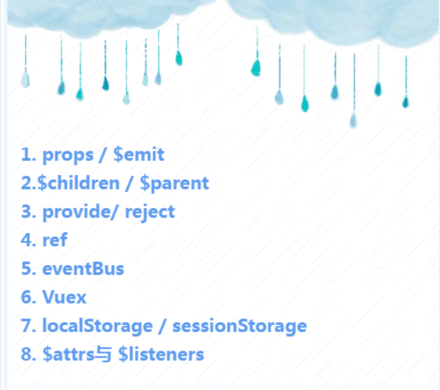

# vue组件通讯

组件与组件的通信可以本质上分为两种，可以使用下图展示的通信方式
1. 父子组件之间的通信
2. 非父子组件之间通信(兄弟组件、隔代关系组件等）




## 1. props / $emit

最常用的就是父子之间的通信，父组件通过 props 向子组件传递值，子组件需要改变父组件的值时可以使用 $emit 来触发

$emit 绑定一个自定义事件, 当这个语句被执行时, 就会将参数arg传递给父组件,父组件通过v-on监听并接收参数。

> prop 只可以从上一级组件传递到下一级组件（父子组件），即所谓的单向数据流。而且 prop 只读，不可被修改，所有修改都会失效并警告。


## 2. $children / $parent

通过`$parent`和`$children`就可以访问组件的实例，拿到实例就可以访问组件上的方法和属性(`$data`上面)

> 要注意边界情况，如在#app上拿$parent得到的是new Vue()的实例，在这实例上再拿$parent得到的是undefined，而在最底层的子组件拿$children是个空数组。也要注意得到$parent和$children的值不一样，$children 的值是数组，而$parent是个对象

## 3. provide / inject

`provide / inject` 是 `vue2.2.0` 新增的API，就是父组件中通过 `provide` 来提供变量，然后子组件中通过 `inject` 来注入变量

> 注意: 这里不论子组件嵌套有多深, 只要调用了inject 那么就可以注入provide中的数据，而不局限于只能从当前父组件的props属性中回去数据

```js
export default{
  provide: {    // 父组件设置变量， 子组件也可以设置，孙组件来获取所有的属性
    for: "demo",
    obj: {name: 'wujun'}
  },
}
export default{
  // 任意一个子组件都可以设置该属性来获取祖先设置的值,在组件中用 this.for 来使用
  inject:['for', 'obj'],
}
```

## 4. ref / refs

ref 如果在普通的DOM元素上使用，则指向的是该DOM元素，如果用在子组件上，指向的就是子组件的实例，可以通过实例直接调用组件的方法或访问数据 `const refsName = this.$refs.refsName;`


## 5.event Bus  是Vue1.0的方式，vue2.0已经移除
eventBus 又称为事件总线，在vue中可以使用它来作为沟通桥梁的概念，就像是所有组件共用相同的事件中心，可以向该中心注册发送事件或者接收事件，所有组件都可以通知其他组件，实质就是利用了观察者模式实现

  1. 初始化，先创建一个事件总线并将其导出，以便其他模块可以使用或者监听它
  2. 发送事件：假如有2个组件 additionNum 和 showNum ，这两个组件可以是兄弟组件或者是父子组件，以兄弟组件为例
  3. 如果想移除观察者  执行 off 函数


## 6. vuex vue全家桶中的状态管理
Vuex 解决了多个视图依赖于同一状态和来自不同视图的行为需要变更同一状态的问题.

## 7. localStorage / sessionStorage
将数据保存在浏览器端，但是不容易管理，比较难维护

> 用JSON.parse() / JSON.stringify() 做数据格式转换 localStorage / sessionStorage可以结合vuex, 实现数据的持久保存,同时使用vuex解决数据和状态混乱问题.

## 8. $attrs 与 $listeners
在 `vue2.4` 中，引入了 `$attrs` `$listeners` ,新增了 `inheritAttrs` 选项，可以实现跨组件传递，虽然会降低代码的可读性，但有时候应该使用

1. 当要抽出某一个通用组件的时候，时常需要对第三方的组件进行包装 ，但包装不应该使原有的一些属性和事件丢失，这时用 `$attrs $liseners` 比较好
2. 用于透传，有一些参数我当前组件不需要用到，但是我的子组件需要用到，这时用 `$attrs $liseners` 比较好

在 `vue2.4` 之前，父作用域中不作为 `props`(即是在子组件中没有在props中申请的变量)，将会作为普通的html自定义属性添加到子组件的根节点上， 使用 `$attrs` 可以表示父组件传递到子组件的属性，可以直接传递给孙组件


---
## 总结
- 父子组件通信: `props; $parent / $children; provide / inject ; ref ; $attrs / $listeners`
- 兄弟组件通信 `eventBus |  vuex`
- 跨级通信: `eventBus`；`Vuex`；`provide / inject` 、`$attrs / $listeners`