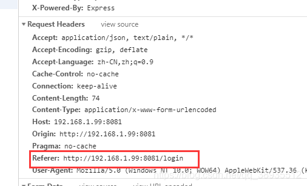

# vue-router
可以配置动态路由 `/user/:id` ，然后在组件中获取其中的参数，如果id值可能有也可能没有就可以使用 `/user/:id?` 的形式，当URL `/user` 的时候也会匹配

> 如果我们需要设置ID必须为数字类型的，可以使用正则表达式 ,以圆括号的形式加入 '/user/:id(\\d+)'  这样我们传递数字以外的内容，组件就无法接收到


### router.addRoutes
```js
// 主要的是下面第一行代码，如果没有这行代码，router.options.routes 不是响应式的。
this.$router.options.routes = routes;
this.$router.addRoutes(routes);
```

### 路由传参
通过URL来传参是一个基本需求，传参的方式有几种类型

1. 在路由文件中通过配置 name 来传参，然后通过 `$route.name` 来接受参数，这种方式很少用
    ```vue
      routes:[{ path: '/', name: 'Hello', component: Hello}];
      <p>{{ $route.name }}</p> 
    ```
2. 可以通过 `<router-link>` 标签中的 `to` 来传参 


### 重定向方式
使用 `redirect` 的方式来重定向路由，一般使用在最后的位置设置 404页面到指定的页面。

如果重定向后需要传递参数的话，可以直接像` router `的参数一样传递，这样在重定向后的组件也能获取到传递的参数

```js
  {
    path: '/user/:id(\\d+)',
    component: User
  },{
    path: '/newUser/:id(\\d+)',
    redirect: '/user/:id(\\d+)'
  }
```

还可以使用别名的方式来模拟重定向效果，和 `redirect` 的不同就是URL不会改变

> 有个坑需要注意就是 别名的配置不能使用在 path: '/'  中，否则，别名是没效果的
```js
  {
     path: '/content',
     component: Hello,
     alias: '/home'  
  }
  {  // 这个配置是不会有效果的
    path: '/',
    component: Home,
    alias: '/home'
  }
```


### [路由全局守卫](https://router.vuejs.org/zh/guide/advanced/navigation-guards.html#全局解析守卫)
`beforeRouteEnter` 访问this的方式： 因为该钩子在组件实例还没创建的时候调用，所以不能获取组件实例this，可以传递一个回调函数给`next`来访问组件实例，next回调的执行时机在`mounted`后面，所以在实际开发中在次钩子函数中访问实例this的实际意义不大，可以放在组件的`created`或者`mounted`中执行

`beforeRouteLeave` 导航离开组件的时候对应的路由，可以用来提示用户确认是否离开，在代码中主要是要销毁定时器，绑定的事件等


###  `<keep-live>`

activated 调用时机，第一次进入缓存路由/组件，在`mounted`后面，`beforeRouteEnter`守卫传给 next 的回调函数之前调用

```
    beforeMount=> 如果你是从别的路由/组件进来(组件销毁destroyed/或离开缓存deactivated)=>
    mounted=> activated 进入缓存组件 => 执行 beforeRouteEnter回调
```

因为组件被缓存了，**再次进入缓存路由/组件时，不会触发这些钩子**：`  beforeCreate created beforeMount mounted `都不会触发。 之后的调用流程是
```
    组件销毁destroyed/或离开缓存deactivated => activated 进入当前缓存组件 
    => 执行 beforeRouteEnter回调       // 组件缓存或销毁，嵌套组件的销毁和缓存也在这里触发
```


### 完整的执行流程中的钩子函数
将路由导航、`keep-alive`、和组件生命周期钩子结合起来的，触发顺序，假设是从a组件离开，第一次进入b组件：

1. `beforeRouteLeave`:路由组件的组件离开路由前钩子，可取消路由离开。
2. `beforeEach`: 路由全局前置守卫，可用于登录验证、全局路由loading等。
3. `beforeEnter`: 路由独享守卫
4. `beforeRouteEnter`: 路由组件的组件进入路由前钩子。
5. `beforeResolve`: 路由全局解析守卫
6. `afterEach`:路由全局后置钩子
7. `beforeCreate`:组件生命周期，不能访问`this`。
8. `created`:组件生命周期，可以访问`this`，不能访问dom。
9. `beforeMount`:组件生命周期
10. `deactivated`: 离开缓存组件a，或者触发a的`beforeDestroy`和`destroyed`组件销毁钩子。
11. `mounted`:访问/操作dom。
12. `activated`:进入缓存组件，进入a的嵌套子组件(如果有的话)。
13. 执行`beforeRouteEnter`回调函数`next` ,其中可以访问组件实例 this 对象。


### vue路由实现

hash模式 ，history 模式 ， abstract模式


**hash模式的特点**

1. 就是指URL后面的#后面的字符，请求的时候不会被包含到HTTP中，只会携带#之前的内容，每次改变hash不会从新请求加载页面
2. hash 改变会触发 hashchange 事件
3. hash 改变会被浏览器记录，浏览器的前进和后退都能使用
4. hash 模式能兼容到IE8


**history 模式的特点**

1. 页面请求时会带上整个连接，所以需要后台做相应处理，不然会返回404
2. 
3. history 只能兼容到 IE10


> history 模式我们去掉了 # 号，但是有个问题，就是刷新操作，刷新的时候是请求了后台服务器，所以需要服务器配置路径，否则会404，在hash模式下，路由是修改# 后面的内容，请求的时候不会携带到后台，所以不会出问题


**abstract模式**

适用于所有的JavaScript环境，例如服务器端和node.js ，如果没有浏览器API，路由将强制进入此模式