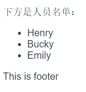
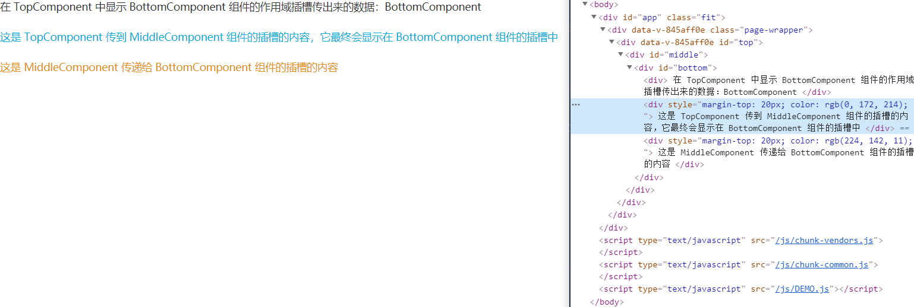

## vue插槽

主要作用是内容分发，即在父组件内的子组件标签里定义子组件里的内容，插槽分为  简单插槽  具名插槽  作用域插槽  透传插槽几个部分

### 简单插槽
```vue
 <template>
  <div>
    <Child ref="childComponent" :users="data" >
      <ul>
        <li v-for="user in data" :key="user">{{user}}</li>
      </ul>
    </Child>
  </div>
</template>
<script>
  import Child from './Child' // 引入users组件
  export default {
    name: 'Parent',
    components: { Child },
    data () {
      return {
        data: ['Henry', 'Bucky', 'Emily']
      }
    }
  }
</script>
```

```vue
<template>
	<div>
    <p>下方是人员名单</p>
    <slot></slot>
  </div>
</template>
<script>
	export default{
    name: 'child'
  }
</script>
```


#### 具名插槽

```vue
<template>
  <div>
    <Child ref="childComponent" :users="data" >
      <!-- 将会传入名为title的具名插槽 -->
      <p slot="title">下方是人员名单：</p>
      <!-- 将会传入默认插槽 -->
      <ul>
        <li v-for="user in data" :key="user">{{user}}</li>
      </ul>
      <!-- 没有内容传入footer插槽，所以会显示后备内容 -->
    </Child>
  </div>
</template>
<script>
import Child from './Child' // 引入users组件
export default {
  name: 'Parent',
  components: { Child },
  data () {
    return {
      data: ['Henry', 'Bucky', 'Emily']
    }
  }
}
</script>
```

```vue
<template>
  <div>
    <!-- 具名插槽 -->
    <slot name="title"><p>中间的内容会被忽略掉</p></slot>
    <!-- 默认插槽，名字为default，可以省略 -->
    <slot></slot>
    <!-- 带有后备内容的具名插槽，如果没有内容传入该插槽则显示后备内容，默认插槽也可以有后备内容 -->
    <slot name="footer"><p>This is footer</p></slot>
  </div>
</template>
<script>
export default {
  name: 'Child'
}
</script>
```



### 作用域插槽

```vue
<template>
  <div>
    <Child ref="childComponent" :users="data" >
      <!-- slot-scope的内容是一个对象，这里使用解构赋值将需要的someWords和users拿出来 -->
      <p slot="title" slot-scope="{ someWords }">{{ someWords }}人员名单：</p>
      <ul slot-scope="{ users }">
        <li v-for="user in users" :key="user">{{user}}</li>
      </ul>
    </Child>
  </div>
</template>
<script>
import Child from './Child' // 引入users组件
export default {
  name: 'Parent',
  components: { Child }
}
</script>
```

```vue
<template>
  <div>
    <!-- 将someWords传出去，放在作用域的对象内 -->
    <slot name="title" :someWords="someWords"></slot>
    <!-- 将users传出去，放在作用域的对象内 -->
    <slot :users="users"></slot>
  </div>
</template>
<script>
export default {
  name: 'Child',
  data () {
    return {
      users: ['Henry', 'Bucky', 'Emily'],
      someWords: '这是'
    }
  }
}
</script>
```

### 透传插槽

将内层组件的作用域插槽通过一层一层的传递出来，以便在外层组件可以将内容传进内层组件的作用域插槽中，每一层组件均可以向下一层组件的作用域插槽中传递内容，最终均会被传递到最深一级组件的作用域插槽中

> 该用法一般用在封装复用性组件或者高阶组件上，请不要将所有UI组件的插槽都传递到顶层组件，避免造成滥用

```vue
<!-- 顶层组件 -->
<template>
  <div id="top"> <!-- id只是用来标记组件，开发中去掉即可 -->
    <MiddleComponent>
      <template slot="MiddleComponent" slot-scope="{data}">
        <div>
          在 TopComponent 中显示 BottomComponent 组件的作用域插槽传出来的数据：{{data}}
        </div>
        <div style="margin-top:20px;color: #00acd6;">
          这是 TopComponent 传到 MiddleComponent 组件的插槽的内容，它最终会显示在 BottomComponent 组件的插槽中
        </div>
      </template>
    </MiddleComponent>
  </div>
</template>
<script>
  import MiddleComponent from './MiddleComponent'
  export default {
    name: 'TopComponent',
    components: { MiddleComponent },
  }
</script>
```

```vue
<!-- 中间组件 -->
<template>
  <div id="middle"> <!-- id只是用来标记组件，开发中去掉即可 -->
    <BottomComponent>
      <template slot="BottomComponent" slot-scope="{data}">
        <slot name="MiddleComponent" :data="data"></slot>
        <div style="margin-top:20px;color: #e08e0b">
          这是 MiddleComponent 传递给 BottomComponent 组件的插槽的内容
        </div>
      </template>
    </BottomComponent>
  </div>
</template>
<script>
  import BottomComponent from './BottomComponent'
  export default {
    name: 'MiddleComponent',
    components: { BottomComponent }
  }
</script>

```

```vue
<!-- 底层组件 -->
<template>
  <div id="bottom"> <!-- id只是用来标记组件，开发中去掉即可 -->
    <slot name="BottomComponent" :data="str">这是 BottomComponent 插槽的后备内容</slot>
  </div>
</template>
<script>
  export default {
    name: 'BottomComponent',
    data () {
      return {
        str: 'BottomComponent'
      }
    }
  }
</script>
```

