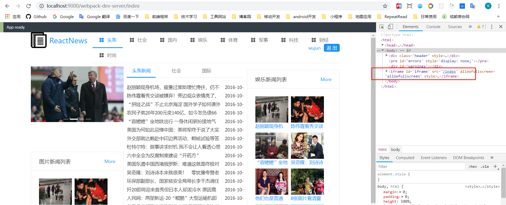
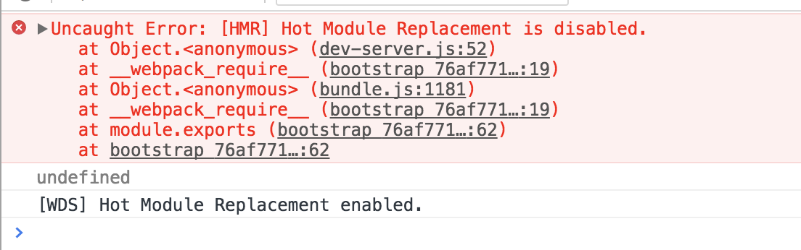

### webpack-dev-server
`webpack-dev-server`主要是启动了一个使用express的Http服务器。它的作用主要是用来伺服资源文件。此外这个Http服务器和client使用了websocket通讯协议，原始文件作出改动后，`webpack-dev-server`会实时的编译，但是最后的编译的文件并没有输出到目标文件夹，而是存在内存中。

**启动webpack-dev-server后，你在目标文件夹中是看不到编译后的文件的,实时编译后的文件都保存到了内存当中。因此很多同学使用webpack-dev-server进行开发的时候都看不到编译后的文件**

#### 启动`webpack-dev-server` 的两种方式
1. 通过 cmd line
2. 通过 node.js API


#### 自动刷新目前主要支持的两种方式
- Iframe mode
- inline mode

第一种: Iframe 方式主要是在网页中内嵌一个 iframe ，我们的应用都注入到这个iframe中，每次修改之后，都是这个iframe进行了reload，使用iframe模式不需要配置任何东西，只需要在你启动的项目的端口号后面加上 `/webpack-dev-server/`即可,访问路径(`localhost:8080/webpack-dev-server/index.html。`)的时候会给我们返回
```html
<!DOCTYPE html><html><head><meta http-equiv="X-UA-Compatible" content="IE=edge"/><meta charset="utf-8"/><meta name="viewport" content="width=device-width, height=device-height, initial-scale=1.0, user-scalable=no, minimum-scale=1.0, maximum-scale=1.0"/><script type="text/javascript" charset="utf-8" src="/__webpack_dev_server__/live.bundle.js"></script></head><body></body></html>
```
页面会请求live.bundle.js,其中里面会新建一个Iframe，你的应用就被注入到了这个Iframe当中。同时live.bundle.js中含有socket.io的client代码，这样它就能和webpack-dev-server建立的http server进行websocket通讯了。并根据返回的信息完成相应的动作。这样在 cmd 启动的时候就不需要额外的参数



第二种方式： Inline-mode模式，是`webpack-dev-server` 会在配置文件中再添加一个入口文件
```js
module.exports = {
    entry: {
        app: [
            'webpack-dev-server/client?http://localhost:8080',
            './src/index.js'  // 第二个是自己的入口文件
        ]
    },
    output: {
        path: './dist/js',
        filename: 'bundle.js'
    }
}
```
这样配置以后就可以将 inlinedJS 打包进 bundle.js里面，inlinedJS里面也包含了socket.io的client代码，可以和webpack-dev-server进行websocket通讯。 这种模式下在 cmd 启动的时候就需要配置相应的参数
`webpack-dev-server --inline --content-base ./dist`

**注意其中的几个易理解错误的点**

1. 使用Node.js方式是没有inline这个参数的，这里的inline模式其实就是三种配置方式，三选一就行。
    1. 在webpack.config.js中配置 devServer.inline: true
    2. 在HTML中添加 `<script src="http://localhost:8080/webpack-dev-server.js"></script>`
    3. 在node.js的配置文件里面配置
    ```js
    // webpack 官网的配置
    var config = require("./webpack.config.js");
    config.entry.app.unshift("webpack-dev-server/client?http://localhost:8080/");
    var compiler = webpack(config);
    var server = new WebpackDevServer(compiler, {...});
    server.listen(8080);
    ```
2. 需要在entry属性里添加`webpack-dev-server/client?http://«path»:«port»/` 由于采用Node.js配置，webpack-dev-server模块无法读取webpack的配置，所以用户必须手动去webpack.config.js的entry指定webpack-dev-server客户端入口。意思是只有采用Node.js方式才会需要添加这句话，而且，我们并不需要去污染webpack.config.js文件，而是将这句代码写在Node.js 的配置文件里：
`config.entry.rootName.unshift("webpack-dev-server/client?http://localhost:8080/");`
3. 如果使用node.js的方式启动，即使配置了devServer 也会被忽略，起作用的是nodejs的server.js文件，该文件作为配置文件启动
`start: "node server.js"`

> 上面两种方式只是配置不同的方式，但是都可以达到刷新页面的效果，热替换是不需要刷新浏览器就能改变页面内容，但是在实际使用中很多时候都是页面直接刷新了，官网解释: CSS很容易实现HMR，而对于js，devServer会尝试做HMR，如果不行就触发整个页面刷新。


#### 主要是讲解一下通过 cmd line 的方式
几个关键的配置参数

- content-base: `webpack-dev-server`访问的目录不进行设定的话，就会默认为当前目录下，一般采用绝对路径，但是这个路径是相对于 output.publicPath 这个文件输出字段值的
- hot 开启 `Hot Module Replacement` 功能，一般都是在 cmd 命令行添加，否则会报


- quiet 控制台中不输出打包的信息
- compress 开启gzip压缩
- progress 显示打包的进度 
- open 可以自动打开浏览器，好像参数只限于命令行使用。

### webpack-dev-server实现模块热替换(HMR)
1. 保持刷新前的应用状态(这一点在react里是做不到的，具体原因看下面)
2. 不浪费时间在等待不必要更新的组件被更新上面
3. 调整CSS样式的速度更快

#### 非Node方式
非Node方式有关`webpack-dev-server`的配置都在devServer参数里，首先开启HMR，添加配置参数hot: true，并且一定要指定output.publicPath，如果不指定会导致HMR无法工作，建议devServer.publicPath和output.publicPath一样,而且还要添加 `HotModuleReplacementPlugin` 到plugins中否则会报错


```js
module.exports = {
    plugins: [
        new webpack.HotModuleReplacementPlugin(), //添加
        new webpack.NamedModulesPlugin(), //添加，官方推荐的帮助分析依赖的插件
    ],
}

// 或者采用下面的方式 将 hot 参数添加到 cmd 命令中
"dev": "webpack-dev-server --progress --colors --hot "
```

#### 可以通过 node的方式

1. webpack 的 entry 添加`webpack/hot/dev-server`
2. webpack 的 plugins 添加 new webpack.HotModuleReplacementPlugin()
3. webpack-dev-server 添加 `hot: true`

采用Node方式做不到自动将webpack/hot/dev-server添加到entry里面，这和前面的自动刷新是一样的。然后！！使用Node方式启动也不能在命令行里面添加启动参数了，所以我们需要手动添加HotModuleReplacementPlugin，还有,--open自然也没法用了

```js
config.entry.unshift("webpack-dev-server/client?http://localhost:8080/", 'webpack/hot/dev-server');
let server = new WebpackDevServer(compiler, {
    contentBase: config.output.path,  
    publicPath: config.output.publicPath,
    hot: true
    ...
});
// 注：我不太清楚这里是否必须要配置publicPath，经测试不配置也是可以的。
```

```js
plugins: [
        new HtmlWebpackPlugin({
            template: './public/index.html'
        }),
        new webpack.HotModuleReplacementPlugin(),
        new webpack.NamedModulesPlugin(),
]
```


##### 额外阅读
在启动热更新的时候，React有时候想查询更新前的状态，这是办不到的。所以才有了react-hot-loader这个东西，可以帮助我们查看更新前的状态。