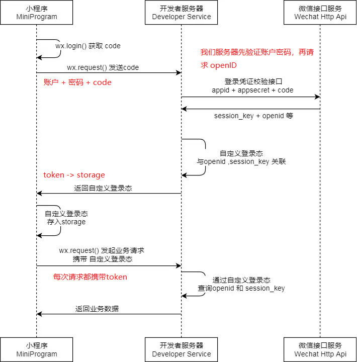

# 小程序登陆鉴权

为了方便小程序应用使用微信登录态进行授权登录，微信小程序提供了登录授权的开放接口。



上图的名称解释

- code 临时登陆凭证 有效期5分钟，通过 `wx.login()` 获取
- session_key 会话密钥，服务端通过code2Session 获取
- openId 用户在该小程序下的唯一标识，永远不变，服务端通过code获取
- unionId 用户在同一个微信开发平台账号(公众号，小程序，网站，移动应用)下的唯一标识，永远不变
- appId 小程序唯一标识
- appSecret 小程序的app  secret 可以和code，appid 一起换取session_key

从上图可以看出 小程序进行通信交互的不止是小程序前端和我们自己的服务端，微信第三方服务端也参与其中，那么微信服务端在其中扮演着怎样的角色呢？我们一起来串一遍登录鉴权的流程就明白了。


## 调用 wx.login 生成code
`wx.login()` 这个API的作用就是为当前用户生成一个 临时的登陆凭证，这个临时登陆凭证有效期只有五分钟，我们拿到这个凭证之后就可以进行下一个的操作 获取 `openid 和 sessionKey`

## 获取 openid  和 session_key

用过公众号的童鞋应该对这个标识都不陌生了，在公众平台里，用来标识每个用户在订阅号、服务号、小程序这三种不同应用的唯一标识，也就是说每个用户在每个应用的openid都是不一致的，所以在小程序里，我们可以用openid来标识用户的唯一性。

那么session_key是用来干嘛的呢？有了用户标识，我们就需要让该用户进行登录，那么`session_key`就保证了当前用户进行会话操作的有效性，这个`session_key`是微信服务端给我们派发的。也就是说，我们可以用这个标识来间接地维护我们小程序用户的登录态，那么这个`session_key`是怎么拿到的呢？我们需要在自己的服务端请求微信提供的第三方接口`https://api.weixin.qq.com/sns/jscode2session`，这个接口需要带上四个参数字段: 

1. appid : 小程序的APPID
2. secret ： 小程序的 secret
3. js_code : 前面调用wx.login派发的code
4. grant_type :  ‘authorization_code’

从上面的这几个参数可以看出，要请求这个必须调用wx.login()来获取用户当前会话的code，用服务器来请求这个接口是为了保证安全，前端通过request调用接口，能被抓包到APPID和secret和session_key 等，同时请求还需要注意两点

1. session_key 和微信派发的code是一一对应的，同一个code只能换取一次`session_key` ，每次调用`wx.login()`  都会发一个新的code对应的`session_key`，为了保证用户体验和登录态有效性，开发者需要清楚需要重新登录的时候才调用`wx.loing()`
2. session_key 是有时效性的，即使不调用wx.login(), session_key 也会过期，过期时间和用户使用小程序的频率相关，但具体的时间用户和开发者都不知道

```js
function getSessionKey(code, appid, appSecret){
  var opt = {
    method: 'GET',
    url: 'https://api.weixin.qq.com/sns/jscode2session',
    params: {
            appid: appid,
            secret: appSecret,
            js_code: code,
            grant_type: 'authorization_code'
    }
  }
  return http(opt).then((response)=>{
    var data = response.data;
    if(!data.openid || !data.session_key || data.errcode){
      return{
        result : -2,
        errmsg: data.errmsg || '返回数据字段不完整'
      }
    }else{
      return data;
    }
  })
}
```

## 生成 3rd_session

可以通过`session_key` 来间接维持登陆状态，所谓间接就是**需要我们自己维护自己的登陆态信息**,这也是考虑到安全性，如果直接使用`session_key`来作为业务登陆态使用不安全，比如 wx.getUserInfo() 这个接口，就需要`session_key`来配合解密微信用户的敏感信息

所以会自己生成登录态标识，一般使用常见的不可逆的哈希算法，md5 、 sha1等，将生成后的登录态标识返回给前端，并在前端维护这份登录态标识(存入storage)，而在服务端，我们会把生成的skey存在用户对应的数据表中，前端使用skey来获取用户信息

```js
const ctypto = require('crypto');
return getSessionKey(code, appid, secret).then(resData => {
  const { session_key }   = resData;
  const skey = encryptSha1(session_key);
})

function encryptSha1(data){
  return crypto.createHash('sha1').update(data, 'utf8').digest('hex')
}
```

## checkSession

前面我们将skey保存到storage中，每次请求的时候都携带，如果session_key过期的时候，我们就需要调用 wx.checkSession() 这个API来验证当前`session_key` 是否过期，这个API直接调用就可不用传入参数，小程序会自动去调用查询用户最近一次的`session_key是否过期，如果`session_key过期就让用户重新登录更新`session_key`,并将新的skey存入用户表，

我们一般讲checkSession这个步骤放在小程序启动的时候校验登录态


简单的流程图

```js
let loginFlag = wx.getStorageSync('skye');
if(loginFlag){
  wx.checkSession({
    success:function(){}, // session_key 有效未过期
    fail:function(){ doLogin() } // session_key 过期，重新登陆
  })
}else{
  doLogin()
}
```

## 支持emoji表情存储

如果需要将用户名存入数据表中，需要注意数据表的编码格式，用户名可能保存emoji图标，常用的UTF8 只支持1-3个字节，emoji图标刚好4个字节编码


[@chunpu/http](https://github.com/chunpu/http#readme) 是一个专门为小程序设计的 http 请求库, 可以在小程序上像 axios 一样发请求, 支持拦截器等强大功能

微信自带的异步接口都是 success 和 fail函数，这样很容易出现回调地狱，可以先将 wx 异步函数转换成 promise 函数

```js
const promisify = original => {
  return function(opt){
    return new Promise((resolve, reject)=>{
      opt = Object.assign({
        success: resolve,
        fail: reject
      }, opt)
      original(opt)
    })
  }
}
// 后续就可以调用函数
promisify(wx.getStorage)({key: 'key'}).then().catch()
```

