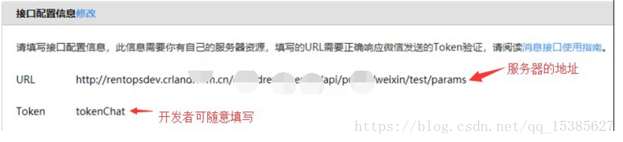
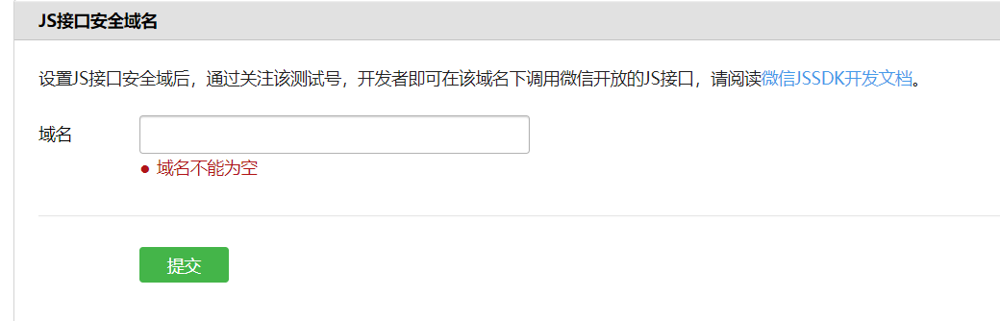
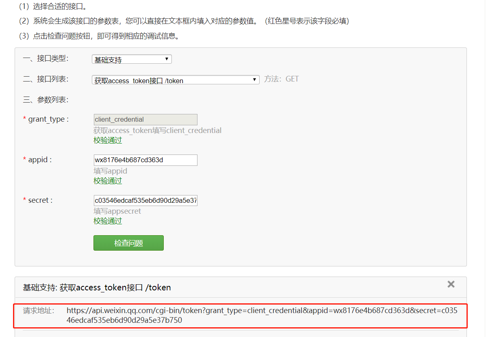
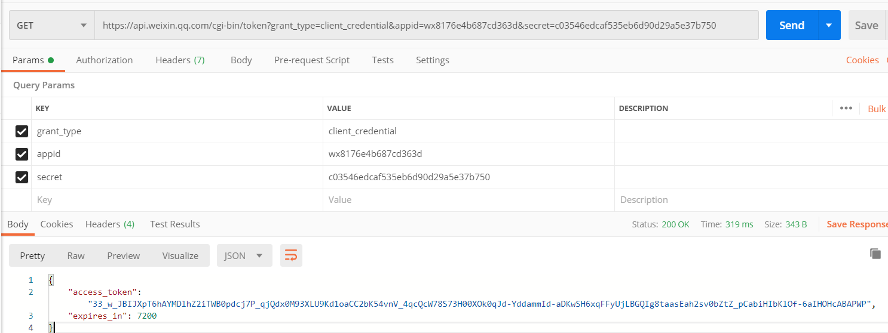
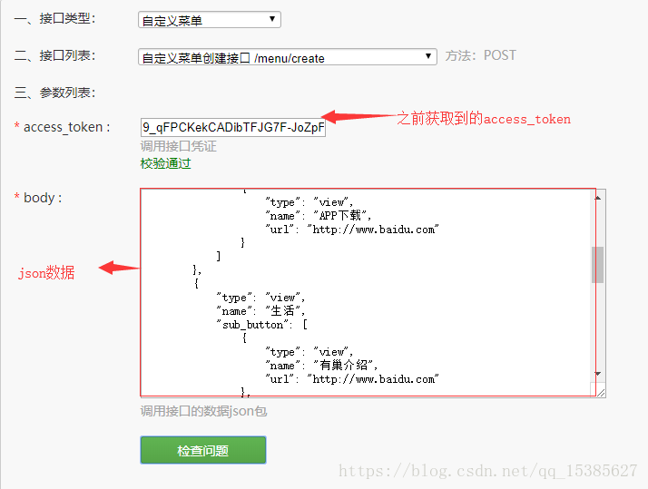
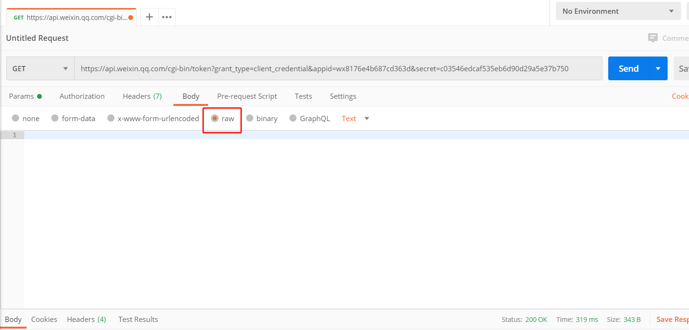

# 测试号使用

当我们开发微信公众号的页面时，如果是涉及到调用JSSDK的情况，本地就不能启动服务访问了。这时可以使用 测试号的方式来整理

需要准备的材料

1. 服务器
2. 外网可访问域名(端口为80)
3. 公众号


### 测试账号的申请配置

1. [测试账号申请地址](https://mp.weixin.qq.com/debug/cgi-bin/sandbox?t=sandbox/login)

2. 测试号配置，测试号会有一个 `appId appsecret` 他们可以结合调用公众号的接口

3. 接口配置信息填写， URL： 服务器的URL，当普通用户向公众账号发消息时，微信服务器将post消息的XML数据包到开发者的URL上

   ​	

4. JS 接口安全域名填写,  JSSDK 是微信公众平台面向网页开发者提供的基于微信内的网页开发工具包，通过使用JSSDK，网页开发者可借助微信高效的使用拍照，选图，语音，位置等手机系统的能力，还能使用微信分享，扫一扫，支付等微信特有的功能。

   ​	

5. 然后扫描测试号二维码 就可以查看，  列表中的微信号就是每个用户的身份标识，相当于把关注者的微信号转化为一串`openID`，`openID`在调用用户信息，用户位置等接口有用


### 测试号使用和接口调试

这个测试号关注之后，是没有底部的菜单的，需要自己去设置自定义菜单   [平台接口调试工具](https://mp.weixin.qq.com/debug/)

1. 获取 `access_token`, 由于调试其他接口都需要获取`access_token`，所以先用 `appid  secret` 这样就可以获取 `access_token`, 如果这个工具获取不到token，可以将请求地址用postman请求，就会返回

   ​	

   

2. 自定义创建菜单， [自定义创建菜单的接口文档](https://mp.weixin.qq.com/wiki?t=resource/res_main&id=mp1421141013),  将其中的请求用 postman 执行一下，公众号就可以看到自定义的菜单了，需要用token，还有body请求体，如果返回数据域不对可以使用postman来请求，其中的请求体是json格式

   

   

这样就可以直接进行调试了，还可以调试其他的接口，接口返回成功或提示request successful，有问题会出现下面的[错误代码](https://developers.weixin.qq.com/doc/offiaccount/Getting_Started/Global_Return_Code.html)


### 获取 微信网页授权

在获取微信网页授权之前，需要在公众平台中配置授权回调函数

网页授权有两种scope

1. 以 snsapi_base 为 scope 发起的网页授权，是用来获取进入页面的用户的openid ，需要注意的是，即使没有关注用户号的用户，只要进入到页面，都会有一个 openid ，这种方式是静默授权并自动跳转到回调页的，用户感知的是直接进入到业务页面
2. 以 snsapi_userinfo 为 scope 发起的网页授权，是用来获取用户的基本信息的，但是这种授权需要用户手动同意，无需关注就可以获取该用户的基本信息，

#### 网页授权流程

1. 引导用户进入授权页面同意授权 获取 code,  可以直接在自定义菜单的时候把授权同意页面的链接放到菜单地址中去，这样用户一点击就在获取授权，APPID 就是公众号的 appid，redirect_uri 就是服务器上页面所在的地址，response_type 可以直接写code， scope 按照自己的需求选择 snsapi_base 或者 snsapi_userinfo,   state是自己需要的参数，可以自己添加， #wechat_redirect 必须带着，参数顺序不能修改，由于授权操作安全等级较高，在发起授权时，微信会对授权链接做正则强匹配校验

   ```js
   `https://open.weixin.qq.com/connect/oauth2/authorize?appid=APPID
   &redirect_uri=REDIRECT_URI
   &response_type=code
   &scope=SCOPE
   &state=STATE#wechat_redirect`
   // 下面的链接是乌鲁木齐公众号的连接
   `https://open.weixin.qq.com/connect/oauth2/authorize?appid=wxd48c6472a67a0cc1
   &redirect_uri=http://www.wlmqsme.cn/wechatMG/authorize/getAuthorisedUserInfo.do
   &response_type=code
   &scope=snsapi_userinfo
   &state=http://www.wlmqsme.cn/wxqyfw/html/servicecatalogue.html#wechat_redirect`
   ```

2. 通过code 获取网页授权的 access_token, 

    当用户点击了公众号菜单中或其他引导链接进入授权后，页面的连接也会变为 `redirect_uri/?code=CODE&state=STATE`, 即页面所在域名的URL和微信拼接的code和参数，由于获取的是 `access_token` 和 `secrect` 安全级别比较高，前端不去获取，而是把code传给服务器，由服务端去获取并保存

3. 刷新 `access_token`,  由于 `access_token` 拥有较短的有效期，当`access_token`超时后，可以使用 refresh_token 进行刷新，refresh_token 有效期为30天，失效后需要用户重新授权，这一步也是服务端进行

4. 获取用户信息，得到 `access_token` 和 openid 之后就可以去获取用户信息了