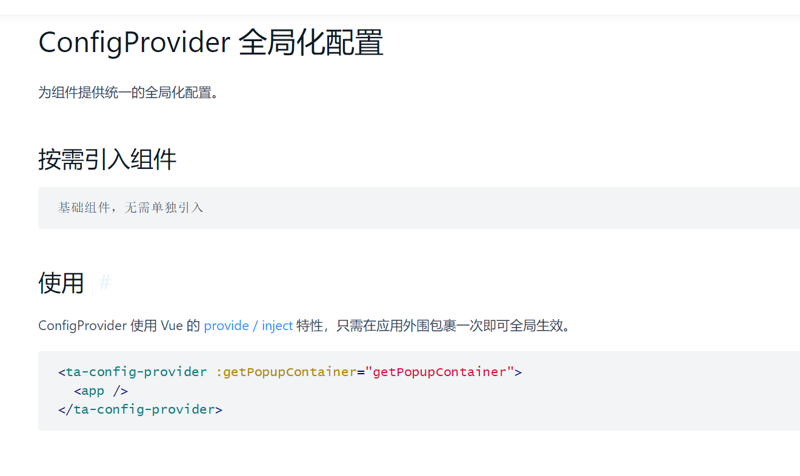
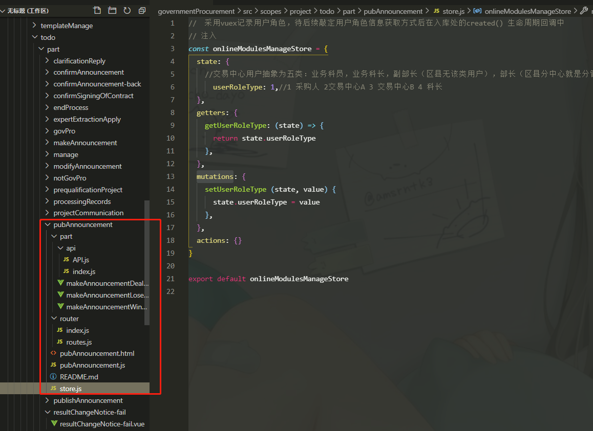
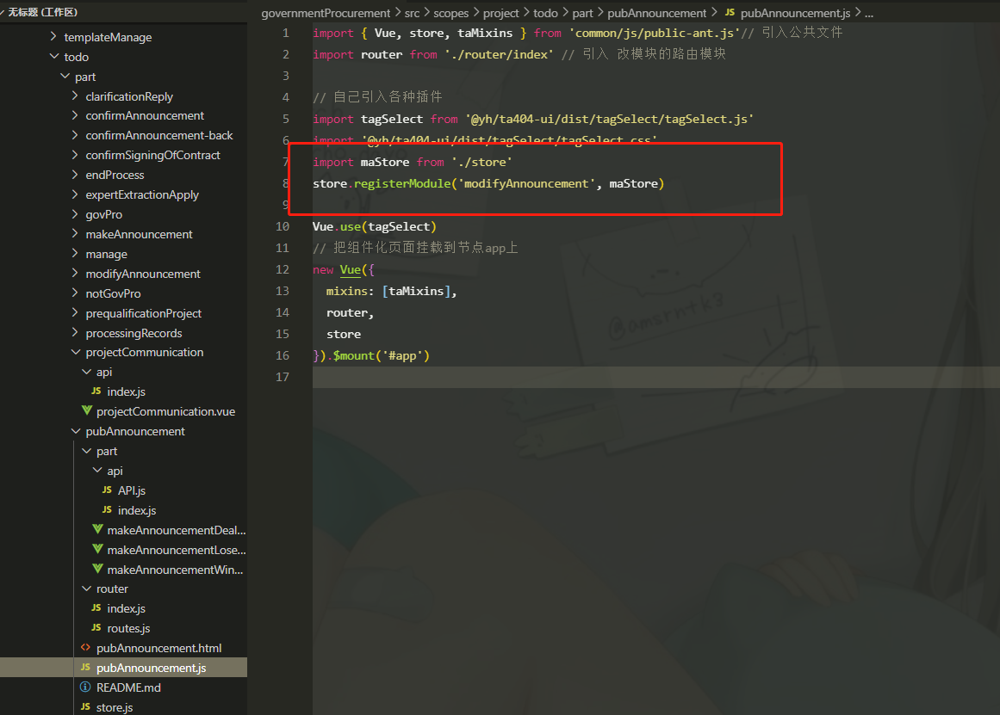

# Ta404 使用记录
[Ta404使用文档](http://cyshigehaohaizi.gitee.io/docs/ta_doc/docs/product/Ta404/ta404-ui-cli/%E5%B8%B8%E8%A7%81%E9%97%AE%E9%A2%98/#%E5%86%85%E5%AD%98%E6%BA%A2%E5%87%BA%E6%8A%A5%E9%94%99)

1. 最常用的功能是 表格加分页组件的一起使用，需要注意其中的表格中的码值转换
    ```js
    <ta-table
      bordered  haveSn
      :rowSelection="rowSelection"  
      :columns="columns"
      :dataSource="dataSourceTable"
      :scroll="{ y: '100%' }"
      :customRow="tableAdapt"
    >
         <span slot="nameTitle">序号</span>

          如果表格有操作动作的话就需要添加这部分
        <template slot="operator" slot-scope="text, record">
            employeeId 表示你需要点击的时候传入到函数的参数，可以是该行的id值 
          <a @click="handleShow(record.employeeId)">查看</a>
    			<a @click="handleChange(record.employeeId)">修改</a>
    </template>
    
        <template slot="name" slot-scope="text">
          <a>{{text}}</a>
        </template>
    </ta-table>
    <ta-pagination
      showSizeChanger  showQuickJumper
      :dataSource.sync="dataSourceTable"  :params="userPageParams"  :url="pageUrl"  ref="gridPager"
/>
    
    // 如果表格是右侧固定，左侧滚动条的情况下，最好每个元素设置一个 width 为数值，否则最后一个元素会被挤压变形
    // 如果需要设置一个值例如序号，不是后端返回的值，可以在table 中间设置 <span slot="nameTitle">序号</span>
    // 这样第一行就是我们自己设置的标识，值也可以有前端控制
    // title表示表头的显示的文字
    const columns = [
      {
        title: "序号",
        slots:{ title: 'nameTitle'},
        customRender: (text, record, index) => {
          return index + 1
        }
      },{
        dataIndex: "employeeName",
        title: "姓名",
        align: "center",
        width: '10%'
      },{
        dataIndex: "sex",
        title: "性别",
        collectionType: "SEX",    // 使用该属性来码值转换
        align: "center",
        width: '10%',
      }, {
        dataIndex: 'name',
        title: '名字',
        // 如果需要设置特殊的值的时候就可以使用函数的形式来返回值
        customRender: function(text, record, index) {
          // 当前行的值，当前行数据，行索引
          let value = Number.parseInt(text);
          let result = this.CollectionLabel("AUDITFLAG", value);
          return result;
        },
        width: '10%',
      },{
        title: "操作",
        align: "center",
        // operator 只是自定义元素的名字，也是 slot 的值,可以改变
        scopedSlots: { customRender: "operator" },
        width: '10%'
      },{
        title: '名字',
        dataIndex: 'name',
        // 该行是需要将表格特殊处理的时候才设置的属性，可以在 template 中添加一个 template slot="name" slot-scope="text" 其中text就表示该空格的值
        // 如果不需要该表格的数据，就不需要设置 dataIndex 的参数
        scopedSlots: { customRender: 'name' },
      }
    ];
    data(){
        return {
            pageUrl:'',
            dataSourceTable:[],
            selectedRows:[],
            rowSelection: {
              selectedRowKeys: [],
              // 行选择改变事件
              onChange: this.onSelectChange
            }, // 选择
        }
    },
    mounted(){
        this.qeury(); // 加载的时候执行 请求后台数据
    },
    methods:{
        tableAdapt,
        userPageParams(){
            return {}
        },
        // 表格选择事件
        onSelectChange(selectedRowKeys, selectedRows) {
          this.selectedRows = selectedRows;
          // 设置选中项为点击选中的项
          this.rowSelection.selectedRowKeys = selectedRowKeys;
        },
        qeury(){
            // 执行请求数据的时候会先执行 userPageParams() 这个方法，把数据添加到请求 form.data 中
        this.$refs.gridPager.loadData();
    
            // 如果需要在页面加载时特殊处理事件
            this.$refs.gridPager.loadData(data => {
                console.log(111,data) // 返回的数据
        });
    
            // 可以修改其中的表格数据，数据格式保存一致即可
            this.$refs.gridPager.loadData(res => {
              let temp = res.data.pageBean.list.map(item => {
                let { employeeName, ...obj } = item;
                return obj;
              });
              res.data.pageBean.list = temp;
        });
    
            // 如果输入条件中有些是必传的，可以使用表单验证功能，通过了验证才请求数据 ,验证的话前提是需要有表单组件
            this.form.validateFields((err, values) => {
              if (!err) {
                this.$refs.gridPager.loadData();
              }
            });
        }
    }
    ```
    1. 其中 `columns` 表示表格的表头内容， `dataSourceTable` 表示表格主体的内容部分，两者使用 `dataIndex` 来关联数据
    2. `pageUrl` 是请求后台的URL地址，请求数据的
    3. `userPageParams` 是 `methods` 中的一个方法，在该方法中会返回一个对象，该对象就是向后台传递的参数 ，其中有 `pageNumber: 1  pageSize: 10` 这两个参数是默认的，不用设置，获取用户设置的输入内容也在该方法内
    4.  设置了`:scroll="{ y: '100%' }"` 的话，一般会导致表格主体部分出现滚动条边框对不齐，这个时候在`columns`数据中设置 `width` 最后一个不要设置数值，就可以对齐表格
5.  公司在项目中优化了表格，在表格中加上 ` :customRow="tableAdapt"` 并在 `methods`注册  `tableAdapt` 方法，然后再 columns 里面都使用百分比，就不会出现分辨率不一样，最后一行宽度变形的情况
    
2. 如果需要添加输入框或者选择的条件查询, 如果表单中有转码的输入框，就需要注意值的存储和设置
    ```js
      <ta-form layout="inline"  :autoFormCreate="form => (this.form = form)" >
        <ta-row>
            <ta-col :span="6">
              <ta-form-item
                label='身份证号'
                fieldDecoratorId="idCard"
                :labelCol="{ span: 20 }"
                :wrapperCol="{ span: 20 }"
                :fieldDecoratorOptions="{rules: [
                  {required: true, message: '请输入身份证号'},
                  {pattern: /^(^[1-9]\d{7}((0\d)|(1[0-2]))(([0|1|2]\d)|3[0-1])\d{3}$)|(^[1-9]\d{5}[1-9]\d{3}((0\d)|(1[0-2]))(([0|1|2]\d)|3[0-1])((\d{4})|\d{3}[Xx])$)$/, message: '请输入正确的身份证号码'}]}"
              >
              <!-- fieldDecoratorOptions 复杂的验证功能, 如果只是一个必传的话，可以使用 姓名 里面的简写方式 -->
                <ta-input />
              </ta-form-item>
            </ta-col>
            <ta-col :span="5" :offset="1">
              <ta-button
                type='primary'
                icon="search"
                @click="qeury"
              >查询</ta-button>
              <ta-button
                type='primary'
                icon="reload"
                @click="form.resetFields()"
              >重置</ta-button>
            </ta-col>
        </ta-row>
     </ta-form>

     methods:{
        getVlaue(){
            // 获取表单的全部的值
            let value = this.form.getFieldsValue();
            // 获取某一个具体的输入框值  通过 表单框的 `fieldDecoratorId`
            let value = this.form.getFieldValue('employeeName');
        },
        setValue(){
            // 通过 表单框的 `fieldDecoratorId`
            this.form.setFieldsValue({})
        /* ****** 需要先设置表单默认值，然后在单独设置码值的输入框 */
        },
        reSetValue(){
          // 重置表单
            this.form.resetFields();
        },
        verification(){
            // 验资表单，通过了才会执行下面函数
            this.form.validateFields((err, values) => {
              if (!err) {
                this.$refs.gridPager.loadData();
              }
            });
        },
     }
    ```

    ```shell
        1. 一般有输入框都可以使用 `ta-form` 表单框的方式，这样获取值或者设置值比较容易，同样也适用于表单时间选择
        2. 点击提交的时候，我们可以直接获取表单的全部数值，时间的话可以在表单的 `userPageParams` 方法中设置
        3. 如果是表单和table，分页条一起使用的话，submit 事件中只用触发发起数据请求，输入的内容都在`userPageParams`方法中获取输入的内容，具体看上面`<ta-form>` 的内容
        4. 自适应的话，最好在表单的输入框中使用栅格系统，利用24个栅格来自适应表单的输入框等
        5. 如果想用表单自带的验证功能，
              1. 需要在 `ta-form-item` 组件上使用 `:require="{message:'自定义年龄不能为空'}"` 属性，
              2. 在`this.Base.submit` 的第一个参数就是该表单的名字 `autoFormCreate` 的值
              3. 在接口参数 第三个参数 `autoValid: true // 提交前是否自动验证`
    ```


3. 时间选择器是个经常使用的，其中内部使用的 [Moment.js](https://momentjs.com/)
    ```js
      <ta-date-picker @change="onChange" />
        // 如果时间选择器是在表单中的话，需要下面这种方式
      <ta-form-item
          label='日期'
          fieldDecoratorId="startTime"
      >
          <ta-date-picker
            placeholder="请选择时间"
            size="large"
            :format="'YYYY-MM-DD'"
          />
      </ta-form-item>

      // 如果是在表单中获取该时间选择框的值 返回的是一个 moment 对象
      this.form.getFieldValue("startTime").format("YYYY-MM-DD");   // 2019-08-08 返回的格式
      this.form.setFieldsValue({"datePicker":this.moment('2019-06-28', "YYYY-MM-DD")})

      moment().format("YYYY-MM-DD HH:mm:ss");             //获取当天的时间
      moment().subtract(10, "days").format("YYYY-MM-DD"); //当前时间的前10天时间
      moment().add(2, "days").format("YYYY-MM-DD");       //当前时间的后2天时间
      moment(new Date()).format("YYYY-MM-DD HH:mm:ss");  // 将时间转换为 moment 对象
    ```
    ```
        1. 项目中使用的需要 `import moment from 'moment'` 然后在 `methods`里实例化一个方法,这样就可以在组件内部使用 `this.moment`
        2. 如果需要将一个时间转为moment对象，直接使用 `moment(MyTime)` 就返回moment格式的对象
    ```


4. 布局，框架使用了2中布局的方式，一种是layout 布局，第二种是包含表格边框的布局,主要是有灰色的边框
    ```js
      <ta-border-layout
        :layout="{ header: '90px', footer: '70px' }"
        :footer-cfg="{ showBorder: false}"
      >
         <div slot="header"></div>
         <div style="height: 100%"></div>
         <div slot="footer"></div>
      </ta-border-layout>
	```

    1. 上面表格主要是用于增删改查的表格展示，其中 header和footer的固定都是固定的
    2. 中间的展示表格，底部展示分页条, 需要设置`showBorder: false`这样表格和分页条之间就不会出现灰色的间隔条
    3. 需要在父元素上设置高度为100%，这样就可以让layou布局充满表格


5. 码值转换，有些判断的值后台返回给我的是数字类型，
    1. 若是是table表中的值需要转码的，直接在 `colums` 里面对象设置 `collectionType: "sex"` 这样table里面的值就会自动的转码
    2. 如果是在函数里面的时候则可以使用 `this.CollectionLabel(collectionType,value);`  返回码值信息
    3. 如果是表达式，可以直接使用 `{{CollectionLabel('SEX', text)}}`
    4. 如果在 form 中需要设置 `<ta-form-item :value="collectionLabel(basisInfo.sex, 'SEX')>`
    ```js
        {{CollectionLabel('SEX', text)}}
        // 下拉框数据使用码值：
        <ta-form-item
          label='在职状态'
          fieldDecoratorId="status"
          :labelCol="{ span: 7, offset: 1 }"
          :wrapperCol="{ span: 16 }"
        >
          <ta-select
            collectionType="INFO_STATUS"
            collection-type="YESORNO"    两种方式都是可以的
          ></ta-select>
        </ta-form-item>
    ```


6. 上传功能，可以使用Ta404的上传插件组件，主要是有2个URL，一个是上传地址URL，另一个是错误的时候，下载错误文档的地址
    ```js
      <ta-upload
        name="file"
        :withCredentials="true"
        :action="uploadUrl"
        :beforeUpload="beforeUpload"
        :showUploadList="false"
        :data="setDataUpload"
        @change="uploadChange"
      >
        <ta-button
          type="primary"
          class="click-btn white-btn"
          icon="cloud-upload-o"
        >员工家庭信息导入</ta-button>
      </ta-upload>

      data(){
        return {
          uploadUrl: "" //faceConfig.basePath + api.uploadUrl  上传的时候的后台接口地址
        }
      },
      methods:{
        // 导入功能 验证文件格式 只能是 excel   在上传之前执行的函数
        beforeUpload(file) {
          if (file.type.indexOf("officedocument") === -1) {
            this.$message.error("只能导入excel格式的文件");
            return false;
          }
        },
        // 上传的时候携带的参数 使用此方法，后台可以直接获取
        setDataUpload() {
          let data = {}
          return data;
        },
        uploadChange(info) {
          if (info.file.status === "done") {
            let result = info.file.response.data.reMap;
            // 如果上传错误了，这里是可以下载错误文档的
            if (result.isError) {
              this.$confirm({
                title: "导入异常",
                content: "是否下载异常数据？",
                okText: "是",
                cancelText: "否",
                onOk: () => {
                  let form = document.getElementById("download");
                  if (!form) {
                    form = document.createElement("form");
                  }
                  form.id = "download";
                  form.method = "post";
                  form.action = faceConfig.basePath + api.downOtherUrl + "?filePath=" + result.filePath + "&fileName=haha";
                  document.body.appendChild(form);
                  form.submit();
                },
                onCancel: () => {}
              });
            } else {
              this.$message.success("导入成功");
            }
          }
        },
      }
    ```
    > `:withCredentials="true"` 后台就可以拿到用户信息  `setDataUpload` 就不需要返回用户信息部分了

    
    
7. 文件下载，可以使用框架的下载功能，下载只使用一个URL就可以完成

    ```js
      <ta-button
        type="primary"
        icon="cloud-download-o"
        @click="download"
      >模板下载</ta-button>
    
      methods:{
        download() {
          let form = document.getElementById("download");
          if (!form) {
            form = document.createElement("form");
          }
          form.id = "download";
          form.method = "get";
          form.action = faceConfig.basePath + downUrl;
          document.body.appendChild(form);
          form.submit();
        }
      }
    ```

8. RAP2一般使用的是 `post` 请求，在使用的时候，直接点击地址预览的话，需要在 URL 中，地址那部分前面加 `/POST` 的方式才能访问，在公司框架中使用 Base.submit() 请求的时候，也是需要加上 `POST` 才能访问

9. 开发中使用的如果是mock 的方式，涉及到表格和分页条的话，那`mock`的数据格式只能是下面的格式   其中的`data.pageBean`也是必须的，只能是`list`内部的修改，这样才能自动填入到表格中
    ```js
    {
          "code": 200,
          "requestId": "c7587648-2a6a-4af4-a1b8-b3948fb3e3f6",
          "data": {
            "pageBean": {
              "pageNum": 1,
              "pageSize": 10,
              "currentSize": 2,
              "total": 2,
              "pages": 1,
              "list": [{
                "workshopname": "二车间",
                "workshophead": "负责人2",
                "workshopid": "2",
                "enterpriseid": "1",
                "workshopemployeenumber": 0,
                "workshopheadtel": "18783981376"
              }]
            }
          },
          "errors": null,
          "serviceSuccess": true,
          "redirectUrl": null
        }
    ```

10. 如果使用mock模拟接口返回参数的时候： 如果是普通的接口，则需要配置成下面的格式，`data`就是配置参数
    ```js
    {
          code: 200
          data: {}
          errors: null
          redirectUrl: null
          requestId: "7ea714e6-5e91-48d4-b753-736423ce2445"
        }
    ```

11. 项目`webpack` 的代理设置
     ```js
        // 基础路径,打包发布的时候修改为后端发布服务地址
       'basePath': 'http://192.168.22.26:8081/git',
       // 开发模式mockServer服务地址
       'mockServer': 'http://192.168.17.50:38080/app/mock/53',
         // 开发模式后端服务地址
       'devServer': 'http://192.168.22.26:8081/git',
     
         // dev-mock 的使用弹出
         {
           'http://192.168.22.26:8081/git': {
             target: 'http://localhost:36742/',
             changeOrigin: true,
             pathRewrite: {
               '^http://192.168.22.26:8081/git': '/'
             }
           }
         }
     
       // npm run dev
       {}
     
       // npm run dev-server
       {
         'http://192.168.22.26:8081/git': {
           target: 'http://192.168.22.26:8081/git',
           changeOrigin: true,
           pathRewrite: {
             '^http://192.168.22.26:8081/git': '/'
           }
         }
       }
     ```

12. `<ta-modal>` 在第一次初始化的时候生命周期函数执行，之后隐藏，再展示的时候，生命周期的函数就不会再执行，是不是因为节点已经存在页面上了

13. 如果在同一个级别中使用导航连接的话，可能会产生URL不变化的情况，可以在html页面中设置路由的时候用下面的方式
     ```js
       <keep-alive>
         <router-view :key="$route.fullPath"></router-view>
       </keep-alive>
     ```

14. 项目中如果有echarts图，在页面刷新的时候会初始化，初始化完毕之后页面大小改变的时候，echarts不会改变，有时会错位
     ```js
       this.outputechart = echarts.init(document.getElementById("outputechart"));
     
       window.addEventListener("resize", () => {
         this.outputechart.resize();
       });
     ```
     1. 在页面data中设置变量
     2. 在`mounted`生命周期内初始化echarts, 并将 resize 事件挂载到window上


15. 公司项目的整体按钮图标，在框架按钮的基础上再使用 统一的表示
    ```shell
    查询：<ta-button type="primary"  icon="search">查询</ta-button>
    重置：<ta-button type="primary"  icon="reload">重置</ta-button>
    新增：<ta-button type="primary"  type="plus-circle-o">新增</ta-button>
    删除：<ta-button type="primary"  type="minus-circle-o">删除</ta-button>
    修改：<ta-button type="primary"  type="edit">修改</ta-button>
    上传：<ta-button type="primary"  type="cloud-upload-o">上传</ta-button>
    下载：<ta-button type="primary"  type="cloud-download-o">下载</ta-button>
    导入：<ta-button type="primary"  type="">导入</ta-button>
    导出：<ta-button type="primary"  type="export">导出</ta-button>
    查看：<ta-button type="primary"  type="file-text">查看</ta-button>
    保存：<ta-button type="primary"  type="save">保存</ta-button>
    取消：<ta-button type="primary"  type="close-circle-o">取消</ta-button>
    审核：<ta-button type="primary"  type="solution">审核</ta-button>
    ```

16. 在项目中，确认删除类似操作的时候，需要用户确认一次，可以使用下面的代码，  配置参数在 `Popconfirm` 类似，不建议添加model 通过data 属性控制减少不必要的data属性

    ```js
    this.$confirm({
      title: '确认离职',
      content: <p>确认所选人员离职</p>,
      footer: false,
      okText: '确定',
      cancelText: '取消',
      onOk() {
        // successFn();
      }
    });
    ```

17. Ta404框架封装的打开新tab页面的方法

    ```js
    let tabMenuInfo = {
      id: obj.id,
      name: obj.name,
      url: obj.url
    };
    
    // 触发框架方法增加 导航
    // vue\src\corePage\index\js\indexTools.js
    window.parent.indexTool.openTabMenu(tabMenuInfo);
    ```

18. `up-load` 上传插件的API 如果调用了 `beforeUpload` 并返回false，如果页面有展示已上传的列表，则这次没上传功能的文件还是会展示在已上传列表中，但是文件是没上传的，该插件可以用于手机端的H5页面的上传功能，应该是在原生的基础上封装了

19. 在项目中如果要获取用户信息(用户信息保存在state里面)，但是只能在顶层框架页里面获取，组件里面的页面是获取不到的，可以使用下面的方法来获取，项目中采用的是`iframe`页面的形式，可以获取顶部`top`
    ```js
    top.indexTool.getUserInfo();   // 这个方法在子组件里面获取用户信息
    ```

20. 用upload属性，后台去接受前台传的文件如果报错，可以尝试下面的写法
    ```js
    upload(data,callback){
      Base.submit(null, {url: url, data: data, isFormData: ture},{
        successCallback:(data) => callback(data)
      })
    }
    ```

21. 如果在页面中展示模态框可以使用路由的形式，在路由配置哪里需要配置路由
    ```js
      this.dialog.title = item.productionName;
      this.dialog.width = '65%';
      let param = Object.assign({}, item, { type: 'edit' });
      console.log(11,param)
      this.$router.push({
        name: 'editAllocation',
        query: param
      });
      this.dialog.visible = true;
    ```

    
    
22. <ta-table-edit  slot-scope="text, record" type="select"></ta-table-edit> 表格编辑时 type 为select时候 提供 有 select 组件的getPopupContainer 方法吗？
    

    

23. 项目启动的时候有可能登记进去后一直弹回登陆页面，这是因为后端的`session`一直在变动, 登陆页面的接口的`response.header`中 `set-cookie: JSESSIONID=529571D1A14C598F5ADAD0EC56C7567B; Path=/git; HttpOnly` 每次都是不一样的，并且接口的`session`是挂载在`path=/git`路径上的，所以我们请求代理地址最后也需要挂载到`/git`路径下， 代理之后的后端接口地址就是 `http://192.168.75.197:8081/git`

   > 我们需要设置 `basePath` 然后设置 `config/index` 来配合接口请求

  ```js
  // 设置为 / 的时候 在登陆页请求的地址是 http://127.0.0.1:8081/loginRestService/getConfig  没有在 /git路径下，此时session是挂载在 / 或者*  路径下
  {
      basePath: '',      
  }

  // 在登陆页请求的地址是  http://127.0.0.1:8081/wujun/loginRestService/getConfig  没有在/git路径下
  {
      basePath: '/wujun',

      pathRewrite:{
          '/wujun': ''
      }
  }

  // 在登陆页请求的地址是  http://127.0.0.1:8081/git/loginRestService/getConfig  session是挂载在 /git 路径下 和后端接口地址一致
  {
      basePath : '/git',    // 本地接口的项目名称  需要和后端接口后的项目名称一致
      devServer: 'http://192.168.75.197:8081'   // 不加后面的项目名称  项目名称通过代理的pathRewrite来写

      pathRewrite:{
          basePath : '/git'  // 就将后台接口的地址拼好了，并且可以访问 /git 路径下的session。
      }
  }
  ```

24. Form表单赋值, setFieldsValue 可配合框架提供的 Tool.objectAssign 方法使用, 方便有效

    ```js
    this.form.resetFields();
    let updateFormItemValue = this.Tool.objectAssign(this.form.getFieldsValue(),result)
    this.form.setFieldsValue(updateFormItemValue)
    ```
    
    
    
25. 一个单独的模块要使用store可以设置自己的store 

      页面书写位置  
    

    页面注册方式 其中 `store.registerModule('name', store)` 前面那个name只是在根store上面注册一个名字而已,使用vuex插件就可以看到
    

    

26. ta404的项目的时候，没有后端接口，直接跳转路由开发前端页面，报错堆栈溢出的话是框架做了重定向的处理，在该模块的根目录 js 文件

    ```js
    import { store, taMixins, Vue } from "common/js/public-ant.js"; // 引入公共文件
    import router from "./router/index"; // 引入 改模块的路由模块
    new Vue({
      // mixins: [taMixins],  // 将这行注释就可以屏蔽重定向的代码
      router,
      store
    }).$mount("#app");
    ```

    