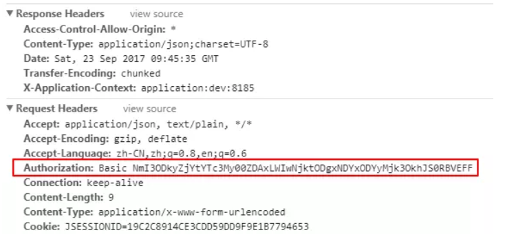
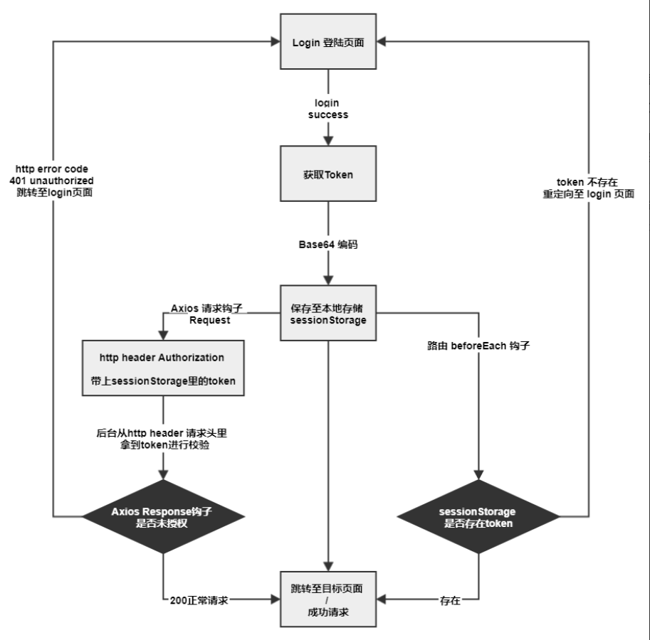

# 权限控制


### 权限控制大致分为两个维度
1. 垂直维度： 控制用户可以访问那些URL的权限
2. 水平维度： 控制用户访问特定的URL，不同的权限人员访问不同的页面

### Web权限控制方案list
1. 前后端不分离： 以公司之前java的方式，后端是通过模版来控制相应权限的数据，渲染完呈现
2. 前后端分离
    1. SPA 单页面，路由由前端控制，前端通过js控制hash路由的权限
    2. SSR 服务端渲染，node中间层做代理路由，判断权限控制渲染特定的路由返回浏览器


### SPA前端权限控制方案（以vue为例）
> SPA: 单页Web应用（single page web application）将所有web活动局限于一个html页面中，利用js通过hash或者浏览器history api来实现无刷新路由跳转，前后端通过ajax数据通信，避免了浏览器的刷新重新加载，为用户提供流程的操作体验。这意味着前端接管了路由层，需要通过调用前端自身的MVC模块，来渲染不同的页面

---

1. 登录事件
```js
dispatch('login')
commit(name,data)
```

2. 获取Token，经`Base64`编码后存至 `sessionStorage`

3. 将所有HTTP Header Authorization 加上编码后的Token（这个需要和后端商议）
```js
axios.interceptors.request.use(req => {
  let token = sessionStorage.getItem(`name`)
  if(token){
    req.headers.Authorization = `Base ${token}`
  }
  req.data = qs.stringify(req.data)
  return req
}, error=>{
  return Promise.reject(error)
})
```


4. 请求拦截： 后台拿到Token后对每个请求进行验资，失败则返回 401， 前端 response 钩子里统一 catch error 跳转至登录页面
```js
// axios 请求钩子 response
axios.interceptors.response.use(res => {
  return res;
}, error =>{
  if(error.response){
    switch(error.response.status){
      // 所有接口 Response 检验钩子，若Token验证失败，后台返回 401，
      // 清除token信息并跳转到登录页面
      case 401:
        store.commit(types.LOGOUT);
        router.replace({path: '/login'})
    }
  }
  return Promise.reject(error)
})
```

5. 路由跳转拦截，任意路由跳转时，在路由 beforeEach 钩子里检验本地是否存在Token，若没有，则跳转至登录页面
```js
// 路由钩子 每个路由跳转前调用 beforeEach 钩子
router.beforeEach((to, from, next) =>{
  if(to.path===`/login`){
    sessionStorage.removeItem('userToken');
  }
  let user = sessionStorage.getItem('userToken')
  if(!user && to.path !== '/login'){
    // 若本地Token不存在，则任意路由跳转的时候，重定向只login登录页面
    next({path: `/login`})
  }else{
    next();
  }
})
```

6. 登出logout： 清除本地sessionStorage的Token信息

