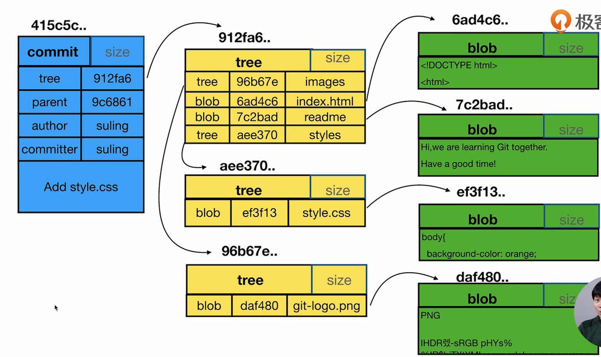

### git学习资料
1. 下载git安装文件 [Git官网](https://git-scm.com/downloads)
2. 使用之前设置一下用户的信息,在命令行输入,如果使用了global配置，在本机配置一次就行了，之后会自动去读取
    ```shell
    # 设置用户信息 如果设置的时候没有后面的参数 默认第一个
    $ git config --local  // 只对某个仓库有效
    $ git config --global // global对当前用户所有仓库有效 **工作中最常用**
    $ git config --system // 对系统所有登录用户有效
    # 如果想查看之前的设置
    $ git config --list --local
    $ git config --list --global
    ```
3. 查看了配置之后，就可以在本地文件夹目录中初始化一个仓库 `git init projectName / git init` ，文件夹会出现一个 ` .git `文件夹(默认隐藏)，但是此时所有的文件并没有添加到暂缓区
  > 上面两种命令是两种不同的情况，第一个是在全新的文件下初始化项目，第二种是在已经存在文件的文件夹中初始化Git仓库来版本控制，应该开始跟踪这些文件并提交。

4. 往本地暂缓区 仓库里添加文件
    - `git add [filename] `将本地文件先添加到暂存区中，被 git 监控，可以快速添加所有文件 `git add .`
    - `git commit -m"xxx"` 将刚刚添加的文件添加注释 这样是单个文件添加不同的注释, 文件并没有被托管到GitHub上面
    - `git commit -a -m"xxx"` 如果是一次性提交所有文件并添加注释, 可以直接将所有文件直接添加注释并添加到暂缓区
    - `git remote add origin http://url ` 将本地的仓库关联到远程服务器的某个仓库
    - `git push origin master` 将本地暂缓区的代码上传到服务器，可以选择某个用户上传
5. 提交完成之后，`git log` 可以查看提交信息，用户和提交的文件，后面可以配置参数展示形式


##### git常用命令
```shell
git init  初始化 git 项目，然后就需要配置最小的配置参数，不是必须的，会自动使用全局配置的参数
git add <filename>  开始跟踪一个文件(文件目录) / 把已跟踪的文件放到暂存区 / 合并时把有冲突的文件标记为已解决状态
git add -A  表示stages所有文件，最好不要使用'.'，后面的方式不能 stages 删除的文件
git reset <filename>  删除暂存区的文件，   git  add 相反操作
git status  当前文件的状态(未跟踪，未添加到暂缓区，未push等)

git rm <filename>  删除文件 
git rm --cached <filename>  删除暂存区文件,但是保留在当前工作目录中,并且git之后都不再跟踪该文件
git commit -m'explain'  添加某个文件到版本库 后面是注释信息
git commit -a  添加所有未提交的文件到版本库
git commit -a -m"explain"  产生的内容不存入暂存区，直接提交到commit中去。不推荐使用
git fetch  更新远程仓库的所有分支
git fetch origin master  只是更新主分支
git fetch
git push origin master  推送到远程，用主分支来推送
git push origin dev  推送到远程仓库，用开发中分支来推送
*** git reset --hard  git暂存区中所有的改动都会被清理到，注意使用
```

### 1.远程仓库相关命令
```shell
检出仓库：$ git clone [url]
查看远程仓库：$ git remote -v  （本地代码推送到远程的地址路径）
添加远程仓库：$ git remote add [name] [url]  （增加一个本地版本库到现有的 Git 项目）
删除远程仓库：$ git remote rm [name]
修改远程仓库：$ git remote set-url --push[name][newUrl]
拉取远程仓库：$ git pull [remoteName] [localBranchName]
推送远程仓库：$ git push [remoteName] [localBranchName]
```

### 2. 提交历史部分
```shell
git log --oneline  展示git的日志，每次历史变为一行形式展示
git log --oneline --decorate  可以查看各个分支当前所指的对象
git log --oneline --decorate --graph --all  输出你的提交历史、各个分支的指向以及项目的分支分叉情况。
```

### 3.分支(branch)操作相关命令
**分支信息：切换到新分支上时 Git 会重置你的工作目录，使其看起来像回到了你在那个分支上最后一次提交的样子，因为采用的文件快照的方式实现**
```shell
查看本地分支：$ git branch  ----默认会展示目前工作在那个分支下）
查看远程分支：$ git branch -r
创建本地分支：$ git branch [name]  ----注意新分支创建后不会自动切换为当前分支
切换分支：$ git checkout [name]
创建新分支并立即切换到新分支：$ git checkout -b [name]
查看本地远端所有分支： $ git branch -a

删除分支：$ git branch -d [name]  ---- -d选项只能删除已经参与了合并的分支，
              对于未有合并的分支是无法删除的。如果想强制删除一个分支，可以使用-D选项

合并分支：$ git merge [name]  ----将名称为[name]的分支与当前分支合并

创建远程分支(本地分支push到远程)：$ git push origin [name]
              ----本地创建的分支，远端默认是没有的，需要先添加分支名称到远端

删除远程分支：$ git push origin :heads/[name]

$ git push origin test:master  // 提交本地test分支作为远程的master分支,远程的github就会自动创建一个test分支
$ git push origin test:test    // 提交本地test分支作为远程的test分支
$ git push origin :test        // 刚提交到远程的test将被删除，但是本地还会保存的，不用担心
```
> 我从master分支创建了一个issue5560分支，做了一些修改后，使用git push origin master提交，但是显示的结果却是'Everything up-to-date'，发生问题的原因是git push origin master 在没有track远程分支的本地分支中默认提交的master分支，因为master分支默认指向了origin master 分支，这里要使用git push origin issue5560：master 就可以把issue5560推送到远程的master分支了。

### 本地删除，再从远程拉取
有时候本地修改失败了，会直接删除文件，然后再从远端从新下载本文件
```shell
$ git rm [filename]  // 删除文件
$ git fetch origin [name]  // 更新远端的文件
$ git reset --hard  origin/[name]
// 将当前的指针头指向远端上次提交的时刻,但是本地其他文件夹中的修改也会被还原到之前提交的状态  ？？？ 保存本地文件
```

### git中 comit  tree   blob 的关系


- 一个commit代表一柯树，表示此刻文件的所有快照
- 树中也可以包含其他树结构
- 树中也包含了 blob（就是具体的文件）
- blob 和文件名无关，相同的内容是同一个blob


### 使用中常见的错误
1. git使用报错 `fatal: Couldn't find remote ref master`。
    解决办法： 如果是新建的仓库，fetch的时候是没有内容的，可以忽略上述报错
    1. 先检查本地Git的配置,可以检查是否拼写错误
    ```shell
    git config user.name / git config --global user.name
    git config user.email / git config  --global user.email
    ```
    2. 检查远程仓库配置 `git remote -v`
    3. 如果远程仓库信息有误，直接删除本地仓库配置，再设置地址
    ```shell
    git remote rm origin
    git remote add origin XXX
    ```
    4. 还是不行的话直接找到路径下的 .git 文件，打开 config 文件，删除 `[remote "origin"]` 下的信息，再重复 2.3 步骤

### Git的分支和 tag 操作，可以快速切换之前开发的某个时刻的代码

### 学习博客

- [常用Git命令](https://juejin.im/post/5e0f401f6fb9a047f164fc9f)