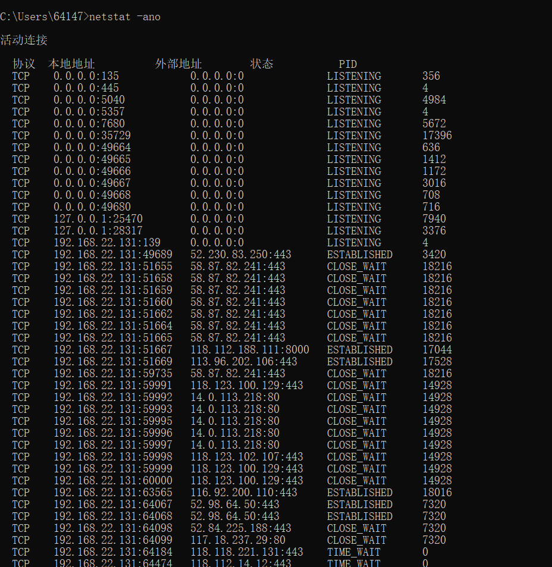
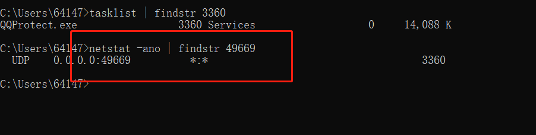
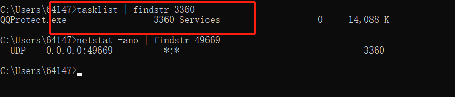
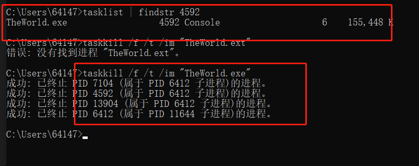

### window进程查询
在日常工作中，经常会碰到启动某个应用时，提示xxx端口已经并占用，导致当前应用无法正常启动。 如何找到占用特定端口的应用并将其释放呢？

1. 查找当前系统的端口使用情况 `netstat -ano`

2. 显示太多的话还可以查看某一个具体的端口 `netstat -ano | findstr xxx` 换位你要查询的端口号，就可以查看是那个程序在占用端口，也可以查看末尾的 PID  值。在 任务管理器 =》 详细信息中 查看对应的程序，以及停止程序

3. 上面只是查询了端口对应的程序 PID 信息，执行 `tasklist | findstr PID` 可以查询是那个执行程序

4. 这样可以到任务管理器中停止程序或者使用命令停止程序 `taskkill /f /t /im "name"` 后面 name 根据上面查询出来的程序来消除，下面例子是删除 世界之窗浏览器的测试

5. 然后就可以启动自己的程序了。

