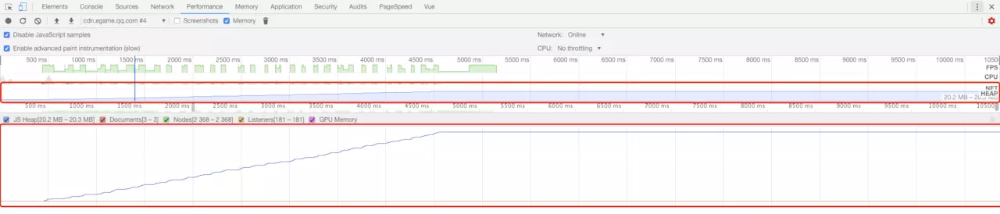
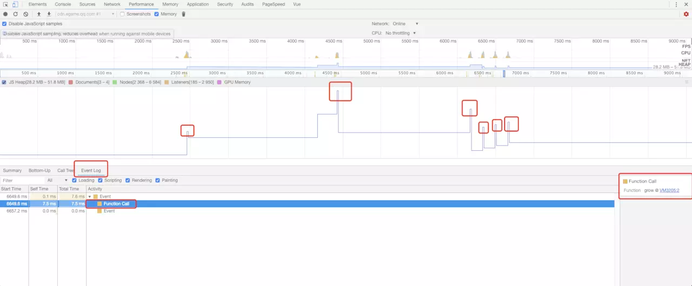

## 平常工作中的积累

**内存泄漏**：指程序中己动态分配的堆内存由于某种原因程序未释放或无法释放，造成系统内存的浪费，导致程序运行速度减慢甚至系统崩溃等严重后果。
资料说闭包会造成内存泄漏，要减少使用，其实我们运用闭包的目的就2个： 变量私有化；延迟变量生命周期，这样是不错操作内存泄漏的。
查看内存泄漏的办法：
1. 打开 Chrome 浏览器开发者工具中的 performance 面板
2. 选项中勾选 Memory 选项
3. 点击左上角录制按钮（实心圆状）
4. 在页面上进行正常操作
5. 一段时间后，点击 stop 看面板上的数据

6. 如果是像上面这样平稳的，就表示内存没有泄漏，如果是像下面这样就是内存泄漏

7. 下方内存图点击对应的内存异常处，然后点击下方面板内的Event Log面板，可以查看代码内具体发生了什么，来接触引用



#### 在项目中写css的时候需要注意的两个点
1. padding-top、margin-top、padding-bottom、margin-bottom取值为百分比时，是相对于父元素的宽度。
2. position:fixed，相对于浏览器窗口定位。例外：父代元素中，有元素设置了transform，则postion:fixed相对于设置了transform的父元素定位。

### 常用的屏幕分辨率
[移动设备的常用尺寸](https://material.io/tools/devices/)

PC端************

按屏幕宽度大小排序（主流的用橙色标明）

分辨率   比例 | 设备尺寸

1024*500 （8.9寸）

1024*768 （比例4：3  | 10.4寸、12.1寸、14.1寸、15寸; ）

1280*800（16：10  |15.4寸）

1280*1024(比例：5：4  | 14.1寸、15.0寸)

1280*854(比例：15：10 | 15.2）

1366*768 (比例：16：9 | 不常见）

1440*900 （16：10  17寸 仅苹果用）

1440*1050（比例：5：4  | 14.1寸、15.0寸）

1600*1024（14：9  不常见）

1600*1200 （4：3 | 15、16.1）

1680*1050（16：10 | 15.4寸、20.0寸）

1920*1200 (23寸）

通过上面的电脑屏蔽及尺寸的例表上我们得到了几个宽度

1024       1280          1366      1440       1680       1920 
```css
@media (min-width: 1024px){
body{font-size: 18px}
} /*>=1024的设备*/

@media (min-width: 1100px) {
body{font-size: 20px}
} /*>=1100的设备*/
@media (min-width: 1280px) {
body{font-size: 22px;}
} /*>=1280的设备*/

@media (min-width: 1366px) {

body{font-size: 24px;}
}  

@media (min-width: 1440px) {
body{font-size: 25px !important;}
} 

@media (min-width: 1680px) {
body{font-size: 28px;}
} 
@media (min-width: 1920px) {
body{font-size: 33px;}
} 
```
### 浏览器解析重名属性
```js
// 下面是一道面试题 结果是返回 1
var a = 1;
function b(){
    a = 10;
    return;
    function a(){
        console.log(a)
    }
}
b();
console.log(a)   // 1
```
上面的有几点需要注意的是
- 隐式申请的变量会变为全局变量
- 变量和函数都存在提升且函数的提升高于变量的提升
- 函数声明比变量声明更置顶
- js预解析和解析变量的声明顺序
- js 给变量赋值的时候会进行 LHS 和 RHS 查询
- 声明过的变量不会重复声明

> 变量的赋值操作会执行两个动作，首先编译器会在当前作用域中声明一个变量（如果之前没有声明过），然后在运行时引擎会在作用域中查找该变量，如果能够找到就会对它赋值

```js
function b(){
    function a(){
        console.log(a)
    }
    a = 10;
    return;
}
var a;
a =1;
b();
console.log(a)


function one(){}
var one = 10;

var one = 10;
function one(){}
// 上面两行代码在2种不同的写法下js解析的时候就会变为
function one(){}
var one;
one = 10;
/*
 函数提升在上面，然后 `var one`这行代码的时候 js 会进行 LHS 查看，
 发现当前作用域环境中有变量 one 就会忽略这行代码，执行下面哪行
 */
```
要理解上面的重名问题就需要知道js查找的顺序是由里向外的，js执行代码是自上往下的。
执行函数b的时候，函数b内有一个函数名为a的函数声明，函数a下面有一个变量且赋值为10，在`a=10`这行代码的时候，js首先查找变量a的地址，在本作用域内查找，会发现在函数b内声明了一个变量a，就不会再往外找了，其实就是将10赋值给了函数a这个变量了